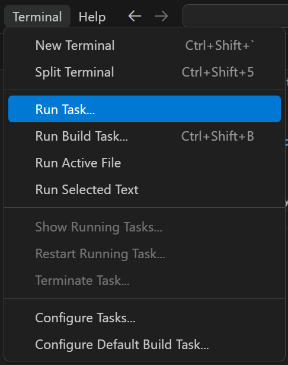
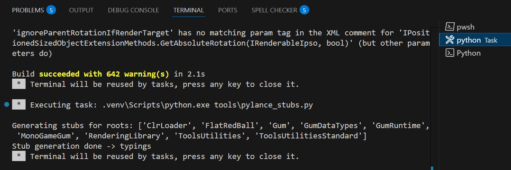
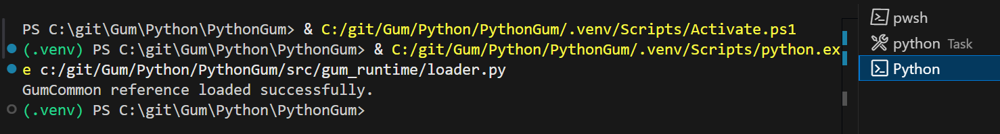

# Setup for Development

## Requirements

1. VSCode
  1. Everything is automated in VSCode Tasks.  If you don't want to use VSCode you don't have to, but you'll need to make sure you manually install everything.
1. Python 3 Installed (and be on the path environment variable)
  1. To test, after installing python, open a command prompt and type `python` to make sure it works
  1. You'll end up in a python REPL, to exit type `exit()`
1. GUM source checked out (This project!) [We utilize the GumCommon.dll built]
1. Dotnet installed
1. Powershell (Windows) (Make sure you have the updated version)
  1. winget install --id Microsoft.Powershell --source winget
  1. for doing the DLL build since it's a PowerShell script, but you can manually do that if you want

## Building GumCommon.DLL and it's dependencies

1. Open VSCode
1. In VSCode, open the Gum/Python/PythonGum/ folder
1. Go to Terminal > Run Task

1. Select Bootstrap

    1. This will Setup the Python Virtual Environment
    1. Update PIP (Package manager for Python)
    1. Install the required packages from (requirements.txt)
    1. Build the GumCommon.dll and pull in all required DLLs and put them in src\gum_runtime\_clr\net6.0\
    1. Create Intellisense PyLance Stubs

## Run the script to test it
1. Now you Can open loader.py and click Play to test it.

