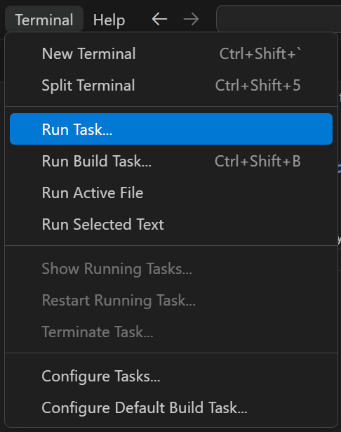
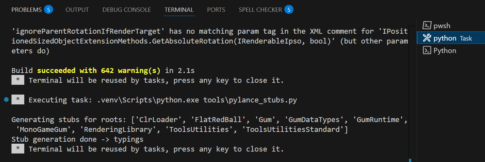

# 1. Setup for Development

This README is for deveopment, the `README_PACKAGED.md` is the file that's included in the published pypi module.

## 1.1 Requirements

1. VSCode
  1. Everything is automated in VSCode Tasks.  If you don't want to use VSCode you don't have to, but you'll need to make sure you manually install everything.
1. Python 3 Installed (and be on the path environment variable)
  1. To test, after installing python, open a command prompt and type `python` to make sure it works
  1. You'll end up in a python REPL, to exit type `exit()`
1. GUM source checked out (This project!) [We utilize the GumCommon.dll built]
1. Dotnet installed
1. Powershell (Windows) (Make sure you have the updated version)
  1. winget install --id Microsoft.Powershell --source winget
  1. for doing the DLL build since it's a PowerShell script, but you can manually do that if you want

## 1.2 Building GumCommon.DLL and it's dependencies

1. Open VSCode
1. In VSCode, open the Gum/Python/PythonGum/ folder
1. Go to Terminal > Run Task

1. Select Bootstrap

    1. This will Setup the Python Virtual Environment
    1. Update PIP (Package manager for Python)
    1. Install the required packages from (requirements.txt)
    1. Build the GumCommon.dll and pull in all required DLLs and put them in src\gum_runtime\_clr\net6.0\
    1. Create Intellisense PyLance Stubs

# 2. Building the Python Module for distribution

## 2.1 Installing tools

Install Twine for building
 - `pip install build twine`

## 2.2 Building the Module

1. Run the `build_gumui.py` script
 - `python build_gumui.py`
>**__TODO:__** Add a task to call build_gumui.py

## 2.3 Uploading the Module

1. `python -m twine upload dist/*`
2. Enter the API key (or, correctly setup the `.pypirc` file)

# 3. Testing

## 3.1 Run pytest

>**__TODO:__** TODO: Add unit tests

## 3.2 Run the script to test it
Install the module and test
1. Install the built module without using pypi
`pip install --force-reinstall dist\gumui-0.1.0-py3-none-any.whl`
2. Run the example
`python .\examples\quick_setup_example.py`

 You should see a grey screen with 16 smaller grey squares with 1 lighter gray square in it.  
 - Press `-/+` to change the width and height of the `RootElement`
 - Press `g` to change the number of Grid Columns
 - Press `arrow keys` to move the `RootElement` around
 - Click `Left-Mouse` to toggle clipping the children of the parent `RootElement`
