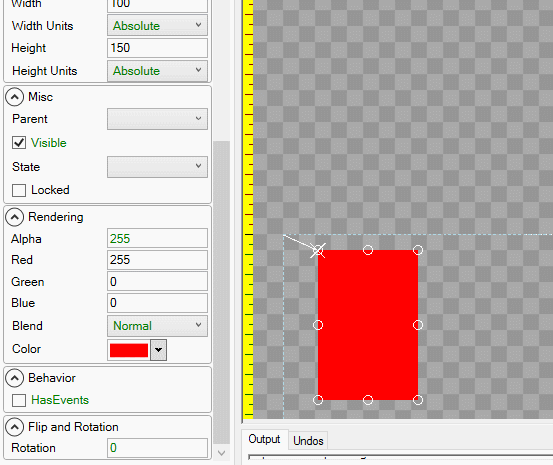

# Introduction

The Rotation property can be used to rotate Gum components. It is measured in degrees, where positive values rotate an object counterclockwise about its origin ([X Origin](X Origin) and [Y Origin](Y Origin)).

# Example

An object is rotated by its origin, which by default is its top-left corner:

# X Origin and Y Origin

The [X Origin](X Origin) and [Y Origin](Y Origin) properties define the point of rotation for an object. For example, the following shows a rectangle rotated about its center:

