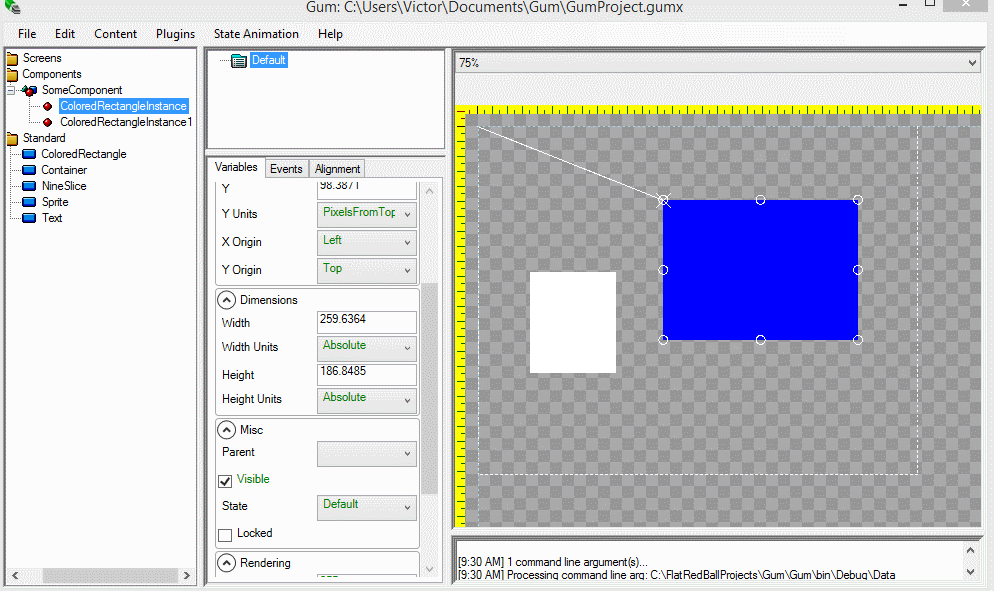

# Introduction

Parenting allows UI elements to be positioned and sized according to other UI elements. Parenting hierarchies can go many levels deep and the parent/child relationship can be visualized by the white line connecting the parent to the child when the child is selected.

# Example

To set a parent/child relationship:

# Select the child
# Change the Parent property to the desired parent:

The Parent can also be changed through a dropdown:

