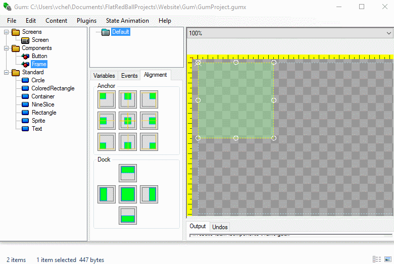
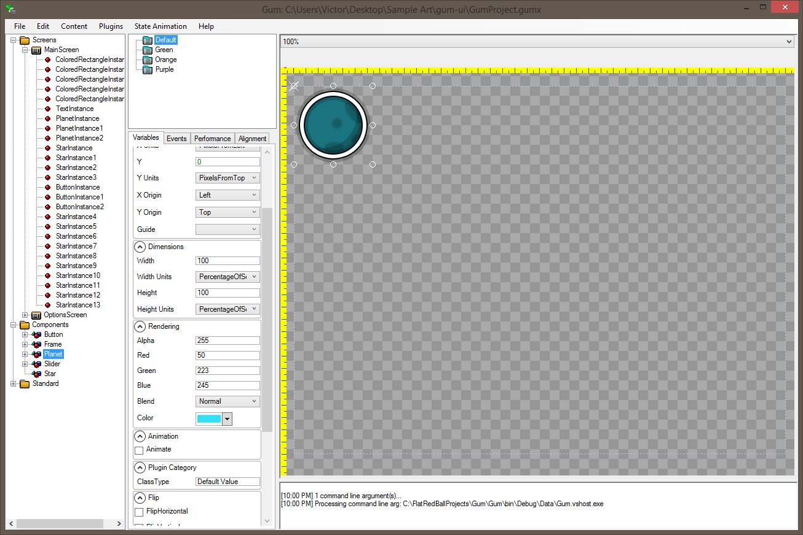
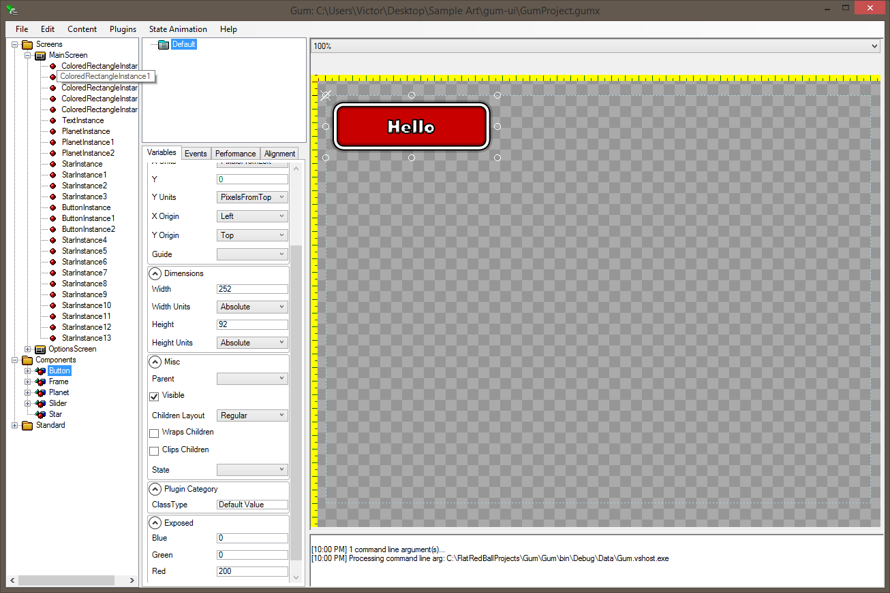

# Introduction

## Important: Binaries have moved

**Binaries can now be downloaded from FlatRedBall here:**

[files.flatredball.com/content/Tools/Gum/Gum.zip](http://files.flatredball.com/content/Tools/Gum/Gum.zip)

## Source code has moved

The source code for Gum has moved to github:

[http://www.github.com/vchelaru/Gum](http://www.github.com/vchelaru/Gum)

Documentation will still \(temporarily\) be housed on CodePlex due to the complexity of adding images to the GitHub wiki.

## Project Description

Gum is a general-purpose UI tool for games, mockups, and websites. Gum saves to an XML format which you can include in your projects, but also supports a plugin system \(using MEF\) for custom exports.

Gum combines the power of programming concepts such as inheritance, instancing, and default/overriding variable values with a easy-to-use visual editor.

## Screenshots

These images were taken from the free sample project here: [http://download-codeplex.sec.s-msft.com/Download?ProjectName=gum&DownloadId=1426617](http://download-codeplex.sec.s-msft.com/Download?ProjectName=gum&DownloadId=1426617)

## How do I use Gum?

For information on how to use Gum, head over to the [**Documentation**](https://github.com/vchelaru/Gum/tree/8c293a405185cca0e819b810220de684b436daf9/docs/Documentation/README.md) page.

