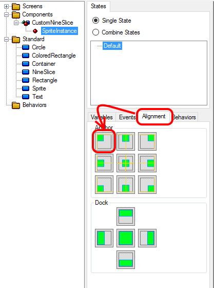

# Introduction

Although Gum naturally provides a NineSlice object, the Gum layout system can be used to create a custom NineSlice component. Such a component could be used if additional flexibility beyond what is provided by the standard NineSlice is needed.

# Creating the Component

As implied by the name, the NineSlice object is composed of nine Sprites. First we'll create the component:

1. Open Gum
1. Open or create a new Gum project
1. Right-click on the **Components** folder
1. Select **Add Component**
1. Name the Component **CustomNineSlice**

# Adding Corner Sprites

Next, we'll add corner Sprite instances to our CustomNineSlice. We'll be using the alignment tab to position Sprites. The alignment tab provides a quick way to place objects, but the same can be achieved using the following variables individually:

* [Width Units](Width-Units)
* [X Origin](X-Origin)
* [X Units](X-Units)
* [Height Units](Height-Units)
* [Y Origin](Y-Origin)
* [Y Units](Y-Units)

1. Drag+drop a Sprite element onto the CustomNineSlice component 
1. Click the Alignment tab
1. Anchor the newly-created Sprite to the top-left of its container 
1. Repeat the steps above three more times, creating one Sprite for each of the four corners 

Notice that if we resize our CustomNineSlice component, each of the four sprites remains in the corner.

# Adding Edge Sprites

Next we'll add the four sprites which will sit on the edge of our component:

1. Drag+drop a Sprite element onto the CustomNineSlice component
1. Click on the alignment tab
1. Dock the newly-created Sprite to the top of its container. Docking sets the width of the sprite to match the width of the component. We'll address this in the next step. 
1. To accommodate for the corner Sprites, we need to adjust the width of the top Sprite. Set the newly-created Sprite's Width to -128. Since the Sprite uses a **Width Units** of **RelativeToContainer**, Setting the value to -128 will make the sprite be 128 units smaller than the container. We picked 128 because each of the corner sprites is 64. 
1. Repeat the above steps, but instead setting the dock to create sprites on the left, right, and bottom. adjust width and height values as necessary.

# Adding the Center Sprite

The last Sprite we'll add is the center Sprite:

1. Drag+drop a Sprite element onto the CustomNineSlice component
1. Click on the alignment tab
1. Dock the newly-created Sprite to the center of its container. 
1. Set both the newly created Sprite's Width and Height to -128

Now the Sprites will stretch and adjust whenever the CustomNineSlice is resized.

# Assigning values on CustomNineSlice

Unlike the regular NineSlice, changing the texture values requires a considerable amount of variable modification. To change the CustomNineSlice to use 9 separate textures, the following values must be set:

* Each of the Sprite instances must have its SourceFile value set
* The edge Sprites will have to have their Width and Height values modified to account for the possible resizing of the corner sprites
* The center Sprite will have to have both its Width and Height values modified

If using a sprite sheet, then all of the work above will need to be done plus the  texture coordinate values will need to be modified.
