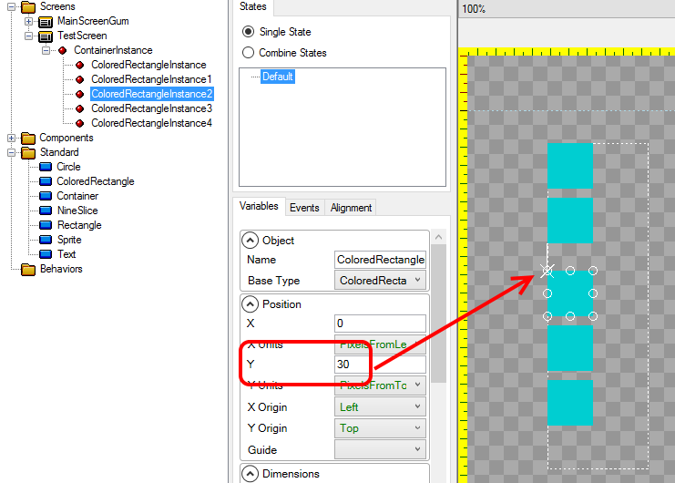
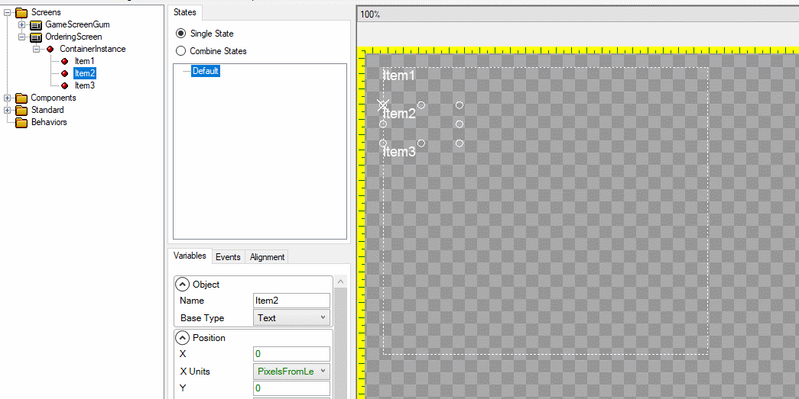
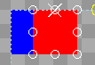
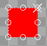

# Introduction 

The **Children Layout** property determines how a container positions its children. The default value is "Regular" which means that children are positioned according to their [X Units](X Units) and [Y Units](Y Units).

The value **TopToBottomStack** results in the children stacking one on top of another, from top to bottom.

The value **LeftToRightStack** results in the children stacking one beside another, from left to right.

# Example

The following shows how to use the ChildrenLayout property to stack objects. It begins with a single NineSlice inside of a container called ContainerInstance. The following actions are performed:

1. The NineSliceInstance is copied and pasted 3 times. At this point all NineSliceInstance's are overlapping each other
1. The Children Layout is changed from Regular to TopToBottomStack. The NineSliceInstance's are automatically stacked top-to-bottom.
1. The Children Layout is changed to LeftToRightStack. The NineSliceInstance's are automatically stacked left-to-right.

# Spacing Elements
When children in a container are stacked, their position values can be used to separate the objects. For example, on a TopToBottomStack, the Y value of each child can be used to separate it from the previous child.

# Reordering Children

Children of a container which uses the **TopToBottomStack** or **LeftToWriteStack** will be ordered according to their order in the tree view on the left. By default this is the order in which the children are added to a parent container.

Children can be reordered using the right-click menu on an instance.

# Wraps Children

The [Wraps Children](Wraps Children) property controls how stacking behaves beyond boundaries. For more information, see the [Wraps Children](Wraps Children) page.

# Stacking and Children Origin

In most cases children which are stacked should use a Left [X Origin](X Origin) if the parent uses a **LeftToRightStack** and should use a Top [Y Origin](Y Origin) if the parent uses a **Top To Bottom Stack**.

For example, consider a parent which contains two children - a blue and a red rectangle.

In the image shown above, the red rectangle is positioned directly to the right of the blue rectangle. Notice that if the red rectangle's [X Origin](X Origin) is changed to **Center**, the red rectangle overlaps the blue rectangle.

If the red rectangle's [X Origin](X Origin) is changed to **Right**, then its right side will align with the right side of the blue rectangle, resulting in the red overlapping the blue completely. In this case the stacking is essentially cancelled out by the [X Origin](X Origin).

This overlapping may not be desirable, so keep this in mind when changing a stacked child's origin.