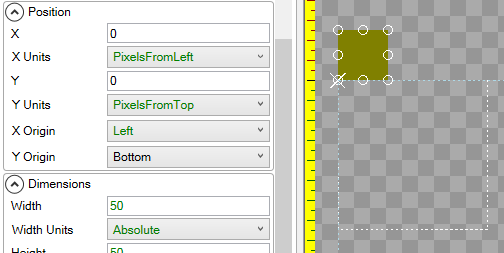

# Introduction

The **Y Origin** variable controls the point which an object is positioned by. By default the **Y Origin** is **Top**. The **Y Origin** is shown visually as a white "X" in the editor.

# Top

The following image shows a [ColoredRectangle](ColoredRectangle) with its **Y Origin** set to **Top**:

# Center

The following image shows a [ColoredRectangle](ColoredRectangle) with its **Y Origin** set to **Center**:

# Bottom

The following image shows a [ColoredRectangle](ColoredRectangle) with its **Y Origin** set to **Bottom**:

