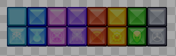

Introduction

The Color value is used to perform a _multiply_ color operation on the sprite. Color values can be used to darken or tint a grayscale texture. By default Sprites us a white color, which means the original texture will display unmodified.

Examples

The following images show the color values as applied to a multi-color sprite.

Red: 255
Green: 255
Blue: 255

Red: 255
Green: 0
Blue: 0

Red: 0
Green: 255
Blue: 0

Red: 0
Green: 0
Blue: 255

Red: 128
Green: 128
Blue: 128

Red: 0
Green: 0
Blue: 0

