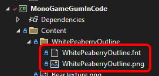
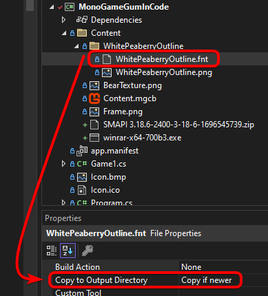

# Font Strategies

## Introduction

This page covers each font loading strategy in detail with code samples and tradeoffs. To decide which strategy fits your game, start with the decision tree on the [Fonts](fonts.md) hub page.

The strategies are:

* [Dynamic KernSmith Generation](font-strategies.md#dynamic-kernsmith-generation) — recommended for MonoGame, KNI, and Raylib.
* [Dynamic Generation on SkiaGum](font-strategies.md#dynamic-generation-on-skiagum) — SkiaGum and Silk.NET rasterize glyphs themselves via SkiaSharp, separate from KernSmith.
* [Custom Font File](font-strategies.md#custom-font-file) — load a specific `.fnt` file you ship with the game.
* [Direct BitmapFont Assignment](font-strategies.md#direct-bitmapfont-assignment) — fully manual.
* [Build-Time Font Cache](font-strategies.md#build-time-font-cache) — pre-baked atlases from the Gum tool.

### Per-Runtime Availability

| Runtime  | Dynamic generation today                                                                                                               |
| -------- | -------------------------------------------------------------------------------------------------------------------------------------- |
| MonoGame | Yes — via KernSmith.                                                                                                                   |
| KNI      | Yes — via KernSmith.                                                                                                                   |
| Raylib   | Yes — via KernSmith (`KernSmith.RaylibGum`).                                                                                           |
| FNA      | Not yet. If you need it, let us know on Discord or [open an issue](https://github.com/vchelaru/Gum/issues).                            |
| Sokol    | Not yet. Use the [Build-Time Font Cache](font-strategies.md#build-time-font-cache) for now.                                            |
| SkiaGum  | Yes — uses SkiaSharp's own glyph rasterization. See [Dynamic Generation on SkiaGum](font-strategies.md#dynamic-generation-on-skiagum). |
| Silk.NET | Yes — renders through SkiaGum and shares its glyph rasterization; no KernSmith package needed. See [Dynamic Generation on SkiaGum](font-strategies.md#dynamic-generation-on-skiagum). |

## Dynamic KernSmith Generation

KernSmith is an in-memory font generator for MonoGame, KNI, and Raylib. Install the NuGet package for your runtime and KernSmith generates font atlases at runtime so you can freely change font properties without managing files on disk.



1. Add the `KernSmith.MonoGameGum` NuGet package to your project.
2. Assign the `InMemoryFontCreator` after initializing Gum:

```csharp
using Gum.Wireframe;

// Initialize
GumService.Default.Initialize(this);

CustomSetPropertyOnRenderable.InMemoryFontCreator =
    new KernSmithFontCreator(GraphicsDevice);
```

Once this is set up, font properties work automatically. Setting `Font`, `FontSize`, `IsBold`, `IsItalic`, `OutlineThickness`, `UseFontSmoothing`, and baked drop shadow (`HasDropshadow` plus the dropshadow fields) on a `TextRuntime` generates the needed font in memory without any font files on disk:

```csharp
// Initialize
var text = new TextRuntime();
text.Text = "Hello, World!";
text.Font = "Times New Roman";
text.FontSize = 24;
text.IsBold = true;
text.AddToRoot();
```

Any combination of font properties can be used and the font is created on demand.



1. Add the `KernSmith.KniGum` NuGet package to your project.
2. Assign the `InMemoryFontCreator` after initializing Gum:

```csharp
using Gum.Wireframe;

// Initialize
GumService.Default.Initialize(this);

CustomSetPropertyOnRenderable.InMemoryFontCreator =
    new KernSmithFontCreator(GraphicsDevice);
```

Once this is set up, font properties work automatically:

```csharp
// Initialize
var text = new TextRuntime();
text.Text = "Hello, World!";
text.Font = "Times New Roman";
text.FontSize = 24;
text.IsBold = true;
text.AddToRoot();
```



1. Add the `KernSmith.RaylibGum` NuGet package to your project.
2. Assign the `InMemoryFontCreator` after initializing Gum:

```csharp
using RaylibGum.Renderables;

// Initialize
GumService.Default.Initialize();

CustomSetPropertyOnRenderable.InMemoryFontCreator =
    new KernSmithRaylibFontCreator();
```

Once this is set up, font properties work automatically — the same `TextRuntime` fields as MonoGame/KNI, including baked drop shadow. See [TextRuntime Fonts — Baked drop shadow](../standard-visuals/textruntime/fonts.md#baked-drop-shadow).

```csharp
// Initialize
var text = new TextRuntime();
text.Text = "Hello, World!";
text.Font = "Times New Roman";
text.FontSize = 24;
text.IsBold = true;
text.AddToRoot();
```



KernSmith is not currently published for FNA. If you need dynamic font generation on FNA, let us know on Discord or [open an issue](https://github.com/vchelaru/Gum/issues) — the request helps us prioritize.

In the meantime, use the [Build-Time Font Cache](font-strategies.md#build-time-font-cache) strategy.



Dynamic font generation is not yet available on Sokol. Use the [Build-Time Font Cache](font-strategies.md#build-time-font-cache) strategy.



### System Fonts vs Registered Fonts

By default, KernSmith resolves the `Font` property by looking up fonts installed on the operating system. Setting `Font = "Times New Roman"` works because that font is typically installed on Windows.

System fonts are convenient for quick prototyping, but they have drawbacks for shipping a game:

* **Platform differences** — a font installed on your development machine may not exist on a player's machine or on other platforms (Linux, macOS, mobile).
* **Version inconsistency** — different OS versions may ship different versions of the same font, causing subtle rendering differences.
* **Licensing** — system fonts may have licenses that restrict redistribution in games.

For these reasons, registering your own `.ttf` (or `.otf`) files is recommended for any font you plan to ship with your game. This guarantees every player sees the same font regardless of their operating system.

### Registering Custom .ttf Fonts

There are two ways to use a `.ttf` file with KernSmith:

* **Register it under a family name**, then set `Font` to that family name. That is what this section covers.
* **Point `Font` (or `CustomFontFile`) straight at the `.ttf` path**, with no register call at all. See [Using a .ttf Path Directly](font-strategies.md#using-a-ttf-path-directly) below.

To register a `.ttf` file:

1. Add the `.ttf` file to your project's **Content** folder.
2. Set its **Copy to Output Directory** to **Copy if newer**. For an easier approach that handles all content files at once, see the wildcard `.csproj` setup in [Loading a Gum Project (.gumx)](../getting-started/setup/loading-a-gum-project-.gumx.md#adding-the-gum-project-to-your-csproj).
3. Call `RegisterFont` before using the font. The method is on the font creator type for your runtime: `KernSmithFontCreator` on MonoGame, KNI, and FNA, and `KernSmithRaylibFontCreator` on raylib. The parameters are the same on both.



```csharp
// Initialize
KernSmithFontCreator.RegisterFont("Bungee", "Content/Fonts/Bungee-Regular.ttf");
```



```csharp
// Initialize
KernSmithRaylibFontCreator.RegisterFont("Bungee", "Content/Fonts/Bungee-Regular.ttf");
```



Once registered, use the font by its family name just like a system font:

```csharp
// Initialize
var text = new TextRuntime();
text.Font = "Bungee";
text.FontSize = 24;
text.Text = "Hello from a custom font!";
text.AddToRoot();
```

You can register multiple fonts, including different styles for the same family:

```csharp
// Initialize
KernSmithFontCreator.RegisterFont("Crimson Pro", "Content/Fonts/CrimsonPro-Regular.ttf");
KernSmithFontCreator.RegisterFont("Crimson Pro", "Content/Fonts/CrimsonPro-Bold.ttf",
    style: "Bold");
```


A `byte[]` overload is also available for fonts loaded from embedded resources, HTTP responses, or other non-file sources. For example: `KernSmithFontCreator.RegisterFont("MyFont", fontBytes)`.



Registered fonts take priority over system fonts. If you register a font with the family name "Arial", KernSmith uses your registered `.ttf` instead of the system-installed Arial.



**Shipping September 2026:** the raylib `KernSmithRaylibFontCreator.RegisterFont(familyName, filePath)` overload ships in the September release, or now if building Gum from source. Before this, raylib had only the `byte[]` overload, so a raylib game had to read the file itself.


### Using a .ttf Path Directly

Instead of registering a family name, you can set `Font` to the path of a `.ttf` file. Gum recognizes any `Font` value ending in `.ttf` as a file to rasterize rather than a family name to look up, so no register call is needed:

```csharp
// Initialize
var text = new TextRuntime();
text.Text = "Hello, World!";
text.Font = "Fonts/Bungee-Regular.ttf";
text.FontSize = 24;
text.AddToRoot();
```

The same works with `CustomFontFile` when `UseCustomFont` is `true`. Paths resolve relative to `FileManager.RelativeDirectory` (your **Content** folder, or the folder holding your `.gumx` project), just like every other Gum asset. See [File Loading](file-loading.md).


On MonoGame, KNI, and FNA this is not the same base directory `RegisterFont` uses. `RegisterFont`'s `filePath` starts at your game's root, so a font at `Content/Fonts/MyFont.ttf` on disk is written `"Content/Fonts/MyFont.ttf"` there, but `"Fonts/MyFont.ttf"` when assigned to `Font` with the usual `Content/` relative directory. Tracked as [issue 4527](https://github.com/vchelaru/Gum/issues/4527).



Only the `.ttf` extension is recognized. An `.otf` file assigned this way is treated as a family name and will not resolve. Register `.otf` files by family name instead, using `RegisterFont`.


### Where a .ttf Can Live

A `.ttf` is read through the same file indirection as every other Gum asset, on both the register-by-path route and the `.ttf`-path route. That means it does not have to be a loose file next to your executable. A font packed into a [`.gumpkg` bundle](../../cli/pack.md), or served by a game that has installed its own `FileManager.CustomGetStreamFromFile` hook (an asset zip, an embedded resource store, a download cache), loads the same way a file on disk does.

If neither source has the font, Gum falls back to the default embedded 18 pixel Arial without raising an error. Subscribe to `CustomSetPropertyOnRenderable.PropertyAssignmentError` to see the failure.


**Shipping September 2026:** reading a `.ttf` through the file indirection ships in the September release, or now if building Gum from source. Before this, a `.ttf` was read straight off the filesystem, so a bundled or custom-sourced font was unreachable and the `byte[]` overload of `RegisterFont` was the workaround.


### Bold and Italic With One Registered Face

`IsBold` and `IsItalic` do not require you to register a bold or italic file. KernSmith uses a real bold or italic face when one is available, and synthesizes the style when one is not: emboldening the regular outlines for bold, and shearing them for italic (often called faux bold and faux italic).

"Available" means either a style you registered for that family, or, for a system font, a styled face the operating system has installed. So all three of these produce bold text:

```csharp
// Initialize
// A registered Bold face is used as-is.
KernSmithFontCreator.RegisterFont("Crimson Pro", "Content/Fonts/CrimsonPro-Regular.ttf");
KernSmithFontCreator.RegisterFont("Crimson Pro", "Content/Fonts/CrimsonPro-Bold.ttf",
    style: "Bold");

// Only a regular face is registered, so bold is synthesized.
KernSmithFontCreator.RegisterFont("Bungee", "Content/Fonts/Bungee-Regular.ttf");

// A system font, where the OS supplies Arial Bold.
var text = new TextRuntime();
text.Font = "Arial";
text.IsBold = true;
```

A real bold face is almost always better looking than a synthesized one, so register the styles you care about when you have them. But nothing silently renders as regular, and nothing silently swaps in a different typeface.


This is KernSmith's behavior, so it covers MonoGame, KNI, FNA, and raylib. SkiaGum and Silk.NET behave differently, see [Bold and Italic on SkiaGum](font-strategies.md#bold-and-italic-on-skiagum).


KernSmith can also synthesize the style even when a real face exists, which is useful for making every platform render identically. `TextRuntime` does not expose that, so it needs the direct KernSmith path: see [Forcing Synthetic Bold and Italic](advanced-font-effects.md#forcing-synthetic-bold-and-italic) on the Advanced Font Effects page.

### When to Use This Strategy

* You're using Latin, Cyrillic, Greek, or another small-charset script.
* You want to change font, size, style, outline thickness, or baked drop shadow without rebuilding atlases.
* You don't want to check generated `.fnt` files into source control.
* For CJK or other large charsets, this strategy still works — but you should pair it with [Font Preloading](font-preloading.md) so the per-atlas generation cost happens on a loading screen rather than during gameplay.

## Dynamic Generation on SkiaGum

SkiaGum is its own thing, and Silk.NET (`Gum.SilkNet`) shares this exact same font path since it renders through SkiaGum. Neither uses KernSmith — SkiaSharp rasterizes glyphs directly, so dynamic font generation works out of the box. No NuGet package to install, no `InMemoryFontCreator` to assign.

### System Fonts

Assign the font properties directly on the `TextRuntime`; the family name must be installed on the system to resolve:

```csharp
// Initialize
var text = new TextRuntime();
text.Text = "Hello, World!";
text.Font = "Times New Roman";
text.FontSize = 24;
text.IsBold = true;
```

### Custom .ttf Files

Point `Font` (or `CustomFontFile` with `UseCustomFont = true`) at a `.ttf` path instead of a family name. SkiaGum/Silk.NET load and cache the file automatically, the same as the [`.ttf`-path route](font-strategies.md#using-a-ttf-path-directly) on the KernSmith runtimes:

```csharp
// Initialize
var text = new TextRuntime();
text.Text = "Hello, World!";
text.Font = "Content/Fonts/Bungee-Regular.ttf";
text.FontSize = 24;
```

The file is read through the same indirection as every other Gum asset, so a `.ttf` inside a [`.gumpkg` bundle](../../cli/pack.md) or behind a `FileManager.CustomGetStreamFromFile` hook loads the same as one on disk. See [Where a .ttf Can Live](font-strategies.md#where-a-ttf-can-live).

For a font loaded from bytes (an embedded resource, for example) rather than a file on disk, call `SkiaGum.Content.Fonts.GumFontMapper.RegisterFont(familyName, fontBytes)` directly and then assign `Font = familyName`. That method also takes an optional style name, so you can register a `Bold` or `Italic` cut alongside the regular one.


`Font`/`CustomFontFile` is detected as a file path purely by whether the string ends in `.ttf` — not by whether it looks like a path. A bare filename with no directory (`"MyFont.ttf"`) is loaded from disk the same as a full path; there's no slash detection involved, and it never falls through to an OS font-name lookup. Only the `.ttf` extension is recognized — `.otf` files are not auto-routed through this path today and resolve as a (likely-missing) system font family name instead.


### Bold and Italic on SkiaGum

SkiaGum and Silk.NET pick a typeface for `IsBold`/`IsItalic`; they do not synthesize one. This differs from the KernSmith runtimes, which fall back to faux bold and faux italic (see [Bold and Italic With One Registered Face](font-strategies.md#bold-and-italic-with-one-registered-face)). What you get depends on where the font came from:

* **A font registered with `GumFontMapper.RegisterFont`** that has no cut for the requested style falls back to the family's regular cut. The text stays in your font, but it is not bolder or slanted. Register a `Bold` and `Italic` cut if you need those styles.
* **A `.ttf` assigned by path** resolves to that one file, so it renders exactly as that file draws, whatever `IsBold` and `IsItalic` are set to.
* **A system font family name** is resolved by SkiaSharp, which returns the closest installed face for the requested weight and slant.


A dedicated SkiaGum fonts page is planned. For now, this section is the canonical reference. If something is unclear, ask on Discord or [open an issue](https://github.com/vchelaru/Gum/issues).


## Custom Font File

If you have a specific `.fnt` file (created with the Gum tool, Angelcode Bitmap Font Generator, Hiero, or another tool), you can load it directly by setting `UseCustomFont` to `true` and assigning `CustomFontFile`:

```csharp
// Initialize
var text = new TextRuntime();
text.UseCustomFont = true;
text.CustomFontFile = "WhitePeaberryOutline/WhitePeaberryOutline.fnt";
text.Text = "Hello, I am using a custom font";
text.AddToRoot();
```


This path loads the `.fnt` file as-is and bypasses KernSmith entirely, so `HasDropshadow` and the other KernSmith-driven properties (`OutlineThickness`, `IsBold`, `IsItalic`, `UseFontSmoothing`) have no effect here. If you need baked drop shadow with a font you own, register it as a `.ttf` and drive it through `Font`/`FontSize` instead — see [Registering Custom .ttf Fonts](font-strategies.md#registering-custom-ttf-fonts).



`CustomFontFile` also accepts a `.ttf` path, which is a different strategy: the font is rasterized on demand and the style properties above do apply. See [Using a .ttf Path Directly](font-strategies.md#using-a-ttf-path-directly). Everything on this page's **Custom Font File** section is about the `.fnt` case.


For information on creating your own `.fnt` file with Angelcode Bitmap Font Generator, see the [Use Custom Font](../../gum-tool/gum-elements/text/use-custom-font.md) page.

This code assumes a font file named `WhitePeaberryOutline.fnt` is located in the `Content/WhitePeaberryOutline` folder. By default all Gum content loading is performed relative to the **Content** folder. See the [File Loading](file-loading.md) page for more information.

`.fnt` files reference one or more image files, so the image file must also be added to the correct folder. In this case the `WhitePeaberryOutline.fnt` file references a `WhitePeaberryOutline.png` file, so both files are in the same folder.

<figure><figcaption><p>WhitePeaberryOutline font in the Solution Explorer</p></figcaption></figure>

Files are loaded from-file rather than using the content pipeline. This means that extensions (such as `.fnt`) are included in the file path, and that both the `.fnt` and `.png` files must have their **Copy to Output Directory** value set to **Copy if newer**.

<figure><figcaption><p>Copy if newer property set</p></figcaption></figure>

The easiest way to mark all content as "Copy to Output Directory" is to use wildcard items in your `.csproj`. For instructions (including Android), see [Loading a Gum Project (.gumx)](../getting-started/setup/loading-a-gum-project-.gumx.md#adding-the-gum-project-to-your-csproj).

### When to Use This Strategy

* You have a single hand-authored bitmap font you want to ship as-is.
* You want full control over which `.fnt` file backs a given `TextRuntime`.
* You don't need to vary size/style/outline at runtime — the file you assign is the file you get.

## Direct BitmapFont Assignment

You can construct a `BitmapFont` yourself and assign it directly, bypassing the font property system entirely. Two sources for the `BitmapFont` are common:

* [From a .fnt file on disk](font-strategies.md#from-a-fnt-file-on-disk) — when you already have a baked atlas.
* [From KernSmith with custom options](font-strategies.md#from-kernsmith-with-custom-options) — when you want visual effects (outline color, gradient fills, SDF, color fonts, custom glyph subsets) or backend control beyond what `TextRuntime` exposes. Baked drop shadow is on the property path — see [TextRuntime Fonts](../standard-visuals/textruntime/fonts.md#baked-drop-shadow).


Once a `BitmapFont` is assigned directly, do not set font component properties (`Font`, `FontSize`, etc.) or `UseCustomFont` on the same `TextRuntime`. Those properties trigger the font loading system, which overwrites the directly assigned `BitmapFont`.


### From a .fnt File on Disk

Load a `BitmapFont` from a `.fnt` file (and its companion `.png` page textures) and assign it:

```csharp
// Initialize
var bitmapFont = new BitmapFont("WhitePeaberryOutline/WhitePeaberryOutline.fnt");
var text = new TextRuntime();
text.BitmapFont = bitmapFont;
text.Text = "Hello, I am using a directly assigned font";
text.AddToRoot();
```

### From KernSmith with Custom Options

`TextRuntime` exposes a subset of KernSmith's options (`Font`, `FontSize`, `IsBold`, `IsItalic`, `OutlineThickness`, `UseFontSmoothing`, and baked drop shadow via `HasDropshadow` and the dropshadow fields). To use outline color, gradient fills, SDF, color fonts, custom glyph subsets, or a non-default rasterizer backend, build a `BitmapFont` yourself by calling KernSmith directly, then assign it.

For the full catalog of effects available through this path, see [Advanced Font Effects](advanced-font-effects.md).


This path requires the KernSmith package for your runtime (`KernSmith.MonoGameGum`, `KernSmith.KniGum`, or `KernSmith.RaylibGum`). The bridge type `GumFontGenerator` lives in `KernSmith.GumCommon`, which is a transitive dependency.


#### Flow 1: Start from a BmfcSave, mutate options, then generate

This is the most common flow. `BmfcSave` carries the same font descriptor `TextRuntime` uses internally — start there so size, style, charset, and smoothing match your normal text, then layer in the extras KernSmith supports:

```csharp
// Initialize
var bmfcSave = new BmfcSave
{
    FontName = "Arial",
    FontSize = 32,
    IsBold = true,
};

var options = KernSmith.Gum.GumFontGenerator.BuildOptions(bmfcSave);

// Layer in effects not exposed via TextRuntime / BmfcSave:
options.Outline = 2;
options.OutlineR = 255;
options.OutlineG = 64;
options.OutlineB = 64;

KernSmith.BmFontResult result = KernSmith.BmFont.GenerateFromSystem(
    bmfcSave.FontName, options);

BitmapFont bitmapFont = CreateBitmapFont(result, GraphicsDevice);

var text = new TextRuntime();
text.BitmapFont = bitmapFont;
text.Text = "Outlined in red";
text.AddToRoot();
```

The helper that wraps a `BmFontResult` into a `BitmapFont` is the same pattern `KernSmithFontCreator.TryCreateFont` uses internally — one `Texture2D` per atlas page, then the `BitmapFont(Texture2D[], string)` constructor:

```csharp
// Class scope
static BitmapFont CreateBitmapFont(KernSmith.BmFontResult result,
    Microsoft.Xna.Framework.Graphics.GraphicsDevice graphicsDevice)
{
    var textures = new Microsoft.Xna.Framework.Graphics.Texture2D[result.Pages.Count];
    for (int i = 0; i < result.Pages.Count; i++)
    {
        KernSmith.Atlas.AtlasPage page = result.Pages[i];
        var texture = new Microsoft.Xna.Framework.Graphics.Texture2D(
            graphicsDevice, page.Width, page.Height, false,
            Microsoft.Xna.Framework.Graphics.SurfaceFormat.Color);
        texture.SetData(page.PixelData);
        textures[i] = texture;
    }
    return new BitmapFont(textures, result.FntText);
}
```

#### Flow 2: Build FontGeneratorOptions from scratch

If you don't have a `BmfcSave` to start from — for example you're constructing a one-off display font for a title screen — build the options directly:

```csharp
// Initialize
var options = new KernSmith.FontGeneratorOptions
{
    Size = 48,
    Bold = true,
    Characters = KernSmith.Font.CharacterSet.Ascii,
    // Match the channel layout Gum's renderer expects for unoutlined text:
    Channels = new KernSmith.Output.ChannelConfig(
        Alpha: KernSmith.Output.ChannelContent.Glyph,
        Red:   KernSmith.Output.ChannelContent.One,
        Green: KernSmith.Output.ChannelContent.One,
        Blue:  KernSmith.Output.ChannelContent.One),
};

KernSmith.BmFontResult result =
    KernSmith.BmFont.GenerateFromSystem("Arial", options);

BitmapFont bitmapFont = CreateBitmapFont(result, GraphicsDevice);
```


The `Channels` setting matters. Gum's text renderer expects a specific channel layout: alpha = glyph (RGB = 1) when there is no outline, and alpha = outline (RGB = glyph) when there is one. `GumFontGenerator.BuildOptions` sets this for you — if you build options from scratch you must set it yourself or text will render incorrectly.


#### Sharing One BitmapFont Across Many TextRuntimes

A single `BitmapFont` instance can be assigned to any number of `TextRuntime`s. Generate once, assign many times — there is no per-runtime regeneration cost and the underlying atlas textures are shared:

```csharp
// Initialize
BitmapFont titleFont = CreateBitmapFont(result, GraphicsDevice);

foreach (var label in titleLabels)
{
    label.BitmapFont = titleFont;
}
```

### When to Use This Strategy

* You want a single `BitmapFont` instance shared across many `TextRuntime`s without each one re-loading from disk.
* You're loading fonts from a non-standard source (embedded resource, network, custom pipeline) and want to keep the load step out of the property-driven path.
* You need effects that `TextRuntime` does not expose — outline color, gradient fills, SDF, color fonts, or custom glyph subsets. Baked drop shadow is on the property path. See [Advanced Font Effects](advanced-font-effects.md).
* You need a custom character set that doesn't match any `BmfcSave.Ranges` value you'd want to ship.
* You need a different rasterizer backend, such as `RasterizerBackend.StbTrueType` on Blazor WASM, where the native FreeType library is missing. KernSmith starts with FreeType on every platform, so on web this is a step you have to take, not a tweak. See [Backend Selection](advanced-font-effects.md#backend-selection-freetype-vs-stbtruetype).

## Build-Time Font Cache


This approach is primarily useful when your project already has pre-generated font files from the Gum tool, or when dynamic font generation is not yet available for your runtime (Sokol and FNA today). For MonoGame, KNI, and Raylib, [Dynamic KernSmith Generation](font-strategies.md#dynamic-kernsmith-generation) is the recommended approach; for SkiaGum or Silk.NET see [Dynamic Generation on SkiaGum](font-strategies.md#dynamic-generation-on-skiagum).


If `UseCustomFont` is `false` (the default) and no `InMemoryFontCreator` is registered, a `TextRuntime`'s font is determined by its font component values. These values combine to produce a file name, and the corresponding `.fnt` file must already exist in a `FontCache` folder.

For the naming convention, generation rules, and full details, see [Font Cache](font-cache.md).

### When to Use This Strategy

* Pixel-perfect determinism: the atlas in source control is the atlas the player sees, every time.
* Dynamic generation isn't available for your runtime (Sokol and FNA today).
* You want zero runtime CPU cost for font generation (atlases are loaded from disk, not generated).

## Missing Font Exceptions

By default `TextRuntime` instances do not throw exceptions for missing font files even if `GraphicalUiElement.ThrowExceptionsForMissingFiles` is set to `CustomSetPropertyOnRenderable.ThrowExceptionsForMissingFiles`. This is because a `TextRuntime`'s font is decided by a combination of multiple properties.

If `UseCustomFont` is `false`, the font is determined by the combination of font values (size, style, etc.). If `UseCustomFont` is `true`, the font is determined by `CustomFontFile`.

Ultimately the variables which are used for fonts can be assigned in any order and from multiple spots (direct assignments, states, Gum projects). The `TextRuntime` doesn't know when variable assignment is finished. We can address this in a few ways:

The first is to explicitly load the desired `BitmapFont` as discussed above. Calling the `BitmapFont` constructor causes missing files to throw immediately.

Another option is to use the `GraphicalUiElement.ThrowExceptionsForMissingFiles` method to verify that a font is valid after a `TextRuntime` has been fully configured:

```csharp
// Initialize
var textWithValidFont = new TextRuntime();
textWithValidFont.UseCustomFont = true;
textWithValidFont.CustomFontFile = "Fonts/ValidFont.fnt";
textWithValidFont.AddToRoot();
// No errors here:
GraphicalUiElement.ThrowExceptionsForMissingFiles(textWithValidFont);

try
{
    var textThatHasError = new TextRuntime();
    textThatHasError.UseCustomFont = true;
    textThatHasError.CustomFontFile = "Fonts/InvalidFont.fnt";
    textThatHasError.AddToRoot();
    GraphicalUiElement.ThrowExceptionsForMissingFiles(textThatHasError);
}
catch (System.IO.FileNotFoundException e)
{
    // Expected — the font file does not exist.
}
```
