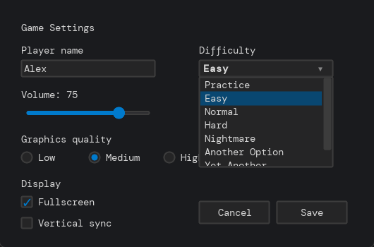
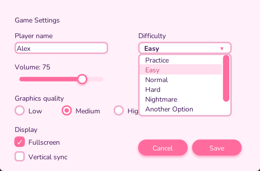
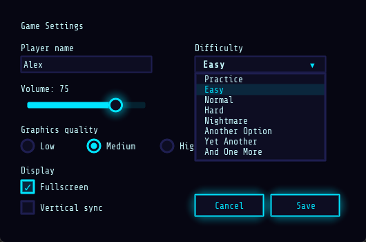
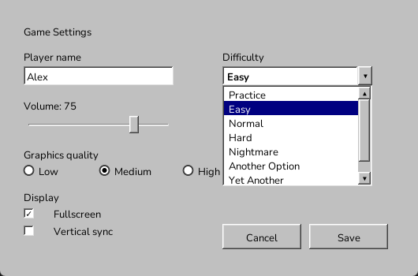
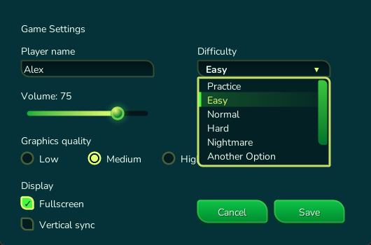
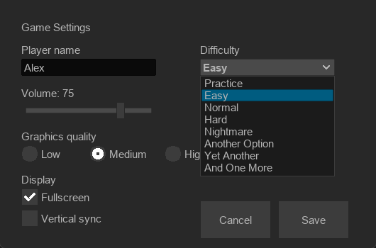
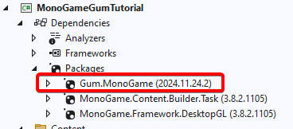

# Setup

Gum Forms gives you a full set of UI controls in code, and a single line restyles **every** control with a built-in theme — so your game's UI can look like any of these without changing a line of control code:

<table><thead><tr><th align="center">DarkPro</th><th align="center">Bubblegum</th><th align="center">Neon</th></tr></thead><tbody><tr><td></td><td></td><td></td></tr></tbody></table>

<table><thead><tr><th align="center">Retro 95</th><th align="center">Forest Glade</th><th align="center">Editor</th></tr></thead><tbody><tr><td></td><td></td><td></td></tr></tbody></table>

This tutorial uses Gum's default visuals to keep the dependency footprint minimal, but you can drop in any of the themes above (or author your own) with one `Apply` call. See the [Themes reference](../../../styling/themes/README.md) for the full gallery and usage.

## Introduction

This tutorial walks you through turning an empty MonoGame, Raylib, or Silk.NET project into a code-only Gum project, which acts as a starting point for the rest of the tutorials.

This tutorial covers:

* Adding Gum NuGet packages
* Adding the code to initialize, update, and draw Gum
* Adding your first Gum control (Button)

Everything after you have a root container is identical across MonoGame, Raylib, and Silk.NET. The only part that differs is the host application skeleton on this Setup page — once Gum is initialized, the rest of the tutorial series is fully shared.

## Adding Gum NuGet Packages

Before writing any code, add the Gum NuGet package for your platform.



Add the `Gum.MonoGame` package to your game. For more information see the [MonoGame/KNI/FNA setup page](../../setup/adding-initializing-gum/monogame-kni-fna/README.md).

Once you are finished, your game project should reference the `Gum.MonoGame` package.

<figure><figcaption><p>Gum.MonoGame NuGet package</p></figcaption></figure>



Add the `Gum.raylib` package to your game ([https://www.nuget.org/packages/Gum.raylib](https://www.nuget.org/packages/Gum.raylib)). For more information see the [raylib setup page](../../setup/adding-initializing-gum/raylib-raylib-cs.md).

Modify csproj:

```xml
<PackageReference Include="Gum.raylib" />
```

Or add through the command line:

```bash
dotnet add package Gum.raylib
```



Add the `Gum.SilkNet` package to your game ([https://www.nuget.org/packages/Gum.SilkNet](https://www.nuget.org/packages/Gum.SilkNet)). For more information see the [Silk.NET setup page](../../setup/adding-initializing-gum/silk.net.md).

Modify csproj:

```xml
<PackageReference Include="Gum.SilkNet" />
```

Or add through the command line:

```bash
dotnet add package Gum.SilkNet
```



## Adding Gum to Your Game

Gum requires a few lines of code to get started. The host application skeleton differs by platform — MonoGame uses a `Game` subclass whose `Initialize`/`Update`/`Draw` methods the framework calls for you, Raylib uses a `Program.Main` with a game loop you own, and Silk.NET uses a `Program.Main` that creates its own window and hands Gum an `SKCanvas`/`IInputContext` pair. The Gum calls themselves follow the same shape on every backend: initialize once, then update and draw each frame.

A simplified host with the required calls would look like the following code:



```csharp
using Microsoft.Xna.Framework;
using Gum;
using Gum.Forms;
using Gum.Forms.Controls;

namespace MyGumProject;

public class Game1 : Game
{
    private GraphicsDeviceManager _graphics;

    GumService GumUI => GumService.Default;

    public Game1()
    {
        _graphics = new GraphicsDeviceManager(this);
        Content.RootDirectory = "Content";
        IsMouseVisible = true;
    }

    protected override void Initialize()
    {
        GumUI.Initialize(this);

        var mainPanel = new StackPanel();
        mainPanel.AddToRoot();

        base.Initialize();
    }

    protected override void Update(GameTime gameTime)
    {
        GumUI.Update(gameTime);
        base.Update(gameTime);
    }

    protected override void Draw(GameTime gameTime)
    {
        GraphicsDevice.Clear(Color.CornflowerBlue);
        GumUI.Draw();
        base.Draw(gameTime);
    }
}
```



```csharp
using Gum;
using Gum.Forms;
using Gum.Forms.Controls;
using Raylib_cs;

namespace MyGumProject;

public class Program
{
    static GumService GumUI => GumService.Default;

    // STAThread is required if you deploy using NativeAOT on Windows - See https://github.com/raylib-cs/raylib-cs/issues/301
    [STAThread]
    public static void Main()
    {
        const int screenWidth = 800;
        const int screenHeight = 450;

        Raylib.InitWindow(screenWidth, screenHeight, "Gum Sample");
        Raylib.SetTargetFPS(60);

        // This tells Gum to use the entire screen
        GumUI.CanvasWidth = screenWidth;
        GumUI.CanvasHeight = screenHeight;

        GumUI.Initialize();

        var mainPanel = new StackPanel();
        mainPanel.AddToRoot();

        while (!Raylib.WindowShouldClose())
        {
            // Update game/UI state first, then render it.
            GumUI.Update(Raylib.GetTime());

            Raylib.BeginDrawing();
            Raylib.ClearBackground(Raylib_cs.Color.SkyBlue);
            GumUI.Draw();
            Raylib.EndDrawing();
        }
        Raylib.CloseWindow();
    }
}
```



The code above includes the following sections:

* Initialize - the initialization code prepares Gum for use. It must be called one time for every Gum project. Once Gum is initialized, we can create controls such as the `StackPanel` which contains all other controls. By calling `AddToRoot`, the `mainPanel` is drawn and receives input. All items added to the `StackPanel` will also be drawn and receive input, so we only need to call `AddToRoot` on the `StackPanel`.

```csharp
// Initialize
var mainPanel = new StackPanel();
mainPanel.AddToRoot();
```

* Update - this updates the internal keyboard, mouse, and gamepad instances and applies default behavior to any forms components. For example, if a `Button` is added to the `StackPanel`, this code is responsible for checking if the cursor is overlapping the `Button` and adjusting the highlight/pressed state appropriately.

* Draw - this draws all Gum objects to the screen. This does not yet perform any drawing since `StackPanels` are invisible, but we'll be adding controls later in this tutorial.

We can run our project to see a blank screen filled with the clear color.

<figure><figcaption><p>Empty project</p></figcaption></figure>

### Adding Controls

Now that we have Gum running, we can add controls to our `StackPanel` (`mainPanel`). The following code adds a `Button` which responds to being clicked by modifying its `Text` property. Add it right after `mainPanel` is created:

```csharp
// Initialize
// Creates a button instance
var button = new Button();
// Adds the button as a child so that it is drawn and has its
// events raised
mainPanel.AddChild(button);
// Initial button text before being clicked
button.Text = "Click Me";
// Makes the button wider so the text fits
button.Width = 350;
// Click event can be handled with a lambda
button.Click += (_, _) =>
    button.Text = $"Clicked at {System.DateTime.Now}";
```

[Try on XnaFiddle.NET](https://xnafiddle.net/#snippet=H4sIAAAAAAAAA12NSwvCMBCE_8oSPFSQUBQvSg--EA-KaNGLINEsdGmagN34xP9uH6LibWfmm9mHmOVTn4kenzy2BFliUobuKHrirE6QKbJLZdFABBYvsGZ1TCsjaPZ39hPLDeVeGTnQOnYr57iKy4WDZ3b2XR9W4q9adEYJGR3UaBnWl4zxykVz58Ow3R4ZOqYwx1p9oS1pTgqq0w2_Zg1X6DCCYN-CfROiUncm__ONn33UoBge61vOmMmxYowpQ7lwl-f7r3i-AEs5ZmU0AQAA)

<figure><figcaption></figcaption></figure>

## Conclusion

Now that we have a basic project set up with a single `Button`. The next tutorial covers the most common forms controls.
