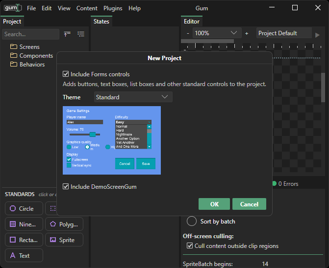
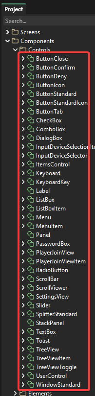

# Setup

## Introduction

This tutorial walks you through creating a brand new Gum project and adding it to an existing MonoGame project.

This tutorial covers:

* Adding Gum NuGet packages
* Creating a new Gum project using the Gum tool
* Modifying the game .csproj to include all Gum files
* Adding Forms Components
* Loading the Gum project in your game

This tutorial presents the minimum amount of code necessary to work with Gum. You may need to adapt the code to fit in your game project.


This tutorial is written for MonoGame, KNI, and FNA. If you are using Unity, the `.csproj` and `Game` class steps do not apply. Follow the [Unity setup page](../../setup/adding-initializing-gum/unity.md) instead, including its **Loading a Gum Project** section, then return to the [code-only tutorial](../code-only-gum-forms-tutorial/) for working with controls in code.


## Adding Gum NuGet Packages

Before writing any code, we must add the Gum NuGet/UPM package. Add the packages to your game according to your project type. For setup instructions, see [Adding/Initializing Gum](../../setup/adding-initializing-gum/).

Once you are finished, your game project should reference the appropriate NuGet/UPM packages.

## Deciding on the Location of Your Gum Project

Before we create a Gum project, we need to decide where the project should be saved. The location depends on the runtime or game engine you are using. For example, MonoGame, KNI, and FNA projects usually save it inside the `Content` folder, while raylib projects use a `resources` folder. See [Loading a Gum Project](../../setup/loading-a-gum-project-.gumx.md) for the recommended location for each platform.

Whichever location you choose, create a new empty folder for the project, such as `GumProject`. Gum creates many files, so keeping them in a dedicated folder keeps them separate from your other content.

## Creating a new Gum Project

Next we'll create a project in the Gum UI tool. If you have not yet run the Gum tool, you can get setup instructions in the Gum [Setup page](../../../../gum-tool/setup/).

Once you have the tool downloaded, run it. You should have an empty project. If this is the first time you are running Gum, you will be prompted to save a Gum project. If you have run Gum before, you will need to select File->New to bring up the new project options.

Later tutorials reference the demo screen, so check the **Include DemoScreenGum** option and click **OK**. Don't worry, you can delete this screen later as you develop your game.

<figure><figcaption><p>New Project Window</p></figcaption></figure>

Leave the defaults, and click the OK button. These defaults add the Forms controls - the common controls that most projects need like Buttons and TextBoxes.

After you click OK, Gum asks where you would like to save your proejct. The project should be saved in the location decided earlier. Make sure to create a new folder for your Gum project, otherwise Gum's files will mix with other files in your content folder, making management and portability more difficult. For example, if you are using MonoGame, you may want to save your project in a subfolder of your game's Content folder.

<figure><figcaption><p>GumProject folder in Visual Studio</p></figcaption></figure>

Give your Gum project a name such as GumProject.

<figure><figcaption><p>Save GumProject in the newly-created GumProject folder</p></figcaption></figure>

After your project is saved it should appear in Visual Studio.

<figure><figcaption><p>Gum project in Visual Studio</p></figcaption></figure>

Your project now includes Forms components.

<figure><figcaption><p>Forms Components in Gum</p></figcaption></figure>

## Modifying the Game .csproj

Now that we have our Gum project created, we can load it in our game.



First, we'll set up our project so all Gum files are copied when the project is built. To do this:

1. Right-click on any Gum file in your project, such as GumProject.gumj
2.  Select the Properties item\\

    <figure><figcaption><p>Properties right click option</p></figcaption></figure>
3.  Set the file to Copy if Newer. If using Android, see instructions below.\\

    <figure><figcaption><p>Mark the Gum file as Copy if newer</p></figcaption></figure>
4.  Double click your game's csproj file to open it in the text editor and find the entry for the file that you marked as Copy if newer.\\

    <figure><figcaption><p>Entry for GumProject.gumj in the csproj file.</p></figcaption></figure>
5.  Modify the code to use a wildcard for all files in the Gum project. In other words, change `Content\GumProject\GumProject.gumj` to `Content\GumProject\**\*.*`\\

    <figure><figcaption><p>Wildcard entry for all files in the GumProject folder</p></figcaption></figure>

    Now all files in your Gum project will be copied to the output folder whenever your project is built, including any files added later as you continue working in Gum.\\

    <figure><figcaption><p>All Gum files automatically are marked as Copy if newer.</p></figcaption></figure>



First, we'll set up our project so all Gum files are copied when the project is built. To do this:

1. Open your game's .cproj in Visual Studio Code to edit the text
2. Find an ItemGroup where you are loading other content. If you do not have one, you can create a new one (see below).
3. Add an entry to copy all Gum files to the output directory. Use wildcards to include all Gum files including the main Gum project, Screens, Components, Standard Elements, fonts, and any other referenced files.

For example, you may add something like this to your .csproj:

```xml
<ItemGroup>
    <None Update="Content\GumProject\**\*.*">
        <CopyToOutputDirectory>PreserveNewest</CopyToOutputDirectory>
    </None>
</ItemGroup>
```

Notice that the folder includes the root of the Gum folder. You may need to adjust this path according to where your .gumj is located.




At the time of this writing, Gum does not use the MonoGame Content Builder to build XNBs for any of its files. This means that referenced image files (.png) will also be copied to the output folder.

As you build your Gum project it's best to keep all referenced PNGs inside your Gum folder to keep it portable.

Future versions may be expanded to support using either the .XNB file format or _raw_ PNGs.


### Android

If you are using Android, then your files must be marked as Android Assets rather than copied files.

The steps to do this are:

1. Open your project file
2. Find the entry for the Gum project if you followed the previous section which copies file using wildcard
3. Change it to an Android Asset. For example your code might look like this:

```xml
<AndroidAsset Include="Content\GumProject\**\*.*" />
```

## Loading the Gum Project

Now that we have a Gum project added to the .csproj, we can load the Gum project. We need to add code to Initialize, Update, and Draw. A simplified Game class with these calls would look like the following code:



```csharp
using Gum;

public class Game1 : Game
{
    private GraphicsDeviceManager _graphics;
    GumService GumUI => GumService.Default;
    
    public Game1()
    {
        _graphics = new GraphicsDeviceManager(this);
        Content.RootDirectory = "Content";
        IsMouseVisible = true;
    }

    protected override void Initialize()
    {
        var gumProject = GumUI.Initialize(this,
            // This is relative to Content:
            "GumProject/GumProject.gumj");

        base.Initialize();
    }

    protected override void Update(GameTime gameTime)
    {
        GumUI.Update(gameTime);
        base.Update(gameTime);
    }

    protected override void Draw(GameTime gameTime)
    {
        GraphicsDevice.Clear(Color.CornflowerBlue);
        GumUI.Draw();
        base.Draw(gameTime);
    }
}
```



```diff
using Gum;

public class Game1 : Game
{
    private GraphicsDeviceManager _graphics;
+    GumService GumUI => GumService.Default;
    
    public Game1()
    {
        _graphics = new GraphicsDeviceManager(this);
        Content.RootDirectory = "Content";
        IsMouseVisible = true;
    }

    protected override void Initialize()
    {
+        var gumProject = GumUI.Initialize(this,
+            // This is relative to Content:
+            "GumProject/GumProject.gumj");

        base.Initialize();
    }

    protected override void Update(GameTime gameTime)
    {
+        GumUI.Update(gameTime);
        base.Update(gameTime);
    }

    protected override void Draw(GameTime gameTime)
    {
        GraphicsDevice.Clear(Color.CornflowerBlue);
+        GumUI.Draw();
        base.Draw(gameTime);
    }
}
```



The code above has the following three calls on Gum:

* Initialize - this loads the argument Gum project and sets appropriate defaults. Note that we are loading a Gum project here, but the gum project is optional. Projects which are using Gum only in code would not pass the second parameter.

```csharp
// Initialize
var gumProject = GumUI.Initialize(this,
    // This is relative to Content:
    "GumProject/GumProject.gumj");
```

* Update - this updates the internal keyboard, mouse, and gamepad instances and applies default behavior to any components which implement Forms. For example, if a Button is added to the Screen, this code is responsible for checking if the cursor is overlapping the Button and adjusting the highlight/pressed state appropriately.

```csharp
// Update
GumUI.Update(gameTime);
```

* Draw - this method draws all Gum objects to the screen. Currently this method does not perform any drawing, but in the next tutorial we'll be adding a Gum screen which is drawn in this method.

```csharp
// Draw
GumUI.Draw();
```

## Conclusion

If you've followed along, your project is now a fully-functional Gum project. We haven't added any screens to the Gum project yet, so if you run the game you'll still see a blank (cornflower blue) screen.

<figure><figcaption><p>Empty MonoGame project</p></figcaption></figure>

The next tutorial adds our first screen.
