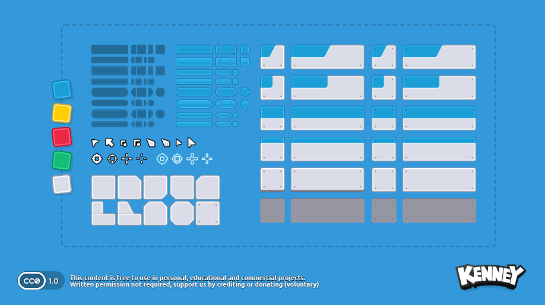

# NineSliceRuntime

### Introduction

The NineSliceRuntime object is used to draw a visual object which references a Texture2D, but which does not stretch the corner pieces of a texture, and which only stretches the edges between the corners along their axis. In other words, the NineSlice (sometimes also referred to as a sprite frame) is used to draw frames in UI which can stretch without introducing visual artifacts.

For more information about the NineSlice type, see the [NineSlice page](../../gum-tool/gum-elements/nineslice/).

### Code Example

The following code can be used to instantiate a NineSliceRuntime which uses a Texture (png file) named Frame.png.


**NOTE:** The Frame.png file must have the `Copy to Output Directory` set to either `Copy always` or `Copy if newer`.  Otherwise you will get an error: System.IO.IOException 'Could not get the stream for the file C:\path\to\file\Frame.png'


```csharp
var nineSlice = new NineSliceRuntime();
nineSlice.SourceFileName = "Frame.png";
nineSlice.Width = 256;
nineSlice.Height = 48;
container.Children.Add(nineSlice);
```

<figure><figcaption><p>NineSlice using Frame.png</p></figcaption></figure>

### Assigning NineSlice Texture

NineSlice textures can be assigned using a string property or Texture2D instance. When assigning using a string, the `ToolsUtilities.FileManager.RelativeDirectory` is used to determine the file's directory.

For example, consider a file called Frame.png which is located in the Content directory:

<figure><figcaption><p>Frame.png in Content</p></figcaption></figure>

This file can be used as a texture by assigning the RelativeDirectory and then loading Frame.png. Note that RelativeDirectory is usually set to Content, or to the location of the .gumx file.

```csharp
ToolsUtilities.FileManager.RelativeDirectory = "Content";
nineSlice.SourceFileName = "Frame.png";
```

Alternatively, a Texture2D can be assigned directly

```csharp
// assuming MyTexture is a valid Texture2D
nineSlice.Texture = MyTexture;
```

Once a SourceFileName is assigned, the Texture property references a valid Texture2D which can be reused.

```csharp
// assigning SourceFileName results in Texture also being set
firstNineSlice.SourceFileName = "Frame.png";
secondNineSlice.Texture = firstNineSlice.Texture;
```

### TextureAddressMode and Texture Coordinates

By default a NineSlice uses it entire texture. This can be customized using texture coordinate and TextureAddress properties.

For example, consider drawing a portion of the following texture:

<figure><figcaption><p>Kenney sprite sheet</p></figcaption></figure>

We can obtain a portion of this texture by assigning the coordinate values. Before doing so, find the coordinates of the area you would like to draw. For example, we can use Paint.NET to find the coordinates of a frame in the image.

<figure><figcaption></figcaption></figure>

We can use these values to set `TextureLeft`, `TextureTop`, `TextureWidth`, and `TextureHeight` values as shown in the following code:

```csharp
nineSlice.TextureAddress = Gum.Managers.TextureAddress.Custom;
nineSlice.TextureLeft = 438;
nineSlice.TextureTop = 231;
nineSlice.TextureWidth = 41;
nineSlice.TextureHeight = 42;
```

<figure><figcaption><p>Portion of texture drawn by a NineSlice</p></figcaption></figure>

Note that if TextureAddress isn't set to Custom, then the four coordinate values are ignored and the entire texture is used.
