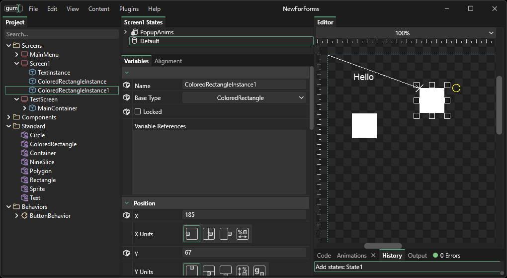

# InstanceSave

## Introduction

An InstanceSave represents an instance in Gum. InstanceSave only stores two pieces of information:

1. The name of the instance
2. The base type of the instance

All InstanceSaves in Gum will be contained in an ElementSave. Information about the InstanceSave's variables (such as its position or size) is not stored directly on the InstanceSave. The reason for this is because InstanceSaves have variables which depend on States. In other words, an InstanceSave may be at X=0 in one state, and at X=100 in another state.

Therefore, all variables values that define the InstanceSave are stored in states within the InstanceSave's container ElementSave.

## Example

In this pic the Screen1 ScreenSave has 3 InstanceSaves: 1. TextInstance 1. ColoredRectangleInstance 1. ColoredRectangleInstance1



## Simple variable access

The following code shows how to access the X value of an ElementSave as defined in the default state of its container.

```csharp
var container = SelectedState.Self.SelectedScreen;
// This code gets an instance by the name "Title"
var instance = container.Instances.FirstOrDefault(item=>item.Name == "Title");

var defaultState = container.DefaultState;

// We'll assume that "instance" is valid, and get its X value:
var xVariable = defaultState.Variables.FirstOrDefault(item=>item.Name == "Title.X");
float xValue = 0;
if(xVariable != null)
{
   xValue = (float)xVariable.Value;
}
```
