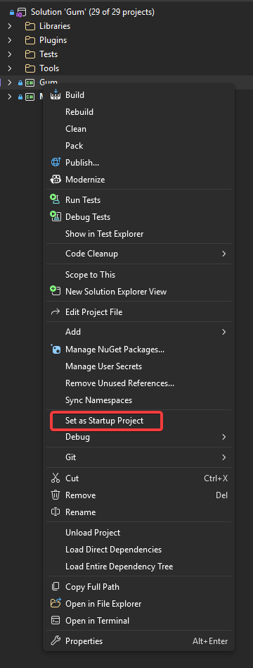

# Localization

## Introduction

Gum supports localization using CSV and RESX files. Localization can be performed automatically by linking a localization file in your Gum project, or it can be done by hand in code-only projects. This document explains how to use the `LocalizationManager` to perform localization.

## Localization in Gum Projects (Using the Gum UI Tool)

If you are using the Gum UI Tool to create your project, you can add and test localization in the tool itself. For information on how to set up localization in the Gum UI tool, see the [Localization page](../gum-tool/localization.md).

Once you have a project set up with localization, the only code change needed is to specify the language index. Keep in mind that index 0 is the string IDs, so if this value is unchanged then your game will display the string IDs.

For example, the following is a screenshot from the Gum UI tool:

<figure><figcaption><p>Screen displaying string IDs</p></figcaption></figure>

At runtime the string IDs are displayed by default:

<figure><figcaption><p>Screen displaying string IDs</p></figcaption></figure>

We can select our string IDs before creating our screen:



```csharp
protected override void Initialize()
{
    var project = GumUI.Initialize(this, "GumProject/GumProject.gumx");

    // set the language index before instantiating a screen or component:
    GumUI.LocalizationService.CurrentLanguage = 1;
    
    var screen = new MainMenu();
    screen.AddToRoot();

    base.Initialize();
}
```



```csharp
protected override void Initialize()
{
    var project = GumUI.Initialize(this, "GumProject/GumProject.gumx");

    // set the language index before calling ToGraphicalUiElement:
    GumUI.LocalizationService.CurrentLanguage = 1;

    var screen = project.Screens.First().ToGraphicalUiElement();
    screen.AddToRoot();

    base.Initialize();
}
```



<figure><figcaption><p>Screen with localization</p></figcaption></figure>

## Localization in a Code-Only Project

Code-only projects can use the `LocalizationManager` to enable localization. The steps for localization are:

1. Create a localization CSV or RESX files
2. Add these files to your project in such a way as to obtain a stream to them
3. Call the appropriate method for loading these files
4. Set the language index
5. Assign Text to a string ID

### Code Example: Loading from CSV

This example uses a CSV file with the following contents:

```csv
String ID,English,Spanish
T_OK,OK,OK
T_Cancel,Cancel,Cancelar
T_Submit,Submit,Entregar
T_Greeting,"Welcome, this is a localized project example","Bienvenido, este es un ejemplo de proyecto localizado."

```

```csharp
using Gum.Localization; // for extension methods
// ...
protected override void Initialize()
{
    //var project = GumUI.Initialize(this, "GumProject/GumProject.gumx");
    GumUI.Initialize(this, Gum.Forms.DefaultVisualsVersion.Newest);

    var localizationService = GumUI.LocalizationService;

    // obtain a stream to your localization data
    using var stream = System.IO.File.OpenRead("Content/LocalizationDB.csv");
    localizationService.AddCsvDatabase(stream);

    // set the language index before creating your UI:
    localizationService.CurrentLanguage = 2;

    // create UI using the string IDs:
    StackPanel panel = new();
    panel.AddToRoot();
    panel.Anchor(Anchor.Center);

    Label label = new();
    panel.AddChild(label);
    label.Text = "T_Greeting";

    Button okButton = new();
    panel.AddChild(okButton);
    okButton.Text = "T_OK";

    Button cancelButton = new();
    panel.AddChild(cancelButton);
    cancelButton.Text = "T_Cancel";
}
```

<figure><figcaption><p>Label and Buttons displaying localized UI</p></figcaption></figure>
