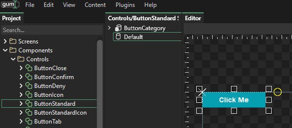
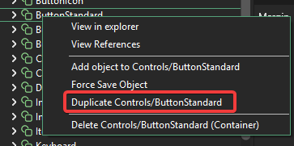

# Control Customization in Gum Tool

## Introduction

Gum Forms controls can be fully customized in Gum. Customization using the Gum tool allows immediate previewing of states.


As of April 2025 Gum Forms is undergoing a change which will simplify how styling is performed. This document is kept here for while the next version of Gum is being built.

If you would like to try the new styling, see the latest preview release on Github and read through the new [Gum Project Forms Tutorial](../tutorials/gum-project-forms-tutorial/).


## Setup

Before customizing controls you should add the default set of forms components to your project. You can check if these components exist by looking in the Components folder.

<figure><figcaption>
Forms Components in Gum
</figcaption></figure>

If you do not have these components you can add them by clicking Content -> Add Forms Components

<figure><figcaption>
Add Forms Components if you do not already have them
</figcaption></figure>

## Creating New Variants

Your game may require multiple types of common components. For example, you may need to have buttons which show different colors depending on their use.

Any component can be copied and modified without changing the original.

First we can create a duplicate of an existing component:

1.  Select the button component you would like to copy. For example select Controls/ButtonStandard\\

    <figure><figcaption>
ButtonStandard in Gum
</figcaption></figure>
2.  Duplicate the component by right-clicking and selecting the Duplicate item\\

    <figure><figcaption>
Right-click duplicate item
</figcaption></figure>
3.  Enter a new name for the component, such as OrangeButton\\

    <figure><figcaption>
Enter component name
</figcaption></figure>

Now we can modify the newly-created component. Most customizations are allowed, but keep in mind that ultimately the component's states are used when your game runs to reflect the control's actions such as being clicked.

To make the button appear orange, we need to modify each of the button's states. We can do this by first selecting the instance in the button that we would like to modify. Then we need to modify the instance in every state.

Keep in mind that your component may already have variables associated with each of the states, so you may want to remove the existing variables first so that they do not conflict with the changs you are about to make. You can do this by selecting the category and pressing the X button next to all variables.

<figure><figcaption></figcaption></figure>

Once all variables have been removed, we can add the changes we want for each state. Select OrangeButton's BackgroundInstance. With this instance selected, select the Enabled state. Change the BackgroundInstance's color with this state selected to change the default appearance of the button.

<figure><figcaption>
Change the Background to orange in the Enabled state
</figcaption></figure>

Repeat these steps for each of the states, adjusting the color as desired. Also, be sure to modify the default state for the button. This state does not get used at runtime, but it gets used in the Gum tool. This state should probably be the same as your Enabled state, so set the backgrould color to the same values.

After you are finished, you can use this new component in any other screen or component.

<figure><figcaption>
Standard and orange button in a screen called GameScreen
</figcaption></figure>
