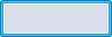

# Control Customization In Code

## Introduction

Gum Forms provide fully functional controls with minimal setup. These controls can be restyled in code through their Visual property.


Gum NuGet packages 2025.7.14.1 and later introduce Version 2 Gum controls which make styling simpler. This documentation has been updated to use Version 2, and all new projects should use Version 2.


## States vs Direct Property Assignments

To customize a component, either the instances can be modified directly, such as directly changing a Text's color), or a variable can be modified through a state, such as changing a background color when the button is highlighted.

Whether you use a direct property assignment or whether you use a state depends on whether the variable should always be applied or whether it should only be applied depending on the actions the user has taken and other UI related properties like enabled/disabled.

This document covers both approaches.


Note that all code in this document assumes that Gum Forms has already been initialized. For more information on setting up a code-only Gum Forms project, see the [Code-Only Setup Tutorial](../../tutorials/code-only-gum-forms-tutorial/setup.md).


## Accessing Strongly Typed Visuals

By default every control type has a strongly-typed visual for customizing its appearance. These types provide access to the visual instances on controls (such as the Text in a Button) as well as the states within a Button (such as the Disabled state).

This document uses strongly-typed visuals wherever possible. Keep in mind that these visuals are only available if all of the following are true:

* Your project is using Version 2 of the visuals. The version is specified in the GumServices.Initialize call.
* Your project has not replaced the default visuals with its own visual type. This topic is discussed later in the document.
* Your project is not using generated code for custom visuals, such as ButtonStandard.&#x20;

Every type of control has a corresponding visual, where the name "Visual" is appended to the control type. For example, the following code shows how to obtain the Visual from a Button instance:

```csharp
using MonoGameGum.Forms.DefaultVisuals;
//...
var button = new Button();
var buttonVisual = (ButtonVisual)button.Visual;
```

## Directly Setting an Instance's Values

Values can be directly assigned visuals. If the variable being assigned does not change in response to user interaction or in response to the control being disabled, the variable can be directly assigned instead of using states.

For example, we can increase the size of a button's Text by changing its FontScale property as shown in the following code:

<pre class="language-csharp"><code class="lang-csharp">var customizedButton = new Button();
customizedButton.AddToRoot();
<strong>var buttonVisual = (ButtonVisual)customizedButton.Visual;
</strong><strong>buttonVisual.TextInstance.FontScale = 2;
</strong></code></pre>

<figure><figcaption></figcaption></figure>

The code above access the TextInstance visual which is of type TextRuntime. Components, such as Button, are ultimately made out of the following visual types:

* [CircleRuntime](../../../gum-code-reference/circleruntime.md)
* [ColoredRectangleRuntime](../../../gum-code-reference/coloredrectangleruntime.md)
* [ContainerRuntime](../../../gum-code-reference/containerruntime.md)
* [NineSliceRuntime](../../../gum-code-reference/ninesliceruntime.md)
* [RectangleRuntime](../../../gum-code-reference/rectangleruntime.md)
* [SpriteRuntime](../../../gum-code-reference/spriteruntime/)
* [TextRuntime](../../../gum-code-reference/textruntime/)

For information on working with the individual visual types, click the links in the list above.

## Identifying State vs Direct Assignment Variables

As mentioned above, some properties react to a state being set. For example, a button changes the color of its text in response to being hovered over and clicked. We can see this by modifying our button to change the text to purple. The text color remains purple until the user interacts with the button.

<pre class="language-csharp"><code class="lang-csharp">var customizedButton = new Button();
customizedButton.AddToRoot();
var buttonVisual = (ButtonVisual)customizedButton.Visual;
<strong>buttonVisual.TextInstance.Color = Color.Purple;
</strong></code></pre>

<figure><figcaption></figcaption></figure>

This behavior happens because the Text's color value reacts to whether the button is hovered, clicked, or disabled. This means that the `TextInstance.Color` variable is _owned_ by states.

Each control type has its own states, but most controls share common states. All states can be accessed through the visual's `States` property. For example, to access the Enabled state to change the text color, the following code could be used:

<pre class="language-csharp"><code class="lang-csharp">var customizedButton = new Button();
customizedButton.AddToRoot();
var buttonVisual = (ButtonVisual)customizedButton.Visual;
<strong>var enabledState = buttonVisual.States.Enabled;
</strong><strong>enabledState.SetValue("TextInstance.Color", Color.Purple);
</strong><strong>// This forces the state to apply immediately:
</strong><strong>customizedButton.UpdateState();
</strong></code></pre>

Now the TextInstance has its Color set whenever the Enabled state is applied, including whenever the mouse leaves the Button boundaries.

<figure><figcaption></figcaption></figure>

## Removing Variables from States

The code above shows how to modify a variable on a state. In some cases it may be easier to reset all states and build them up one by one. For example, the following code resets all states:

<pre class="language-csharp"><code class="lang-csharp">var customizedButton = new Button();
customizedButton.AddToRoot();
var buttonVisual = (ButtonVisual)customizedButton.Visual;
<strong>buttonVisual.ButtonCategory.ResetAllStates();
</strong></code></pre>

After states are cleared, the button does not react visually to any interaction.

<figure><figcaption></figcaption></figure>

Keep in mind that despite the visuals not reacting to hovers or clicks, the Button is still fully functional.

<pre class="language-csharp"><code class="lang-csharp">var customizedButton = new Button();
customizedButton.AddToRoot();
<strong>customizedButton.Click += (_, _) =>
</strong><strong>    customizedButton.Text = "Clicked!";
</strong>var buttonVisual = (ButtonVisual)customizedButton.Visual;
buttonVisual.ButtonCategory.ResetAllStates();
</code></pre>

<figure><figcaption></figcaption></figure>

States can be reset and then modified after the clear to fully customize a button. For example, the following code changes the background color when the button is hovered and pushed:

<pre class="language-csharp"><code class="lang-csharp">var customizedButton = new Button();
customizedButton.AddToRoot();
var buttonVisual = (ButtonVisual)customizedButton.Visual;

buttonVisual.ButtonCategory.ResetAllStates();

<strong>buttonVisual.States.Enabled.SetValue(
</strong><strong>    "Background.Color", Color.Orange);
</strong><strong>buttonVisual.States.Highlighted.SetValue(
</strong><strong>    "Background.Color", Color.Yellow);
</strong><strong>buttonVisual.States.Pushed.SetValue(
</strong><strong>    "Background.Color", Color.Red);
</strong><strong>customizedButton.UpdateState();
</strong>
</code></pre>

<figure><figcaption></figcaption></figure>

## Accessing Children Instances

Some Forms components contain other Forms components. For example, the ListBox component contains a scroll bar named VerticalScrollBar, which itself contains a button named UpButtonInstance. These children can be accessed through the ListBox instance. Since each of these are themselves Forms controls, they also provide access to their respective visuals.

For example, the following code modifies the UpButtonInstance to be pink when enabled:

```csharp
var listBox = new ListBox();
listBox.AddToRoot();
// so the ScrollBar shows even if items
// haven't yet been added:
listBox.VerticalScrollBarVisibility = ScrollBarVisibility.Visible;
var upButton = listBox.VerticalScrollBar.UpButton;
var upButtonVisual = (ButtonVisual)upButton.Visual;
upButtonVisual.States.Enabled.SetValue(
    "Background.Color", Color.Pink);
upButton.UpdateState();
```

<figure><figcaption></figcaption></figure>

## Global Styles

Styling can also be modified globally through the Styling class. The Styling class needs to be modified before controls are created. For example, the following code sets the three primary colors to red colors:

```csharp
Styling.ActiveStyle.Colors.Primary = Color.Red;
Styling.ActiveStyle.Colors.PrimaryLight = new Color(255, 100, 100);
Styling.ActiveStyle.Colors.PrimaryDark = new Color(150, 0, 0);

var panel = new StackPanel();
panel.Spacing = 3;
panel.AddToRoot();

var listBox = new ListBox();
panel.AddChild(listBox);
listBox.VerticalScrollBarVisibility = ScrollBarVisibility.Visible;

var button = new Button();
panel.AddChild(button);

var checkBox = new CheckBox();
panel.AddChild(checkBox);

var radioButton = new RadioButton();
panel.AddChild(radioButton);
```

<figure><figcaption></figcaption></figure>

All colors used by the default controls come from the the Styling object unless these values are changed explicitly as shown in the sections above.

## Customizing Backgrounds

Aside from colors, many of the borders styles can be modified. For example, the Button's Background uses the Bordered state.

This can be changed per instance as shown in the following code:

```csharp
Styling.ActiveStyle.Colors.Primary = Color.Red;
Styling.ActiveStyle.Colors.PrimaryLight = new Color(255, 100, 100);
Styling.ActiveStyle.Colors.PrimaryDark = new Color(150, 0, 0);

var panel = new StackPanel();
panel.Spacing = 3;
panel.AddToRoot();

var button1 = new Button();
panel.AddChild(button1);
var button1Visual = (ButtonVisual)button1.Visual;
button1Visual.Background.ApplyState(Styling.ActiveStyle.NineSlice.Outlined);

var button2 = new Button();
panel.AddChild(button2);
var button2Visual = (ButtonVisual)button2.Visual;
button2Visual.Background.ApplyState(Styling.ActiveStyle.NineSlice.BracketHorizontal);

var defaultButton = new Button();
panel.AddChild(defaultButton);
```

<figure><figcaption></figcaption></figure>

Background visuals can also be explicitly assigned to use custom visuals. For example, we can use the following custom image:

<figure><figcaption></figcaption></figure>

To use this image:

1. Save the image to your project so that it can be used in your project
   1. If your game is using the Content Pipeline, add the png to your content pipeline
   2. If your game is loading from-file, save the file so that it is copied to your output folder
2. Load the file in a Texture2D
3. Set your button's Background properties to use the loaded Texture2D as shown in the following code:

```csharp
var button = new Button();
button.AddToRoot();
var buttonVisual = (ButtonVisual)button.Visual;
var background = buttonVisual.Background;
background.Texture = YourLoadedTexture;
background.TextureAddress = TextureAddress.EntireTexture;

// reset all states
buttonVisual.ButtonCategory.ResetAllStates();

buttonVisual.States.Enabled.SetValue("Background.Color", Color.White);
buttonVisual.States.Highlighted.SetValue("Background.Color", Color.White);
buttonVisual.States.Pushed.SetValue("Background.Color", Color.Gray);
button.UpdateState();
```

<figure><figcaption></figcaption></figure>

Alternatively, you may want to use a sprite sheet texture (texture that has multiple individual parts). In this case, you can customize the coordinates by using custom texture address, as shown in the following code:

```csharp
background.Texture = YourLoadedTexture;
// This tells the NineSlice to use the assigned texture coordiantes
background.TextureAddress = Gum.Managers.TextureAddress.Custom;
// This is in pixels
background.TextureLeft = 438;
background.TextureTop = 231;
background.TextureWidth = 41;
background.TextureHeight = 42;
```

For more information on working with NineSliceRuntime (the background type), see the [NineSliceRuntime page](../../../gum-code-reference/ninesliceruntime.md).
