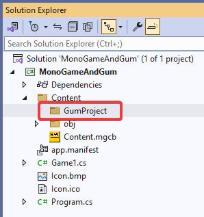
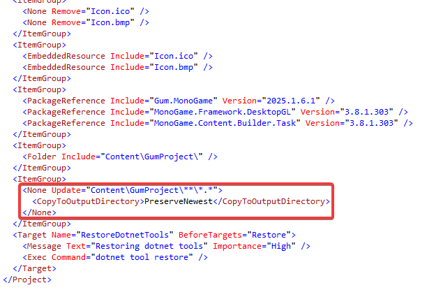
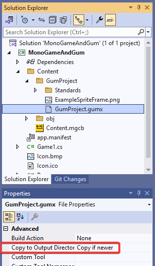

# Loading a Gum Project (Optional)

Gum projects can be loaded in a game project. Gum projects are made up of multiple files including:

* .gumx - the main Gum project
* .gusx - Gum screen files
* .gucx - Gum component files
* .gutx - Gum standard element files
* .png - image files
* .fnt - font files


You are not required to use the Gum tool or .gumx projects - you are free to do everything in code if you prefer. Of course using the Gum tool can make it much easier to iterate quickly and experiment so its use is recommended.


## Creating a Gum Project

Before creating a Gum project, it is recommended that you already have a functional MonoGame. It's best to put your Gum project in a subfolder of the game's Content folder so that it stays organized from the rest of your content files. Remember, Gum creates lots of files.

<figure><figcaption><p>GumProject folder in the game's Content folder</p></figcaption></figure>

If you haven't already downloaded it, you should download the Gum tool. See the [Introduction page](../../#downloading-gum) for information on downloading Gum.

To create a Gum project:

1. Open the Gum tool
2. Select File->New Project
3. Navigate to the Content's subfolder (such as GumProject/) to select a location for the project

## Adding the Gum Project Files to Your .csproj

To add the files to your .csproj:

1. Open your .csproj file in a text editor
2.  Add a line to copy all files in the Gum project folder including the .gumx file itself. For an example, see the .csproj file for the MonoGameGumFromFile project: [https://github.com/vchelaru/Gum/blob/0e266942560e585359f019ac090a6c1010621c0b/Samples/MonoGameGumFromFile/MonoGameGumFromFile/MonoGameGumFromFile.csproj#L37](https://github.com/vchelaru/Gum/blob/0e266942560e585359f019ac090a6c1010621c0b/Samples/MonoGameGumFromFile/MonoGameGumFromFile/MonoGameGumFromFile.csproj#L37)\
    Your .csproj may look like this:

    <figure><figcaption><p>Example of wildcard pattern in .csproj</p></figcaption></figure>
3.  Verify that all gum files (see the extension list above) are marked as Copy if newer in Visual Studio\\

    <figure><figcaption><p>Gum project set to Copy if newer</p></figcaption></figure>

For more information about wildcard support in .csproj files, see this page on how to include wildcards in your .csproj:

[https://learn.microsoft.com/en-us/visualstudio/msbuild/how-to-select-the-files-to-build?view=vs-2022#specify-inputs-with-wildcards](https://learn.microsoft.com/en-us/visualstudio/msbuild/how-to-select-the-files-to-build?view=vs-2022#specify-inputs-with-wildcards)


If you are using the Contentless project ([https://github.com/Ellpeck/Contentless](https://github.com/Ellpeck/Contentless)) , you need to explicitly exclude Gum and all of its files by adding and modifying `Content/Contentless.json` .


#### Android

If you are using Android, then your files must be marked as Android Assets rather than copied files.

The steps to do this are:

1. Open your project file
2. Find the entry for the Gum project if you followed the previous section which copies file using wildcard
3. Change it to an Android Asset. For example your code might look like this:

```xml
<AndroidAsset Include="Content\GumProject\**\*.*" />
```

## Loading a Gum Project

To load a Gum Project:

1. Open Game1.cs
2. Modify the Initialize method it calls Initialize with the name of your .gumx file:

```csharp
protected override void Initialize()
{
    var gumProject = Gum.Initialize(
        this, 
        "GumProject/GumProject.gumx");

    // This assumes that your project has at least 1 screen
    var screenRuntime = gumProject.Screens.First().ToGraphicalUiElement();
    screenRuntime.AddToRoot();
    
    base.Initialize();
}
```

The code above loads the Gum project using the file path `"GumProject/GumProject.gumx"`. By default this path is relative to your game's Content folder. If your Gum project is not part of the Content folder you can still load it by using the "../" prefix to step out of the Content folder. For example, the following code would load a Gum project located at `<exe location>/GumProject/GumProject.gumx`:

```csharp
Gum.Initialize(
    this, "../GumProject/GumProject.gumx");
```

## ToGraphicalUiElement

Once a Gum project is loaded, all of its screens and components can be accessed through the object returned from the Initialize method. The code above stores the project in a variable called `gumProject`. Any screen or component can be converted to a GraphicalUiElement, which is the visual object that displays in game.

The code in the previous section creates a `GraphicalUiElement` from the first screen in the project.

For an example of a Game1.cs file which loads a project file, see the MonoGameGumFromFile: [https://github.com/vchelaru/Gum/blob/0e266942560e585359f019ac090a6c1010621c0b/Samples/MonoGameGumFromFile/MonoGameGumFromFile/Game1.cs#L76-L82](https://github.com/vchelaru/Gum/blob/0e266942560e585359f019ac090a6c1010621c0b/Samples/MonoGameGumFromFile/MonoGameGumFromFile/Game1.cs#L76-L82)

Note that calling ToGraphicalUiElement creates a [GraphicalUiElement](../gum-code-reference/graphicaluielement/) (Gum object) from the first screen. You can access any screen in the `gumProject.Screens` if your project has mutliple Screens.

You can get a reference to elements within the screen by calling `GetGraphicalUiElementByName`, as shown in the following code:

```csharp
// Load the gum project (see code above)
var screenRuntime = gumProject.Screens.First().ToGraphicalUiElement();
screenRuntime.AddToRoot();

// Items in the screen can be accessed using the GetGraphicalUiElementByName method:
var child = screenRuntime .GetGraphicalUiElementByName("TitleInstance");

// All GraphicalUiElements have common properties, like X:
child.X += 30;

// you can also set properties which may not be common to all GraphicalUiElements,
// like Text:
child.SetProperty("Text", "Hello world");
```

A full Game1 class which loads a project might look like this:

```csharp
public class Game1 : Game
{
    private GraphicsDeviceManager _graphics;
    GumService Gum => GumService.Default;
    
    public Game1()
    {
        _graphics = new GraphicsDeviceManager(this);
        Content.RootDirectory = "Content";
    }

    protected override void Initialize()
    {
        var gumProject = Gum.Initialize(
            this, "GumProject/GumProject.gumx");
        // This assumes that your project has at least 1 screen
        var screenRuntime = gumProject.Screens.First().ToGraphicalUiElement();
        screenRuntime.AddToRoot();

        base.Initialize();
    }

    protected override void Update(GameTime gameTime)
    {
        Gum.Update(gameTime);
        base.Update(gameTime);
    }

    protected override void Draw(GameTime gameTime)
    {
        GraphicsDevice.Clear(Color.CornflowerBlue);
        Gum.Draw();
        base.Draw(gameTime);
    }
}
```

## Troubleshooting Gum Project Loading

If your Gum project load results in an exception, you can inspect the exception message for information about the failure. The most common type of failure is a missing file reference.

If you are missing files, you may have not set up the file to copy to the output folder. The following screenshot shows an incorrect setup - the CardInstance.gucx file is not copied, but it probably should be:

<figure><figcaption><p>Incorrect setting on .gucx</p></figcaption></figure>

This can be changed to copy in Visual Studio, or the .csproj can be modified to include wildcards for copying files over, which can make maintenance easier as the project grows. See the section above for information and examples on setting up your project loading.
