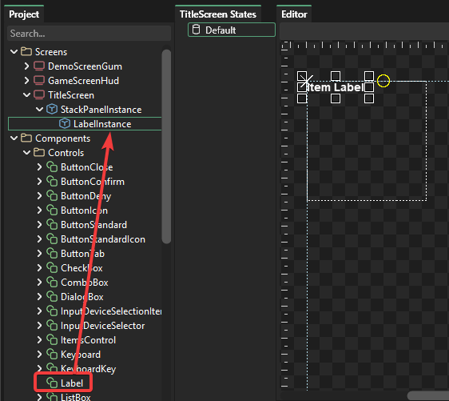

# Common Component Types

## Introduction

This tutorial looks at some of the more common component types in Gum and how to work with them in code. This tutorial provides an introduction to common controls. For a deeper dive into each type of Forms control, see the [Gum Forms Controls](../../gum-forms/controls/) page.

If you've been following the previous tutorials, keep in mind that this tutorial begins with an empty TitleScreen. Since the previously-added buttons are being deleted, any code written must also be removed to no longer reference the buttons or you will get compile errors.


## StackPanel

StackPanels are used to contain other controls in Forms. StackPanels are similar to Containers, but they default to stacking their children top-to-bottom. StackPanels also provide access to their children as Forms, whereas Containers provide access to the visuals of their children rather than the forms object. Therefore, you should usually use a StackPanel to contain children, or a Panel if you do not want stacking.

By default StackPanels display a dotted outline in the Gum tool, but are invisible at runtime. We can add a stack pane to our screen by drag+dropping the StackPanel component into our Screen.

<figure><figcaption><p>StackPanel in TitleScreen</p></figcaption></figure>

## Label

Label provides a way to display read-only strings to the user. A Label's Text property can be used to change the displayed string.

We can add a label to StackPanelInstance by drag+dropping the Label component in the Project tab.

<figure><figcaption><p>LabelInstance in a StackPanelInstance</p></figcaption></figure>

We can change its Text, Color, and Style in the Exposed section in the Variables tab.

<figure><figcaption><p>Common Label properties in Gum</p></figcaption></figure>

We can override these properties in code through the generated instance. For example, we can modify our TitleScreen's CustomInitialize method to change the label text.



```csharp
partial class TitleScreen
{
    partial void CustomInitialize()
    {
        LabelInstance.Text = "I am set in code";
    }
}
```



```diff
partial class TitleScreen
{
    partial void CustomInitialize()
    {
+       LabelInstance.Text = "I am set in code";
    }
}
```



<figure><figcaption><p>Label at runtime with its Text property changed</p></figcaption></figure>


All properties available in the Gum tool are also available in code. To keep the tutorial shorter we will not cover all properties both in Gum and in code unless there are important differences. Feel free to experiment and try setting properties in code as you are reading through the remainder of this tutorial.


## Button

By default Gum provides a variety of Buttons. We'll use ButtonStandard, but feel free to experiment with other button components.

<figure><figcaption><p>Button components in Gum</p></figcaption></figure>

We can add a ButtonStandard to our stack panel by drag+dropping the ButtonStandard component onto the TitleScreen's StackPanelInstance.

<figure><figcaption><p>ButtonStandard in StackPanelInstance</p></figcaption></figure>

Notice that the button automatically stacks below the LabelInstance because the StackPanelInstance stacks top-to-bottom by default.

The most common way to interact with a Button is to assign its Click event. The following code can be used to increment the button's text whenever it is clicked.



```csharp
partial class TitleScreen
{
    int clickCount = 0;
    partial void CustomInitialize()
    {
        LabelInstance.Text = "I am set in code";

        ButtonStandardInstance.Click += (_, _) =>
            ButtonStandardInstance.Text = $"Clicked {++clickCount} Time(s)";
    }
}
```



```diff
partial class TitleScreen
{
+   int clickCount = 0;
    partial void CustomInitialize()
    {
        LabelInstance.Text = "I am set in code";

+       ButtonStandardInstance.Click += (_, _) =>
+           ButtonStandardInstance.Text = $"Clicked {++clickCount} Time(s)";
    }
}
```



<figure><figcaption><p>Button responding to clicks</p></figcaption></figure>

## CheckBox

CheckBox provides a way to display and edit bool values. We can add a CheckBox instance by drag+dropping the CheckBox component onto our StackPanelInstance.

<figure><figcaption><p>CheckBox in StackPanelInstance</p></figcaption></figure>

CheckBox provides a number of events for responding to changes:

* Click - whenever the CheckBox is clicked
* Checked - whenever the CheckBox's IsChecked is set to true
* Unchecked - whenever the CheckBox's IsChecked is set to false
* Indeterminate - whenever the CheckBox's IsChecked is set to null

We can display the checked state by handling the Click event as shown in the following code:



```csharp
partial void CustomInitialize()
{
    CheckBoxInstance.Click += (_, _) =>
    {
        CheckBoxInstance.Text = CheckBoxInstance.IsChecked == true
            ? "Checked"
            : CheckBoxInstance.IsChecked == false
                ? "Unchecked"
                : "Indeterminate";
    };
}
```



```diff
partial void CustomInitialize()
{
+   CheckBoxInstance.Click += (_, _) =>
+   {
+       CheckBoxInstance.Text = CheckBoxInstance.IsChecked == true
+           ? "Checked"
+           : CheckBoxInstance.IsChecked == false
+               ? "Unchecked"
+               : "Indeterminate";
+   };
}
```




The rest of this tutorial omits the full CustomInitialize function and only shows the newly-added code to keep the displayed code shorter.


<figure><figcaption><p>CheckBox in StackPanelInstance</p></figcaption></figure>

## ComboBox

ComboBoxes provide a list of options for the user to select. ComboBoxes internally use a ListBox to display their options.

We can add a ComboBox instance by drag+dropping the ComboBox component onto StackPanelInstance.

<figure><figcaption><p>ComboBox in StackPanelInstance</p></figcaption></figure>


Now that we've seen how stacking works in our StackPanelInstance, the reminder of this tutorial only displays a single component at a time in the StackPanelInstance as to avoid the UI getting too cluttered. Of course, you should feel free to add and remove component instances to experiment on your own.


Notice that our ComboBoxInstance extends horizontally beyond the bounds of our StackPanelInstance. This can be problematic because the portion which is outside of the StackPanelInstance will not respond to clicks.

We can solve this by extending the horizontal size of our StackPanelInstance to include all of its children.

To do this, select the StackPanelInstance and set the following values:

<table><thead><tr><th width="151.5999755859375">Variable</th><th width="199.59991455078125">Value</th></tr></thead><tbody><tr><td>Width</td><td>0</td></tr><tr><td>Width Units</td><td>Relative to Children</td></tr><tr><td>Min Width</td><td>50</td></tr></tbody></table>


We can do the same for Height values:

<table><thead><tr><th width="151.5999755859375">Variable</th><th width="199.5999755859375">Value</th></tr></thead><tbody><tr><td>Height</td><td>0</td></tr><tr><td>Height Units</td><td>Relative to Children</td></tr><tr><td>Min Height</td><td>50</td></tr></tbody></table>

Now the StackPanel sizes itself according to its children.&#x20;

<figure><figcaption><p>StackPanelInstance adjusted to size itself according to its children</p></figcaption></figure>

We can populate objects in a ComboBox by adding to its Items property. We can also react to object being selected by using the SelectionChanged event:



<pre class="language-csharp"><code class="lang-csharp">partial void CustomInitialize()
{
<strong>    for(int i = 0; i &#x3C; 10; i++)
</strong>    {
        ComboBoxInstance.Items.Add($"Item {i}");
    }

    ComboBoxInstance.SelectionChanged += (_, _) =>
    {
        var selectedObject = ComboBoxInstance.SelectedObject;
        System.Diagnostics.Debug.WriteLine($"Selected object: {selectedObject}");
    };
}
</code></pre>



```diff
partial void CustomInitialize()
{
+   for(int i = 0; i < 10; i++)
+   {
+       ComboBoxInstance.Items.Add($"Item {i}");
+   }

+   ComboBoxInstance.SelectionChanged += (_, _) =>
+   {
+       var selectedObject = ComboBoxInstance.SelectedObject;
+       System.Diagnostics.Debug.WriteLine($"Selected object: {selectedObject}");
+   };
}
```



<figure><figcaption><p>ComboBox reacting to SelectionChanged event</p></figcaption></figure>

## ListBox

ListBox provides a way to view and select from a list of items. It is similar to a ComboBox, but it does not collapse when an item is selected.

We can add a ListBox instance by drag+dropping a ListBox onto StackPanelInstance.

<figure><figcaption><p>ListBox in StackPanelInstance</p></figcaption></figure>

We can populate objects in a ListBox by adding to its Items property. We can also react to objects being selected by using the `SelectionChanged` event:



```csharp
partial void CustomInitialize()
{
    for(int i = 0; i < 10; i++)
    {
        ListBoxInstance.Items.Add($"Item {i}");
    }

    ListBoxInstance.SelectionChanged += (_, _) =>
    {
        var selectedObject = ListBoxInstance.SelectedObject;
        System.Diagnostics.Debug.WriteLine($"Selected object: {selectedObject}");
    };
}
```



```diff
partial void CustomInitialize()
{
+   for(int i = 0; i < 10; i++)
+   {
+       ListBoxInstance.Items.Add($"Item {i}");
+   }

+   ListBoxInstance.SelectionChanged += (_, _) =>
+   {
+       var selectedObject = ListBoxInstance.SelectedObject;
+       System.Diagnostics.Debug.WriteLine($"Selected object: {selectedObject}");
+   };
}
```



<figure><figcaption><p>ListBox reacting to SelectionChanged event</p></figcaption></figure>

## RadioButton

RadioButton provides a way to select from a set of options. Unlike CheckBox, when one RadioButton is selected, other RadioButton instances in the group are deselected.

We can add multiple RadioButton instances by drag+dropping the RadioButton component onto StackPanelInstance multiple times.

<figure><figcaption><p>RadioButtons in StackPanelInstance</p></figcaption></figure>

We can modify the Text property of each instance to differentiate between them.

<figure><figcaption><p>RadioButton instances displaying different text</p></figcaption></figure>

We can handle the `Checked` event to respond to a RadioButton being checked.



<pre class="language-csharp"><code class="lang-csharp">partial void CustomInitialize()
{
<strong>    RadioButtonInstance.Checked += (_, _) =>
</strong>        System.Diagnostics.Debug.WriteLine("Option 1 Checked");

    RadioButtonInstance1.Checked += (_, _) =>
        System.Diagnostics.Debug.WriteLine("Option 2 Checked");

    RadioButtonInstance2.Checked += (_, _) =>
        System.Diagnostics.Debug.WriteLine("Option 3 Checked");
}
</code></pre>



```diff
partial void CustomInitialize()
{
+   RadioButtonInstance.Checked += (_, _) =>
+       System.Diagnostics.Debug.WriteLine("Option 1 Checked");

+   RadioButtonInstance1.Checked += (_, _) =>
+       System.Diagnostics.Debug.WriteLine("Option 2 Checked");

+   RadioButtonInstance2.Checked += (_, _) =>
+       System.Diagnostics.Debug.WriteLine("Option 3 Checked");
}
```



<figure><figcaption><p>RadioButtons reacting to Checked event</p></figcaption></figure>


RadioButtons group according to their common parent. For more information on grouping, see the [RadioButton page](../../gum-forms/controls/radiobutton.md).


## Slider

Sliders provide a way to select a value within a range, as specified by `Minimum` and `Maximum`.

We can add a Slider by drag+dropping a Slider component on StackPanelInstance.

<figure><figcaption><p>Slider in StackPanelInstance</p></figcaption></figure>

We can set the slider minimum and maximum and react to value changes using the following code:



```csharp
partial void CustomInitialize()
{
    SliderInstance.Minimum = 0;
    SliderInstance.Maximum = 100;
    SliderInstance.ValueChanged += (_, _) =>
        System.Diagnostics.Debug.WriteLine($"Slider Value: {SliderInstance.Value}");
}
```



```diff
partial void CustomInitialize()
{
+   SliderInstance.Minimum = 0;
+   SliderInstance.Maximum = 100;
+   SliderInstance.ValueChanged += (_, _) =>
+       System.Diagnostics.Debug.WriteLine($"Slider Value: {SliderInstance.Value}");
}
```



<figure><figcaption><p>Slider value changed by dragging the thumb or clicking on the track</p></figcaption></figure>

## TextBox

TextBoxes provide a way to view and edit string values.

We can add a TextBox by drag+dropping a TextBox component on StackPanelInstance.

<figure><figcaption><p>TextBox in StackPanelInstance</p></figcaption></figure>

We can respond to text being entered in the TextBox as shown in the following code:



```csharp
partial void CustomInitialize()
{
    TextBoxInstance.TextChanged += (_,_) =>
        System.Diagnostics.Debug.WriteLine($"TextBox text: '{TextBoxInstance.Text}'");
}
```



```diff
partial void CustomInitialize()
{
+   TextBoxInstance.TextChanged += (_,_) =>
+       System.Diagnostics.Debug.WriteLine($"TextBox text: '{TextBoxInstance.Text}'");
}
```



<figure><figcaption><p>Handling the TextChanged event</p></figcaption></figure>

## Conclusion

This tutorial covers the basics of working with the most common types of forms components. As mentioned above, feel free to experiment with controls and explore the [Controls documentation section](../../gum-forms/controls/) for more information about each control.
