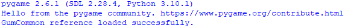
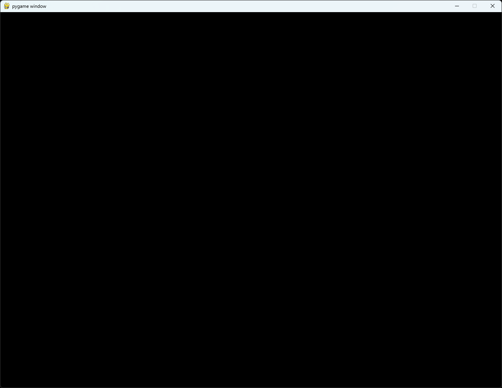
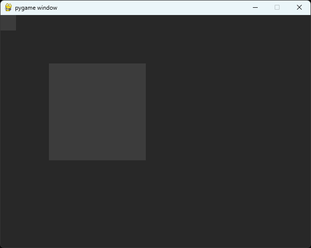

# PyGame

## Experimental Note


_**WARNING:**_ This project is an experiment and proof of concept. The goal was to see if PythonNET could be used to export the C# GUM UI backend Layout Engine to be used in other tools like Python with PyGame.

Currently it "works" but there are many missing features and bugs.

Right now it only draws a RECTANGLE that encompasses the entire size of the GUM UI's [GraphicalUiElement](gum-code-reference/graphicaluielement/).

You can then add other objects to this root object (that are currently only drawing rectangles).

You can't control the color, it starts at color value RGB(20, 20, 20) and increases in color intensity by 20 and wraps around at 256.

If this ends up being something that others want, please join the [discord](https://discord.gg/EvqwmSQuBz) or put tickets into [github](https://github.com/vchelaru/Gum).


## Setup

The package can be found on pypi here: [https://pypi.org/project/gumui/](https://pypi.org/project/gumui/)

Install `gumui` and `pygame`

* `pip install gumui`
* `pip install pygame`


<figure><figcaption></figcaption></figure>

## Getting started with gumui in Python

There are really only 3 important things after you import. Create an Instance of `GumUI`, call Update, and call `Draw()`

1. First you need to import the `GumUI` and `PyGame`

```python
from gumui import GumUI, GraphicalUiElement, InvisibleRenderable
import pygame
from pygame.locals import *
```

<figure><figcaption></figcaption></figure>

2. Next you need to initialize and configure pygame, might as well do it now

```python
pygame.init()
BLACK = (0, 0, 0)
SCREEN_WIDTH = 640
SCREEN_HEIGHT = 480
screen = pygame.display.set_mode((SCREEN_WIDTH, SCREEN_HEIGHT))
```

<figure><figcaption></figcaption></figure>

3. Setup timing to force to 60 FPS (Frames Per Second)

```python
fps_clock = pygame.time.Clock()
fps = 60.0
dt = fps_clock.tick(fps)
```

4. Once PyGame is setup, you need to create the GumUI and initialize it

```python
# Initialize GumUI
myUi = GumUI()
myUi.initialize(screen) # `screen` is a Surface you wish GUM to draw to https://www.pygame.org/docs/ref/surface.html
```

5. Lets add a single item to the UI for now it will be a simple 32x32 square

```python
child = GraphicalUiElement(InvisibleRenderable())
myUi.RootElement.Children.Add(child)
child.XUnits = Converters.GeneralUnitType.PixelsFromSmall
child.Width = 32
child.YUnits = Converters.GeneralUnitType.PixelsFromSmall
child.Height = 32
```

6. Now that you've defined the UI (1 square inside the root element) you can create the standard pygame loop

```python
while True:
    for event in pygame.event.get():
        if event.type == QUIT:
            pygame.quit()
            sys.exit()
```

> _**NOTE:**_ This will run forever, or until you hit ESC or press the X

7. Update and then Draw the UI elements

```python
    myUi.update()
    screen.fill(BLACK)  # Fill the screen with black.
    myUi.draw()
    pygame.display.flip()
    dt = fps_clock.tick(fps)
```

<figure><figcaption></figcaption></figure>

The above image shows the entire screen being drawn as the root element, and then the single 32x32 rectangle being drawn at the default (0, 0) position.

## Adding more UI elements

Currently this is a work in progress, as such, the only thing that is drawn are rectangles.

To add another UI element "square" you create an instance of [GraphicalUiElement](gum-code-reference/graphicaluielement/), set it's properties, and add it to a parent.&#x20;


&#x20;This code needs to be added before the main game while loop.


```python
child = GraphicalUiElement(InvisibleRenderable())
myUi.RootElement.Children.Add(child)

child.XUnits = Converters.GeneralUnitType.PixelsFromSmall
child.X = 100
child.Y = 100
child.Width = 200
child.YUnits = Converters.GeneralUnitType.PixelsFromSmall
child.Height = 200
```

<figure><figcaption></figcaption></figure>

## Adding grandchildren and great grandchildren

Here another child (100x100) is added to the larger (200x200) child from above.

```python
grandChild = GraphicalUiElement(InvisibleRenderable())
child.Children.Add(grandChild)

grandChild.XUnits = Converters.GeneralUnitType.PixelsFromSmall
grandChild.X = 10
grandChild.Y = 10
grandChild.Width = 100
grandChild.YUnits = Converters.GeneralUnitType.PixelsFromSmall
grandChild.Height = 100
```

<figure><figcaption></figcaption></figure>

Notice how the (100x100) rectangle is drawn at (10, 10), but that position is relative to the parent so it's actually drawn at (110, 110)

To see the full list of properties available for a [GraphicalUiElement ](gum-code-reference/graphicaluielement/)see this documentation page&#x20;

