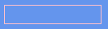

# RectangleRuntime

## Introduction

`RectangleRuntime` draws a rectangle with a **fill** and an **outline (stroke)**, plus an optional uniform `CornerRadius` for rounded corners. Its size is controlled by `Width` and `Height`. The fill is set by `FillColor`; the outline is set by `StrokeColor` and `StrokeWidth`. On top of fill and outline, a `RectangleRuntime` can also render a gradient, a drop shadow, and a dashed outline.

A freshly-constructed `RectangleRuntime` is 50 × 50 and renders as a **stroke-only outline** — `IsFilled` defaults to `false`, so the fill is gated off even though `FillColor` defaults to opaque white. `StrokeColor` defaults to white and `StrokeWidth` defaults to `1`. Set `IsFilled = true` to show the fill (assigning `FillColor` alone does not show it), or set `StrokeWidth` to `0` to hide the outline.

`IsFilled` defaults to `false` because `RectangleRuntime` is historically outline-only. It pairs with an opaque white `FillColor`, so setting `IsFilled = true` alone yields a visible white fill — see [Shapes](shapes-apos.shapes.md#fill) for the full rationale.

For the full property surface — fill, outline, corner radius, gradient, drop shadow, dashed stroke, and the platform/package requirements — see the [Shapes](shapes-apos.shapes.md#circleruntime-and-rectangleruntime) page. The examples below cover the common cases.


On MonoGame, KNI, and FNA the outline and geometry render out of the box, but the **fill** and the richer effects (gradient, drop shadow, dashed stroke, anti-aliasing) only draw once the `Gum.Shapes.<platform>` package is added — otherwise they are stored and round-trip but silently do not draw. See the [Shapes](shapes-apos.shapes.md) page for setup.

Skia, .NET MAUI, raylib, and Silk.NET support the full surface natively — no additional package needed.


### Code Example

The following code creates an outlined `RectangleRuntime`:

```csharp
// Initialize
var rectangle = new RectangleRuntime();
rectangle.Width = 120;
rectangle.Height = 24;
rectangle.StrokeColor = Color.Pink; // This is a Microsoft.Xna.Framework.Color
container.Children.Add(rectangle);
```

<figure><figcaption><p>Pink outlined rectangle</p></figcaption></figure>

To fill the rectangle and round its corners, set `IsFilled = true`, assign a `FillColor`, and set a `CornerRadius`. On MonoGame, KNI, and FNA the fill requires the shape support package (see the [Shapes](shapes-apos.shapes.md) page):

```csharp
// Initialize
var rectangle = new RectangleRuntime();
rectangle.Width = 120;
rectangle.Height = 24;
rectangle.CornerRadius = 8;
rectangle.IsFilled = true;
rectangle.FillColor = Color.Pink; // show the fill
container.Children.Add(rectangle);
```

## Legacy color members


The `Color`, `Red`, `Green`, `Blue`, and `Alpha` members are obsolete and are being phased out. They write the **stroke** color (`RectangleRuntime` was historically outline-only) and are kept only for backward compatibility. Use `StrokeColor` for the outline and `FillColor` for the fill instead. For the property mapping and the automated code fix, see [Migrating to 2026 May](../../gum-tool/upgrading/migrating-to-2026-may.md).

