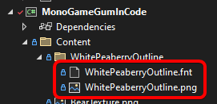

# TextRuntime

## Introduction

The TextRuntime object is used to draw strings to the screen. It supports a variety of options for rendering text including alignment, fonts, coloring, and line wrapping.

A TextRuntime are often used in the following situations:

1. Adding diagnostics to your game to easily display information on screen
2. Adding visuals to a Forms control, such as adding another label to a Button
3. Modifying Visuals, such as a TextInstance in a ButtonVisual

## Example - Creating a TextRuntime

To create a TextRuntime, instantiate it and add it to root as shown in the following code:

```csharp
var textInstance = new TextRuntime();
textInstance.Text = "Hello world";
textInstance.AddToRoot();
```

<figure><figcaption><p>Text</p></figcaption></figure>

TextRuntimes can be added as children of controls. For example, the following code shows how to create a TextRuntime and add it to a Stackpanel named MainStackPanel.

```csharp
var textInstance = new TextRuntime();
textInstance.Text = "Hello world";
MainStackPanel.AddChild(textInstance);
```

## Example - Obtaining an Existing TextRuntime

TextRuntimes are used in Gum Forms controls for all Text display. For example, Button instanes use a TextRuntime named TextInstace, as shown in the following code block:

```csharp
var button = new Button();
var buttonVisual = (ButtonVisual)button.Visual;
var textRuntime = buttonVisual.TextInstance;
textRuntime.FontScale = 2; 
// additional modifications can be made to textRuntime
```

## Fonts

By default all TextRuntime instances use an Arial 18 point font. This can be changed by specifying ta custom font.

Fonts on TextRuntime objects can be modified in one of the following ways:

1. By setting the `UseCustomFont` property to `true`, then changing the `CustomFontFile` property to a desired .fnt file.
2. By directly assigning the `BitmapFont` property on the TextRuntime object, bypassing all other properties.
3. By setting `UseCustomFont` property to `false`, then changing the individual Font values. This approach requires following a specific .fnt naming convention.

For most projects, the first approach is recommended since it doesn't require specific naming conventions. The second approach also works well if you are directly loading the BitmapFont object yourself. The third approach is convenient if your project is using the Gum tool, and if the Gum tool has already generated fonts for the specific combinations of values you are assigning.

### Assigning CustomFontFile

The following code shows how to load a custom font (the first approach):

```csharp
var customText = new TextRuntime();
customText.UseCustomFont = true;
customText.CustomFontFile = "WhitePeaberryOutline/WhitePeaberryOutline.fnt";
customText.Text = "Hello, I am using a custom font";
customText.AddToManagers(SystemManagers.Default, null);
```

For information on creating your own .fnt file with Bitmap Font Generator, see the [Use Custom Font](../../../gum-tool/gum-elements/text/use-custom-font.md) page.

This code assumes a font file named WhitePeaberryOutline.fnt is located in the `Content/WhitePeaberryOutline` folder. By default all Gum content loading is performed relative to the Content folder; however, if UseCustomFont is set to false, then all font loading is performed from the FontCache folder. See the [Font Component Values](./#font-component-values) section for more information on loading from the FontCache folder. See the [File Loading](../../files-and-fonts/file-loading.md) page for more information about loading files in general.

Note that .fnt files reference one or more image files, so the image file must also be added to the correct folder. In this case, the WhitePeaberryOutline.fnt file references a WhitePeaberryOutline.png file, so both files are in the same folder.

<figure><figcaption><p>WhitePeaberryOutline font in the Solution Explorer</p></figcaption></figure>

Also, note that files are loaded from-file rather than using the content pipeline. This means that extensions (such as .fnt) are included in the file path, and that both the .fnt and .png files must have their **Copy to Output Directory** value set to **Copy if newer**.

<figure><figcaption><p>Copy if newer property set</p></figcaption></figure>

The easiest way to mark all content as "Copy to Output Directory" is to use wildcard items in your .csproj. This is explained in the [Loading .gumx (Gum project)](/broken/pages/PGWmyRmXA6uMwNXuO6Aa#adding-the-gum-project-files-to-your-.csproj) page.

### Assigning BitmapFont

The following code shows how to assign the BitmapFont property on a TextRuntime:

```csharp
var bitmapFont = new BitmapFont("WhitePeaberryOutline/WhitePeaberryOutline.fnt", SystemManagers.Default);
customText.BitmapFont = bitmapFont;
// no additional properties such as UseCustomFont or any of the font component values
// are used once this is assigned. By assigning those, the BitmapFont assignment may
// get overwritten
```

### Font Component Values

A TextRuntime's font can be controlled by its individual font component values. **Setting these values in code will not produce a .fnt file for you - the .fnt file must already be in your project in the FontCache folder**. The following values are used to determine the font (.fnt) to load:

* FontSize
* Font
* OutlineThickness
* UseFontSmoothing
* IsItalic
* IsBold

By default, all fonts will be of the format `Font{Font}{FontSize}.fnt`. Consider the following code:

```csharp
text.UseCustomFont = false;
text.Font = "Arial";
text.FontSize = 24;
```

This results in the TextRuntime object searching for a font named `FontArial24.fnt`.

As mentioned before, when UseCustomFont is set to false the Gum runtime looks for the font in the FontCache folder. For this particular example the font would be located at `Content/FontCache/FontArial24.fnt`. Note that if your Gum project is not located at the content root, then your FontCache folder will not be directly in the Content folder either. To fix this problem using the FileManager's RelativeDirectory, see the [File Loading](../../files-and-fonts/file-loading.md) page.

The following additional suffixes (in order listed below) are added to the font name.

* OutlineThicknes - if greater than 0, then the suffix `_o` followed by the outline thickness is added. For example, if OutlineThickness is 3, a font might be named `FontArial24_3.fnt`
* UseFontSmoothing - if false, then \_noSmooth is appended. For example `Font24_noSmooth.fnt`
* IsItalic - if true, then \_Italic is appended. For example `Font24_Italic.fnt`
* IsBold - if true, then \_Bold is appended. For example `Font24_Bold.fnt`

The BmfcSave.GetFontCacheFileNameFor method can be called with any combination to obtain the desired font value. For example, the following code coudl be used to determine the desired .fnt file:

```csharp
var desiredFntName = BmfcSave.GetFontCacheFileNameFor(
    18, // font size
    "Consolas", // font name
    2, // outline thickness
    true, // use font smoothing
    false, // is italic
    true // is bold
    );
```

Note that this method does not take into consideration the content folder.

## Creating Fonts

To create a .fnt file, you have a few options:

1. Open Gum, create a temporary Text instance with the desired properties, then look at the font cache folder
2. Use Angelcode Bitmap Font Generator. For more information see the [Use Custom Font page](../../../gum-tool/gum-elements/text/use-custom-font.md).
3. Manually create a .fnt file in a text editor and a corresponding .png. This option requires understanding how the .fnt file format is structured. The best way to learn this is to open an existing font file.

Using Gum to create the font cache is fairly simple, but you must know which fonts you intend to use ahead of time. A font is created automatically by the Gum tool whenever a Text property is changed.

To view the existing font cache, you can click the View Font Cache menu item in Gum.

<figure><figcaption><p>View Font Cache menu item</p></figcaption></figure>

As you make changes to the Text object, new files are created and added to the font cache folder, as shown in the following animation:

<figure><figcaption><p>Changing the Font Size creates new fonts in FontCache</p></figcaption></figure>

## Missing Font Exceptions

By default TextRuntime instances do not throw exceptions for missing font files even if `GraphicalUiElement.ThrowExceptionsForMissingFiles` is set to `CustomSetPropertyOnRenderable.ThrowExceptionsForMissingFiles`. The reason for this is because a TextRuntime's font is decided by a combination multiple properties.

If UseCustomFont is set to false, then the font is determined by the combination of font values (as discussed above). If UseCustomFont is set to true, then the font is determined by the CustomFontFile (also as discussed above).

Ultimately the variables which are used for fonts can be assigned in any order, and can be assigned from multiple spots (such as direct assignments, states, or creation from Gum projects).

In other words, the TextRuntime doesn't know when variable assignment is finished. We can address this in a few different ways.

The first is to explicitly load the desired BitmapFont as discussed above. By calling the BitmapFont constructor, missing files will immediately throw an exception.

Another option is to use the `GraphicalUiElement.ThrowExceptionsForMissingFiles` method to verify if a font is valid.

The following code example shows how to check for invalid fonts using this method:

```csharp
var textWithValidFont = new TextRuntime();
textWithValidFont.UseCustomFont = true;
textWithValidFont.CustomFontFile = "Fonts/ValidFont.fnt";
textWithValidFont.AddToManagers(SystemManagers.Default, null);
// No errors here:
GraphicalUiElement.ThrowExceptionsForMissingFiles(text3);

try
{
    var textThatHasError = new TextRuntime();
    textThatHasError.UseCustomFont = true;
    textThatHasError.CustomFontFile = "Fonts/InvalidFont.fnt";
    textWithValidFont.AddToManagers(SystemManagers.Default, null);
    GraphicalUiElement.ThrowExceptionsForMissingFiles(textThatHasError);
}
catch (FileNotFoundException e)
{
    System.Diagnostics.Debug.WriteLine("Yay we got an exception! That's expected");     
}
```
