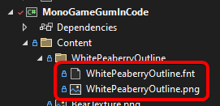
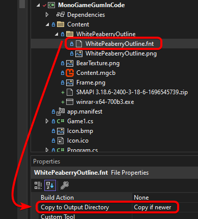

# Fonts

## Introduction

TextRuntime instances can change their font. This page discusses how to load and assign fonts in code.

By default all TextRuntime instances use an Arial 18 point font which is embedded in the Gum libraries.

## Dynamic Font Generation (Recommended)



The easiest way to use fonts is to install the KernSmith NuGet package, which generates fonts at runtime so you can freely change font properties without managing font files.

To set up dynamic font generation:

1. Add the `KernSmith.MonoGameGum` NuGet package to your project
2. Assign the `InMemoryFontCreator` after initializing Gum:

```csharp
// Initialize
GumService.Default.Initialize(this);

CustomSetPropertyOnRenderable.InMemoryFontCreator =
    new KernSmithFontCreator(GraphicsDevice);
```

Once this is set up, font properties work automatically. Setting `Font`, `FontSize`, `IsBold`, `IsItalic`, `OutlineThickness`, and `UseFontSmoothing` on a TextRuntime generates the needed font in memory without any font files on disk:

```csharp
// Initialize
var text = new TextRuntime();
text.Text = "Hello, World!";
text.Font = "Times New Roman";
text.FontSize = 24;
text.IsBold = true;
text.AddToRoot();
```

Any combination of font properties can be used and the font is created on demand.



The easiest way to use fonts is to install the KernSmith NuGet package, which generates fonts at runtime so you can freely change font properties without managing font files.

To set up dynamic font generation:

1. Add the `KernSmith.KniGum` NuGet package to your project
2. Assign the `InMemoryFontCreator` after initializing Gum:

```csharp
// Initialize
GumService.Default.Initialize(this);

CustomSetPropertyOnRenderable.InMemoryFontCreator =
    new KernSmithFontCreator(GraphicsDevice);
```

Once this is set up, font properties work automatically. Setting `Font`, `FontSize`, `IsBold`, `IsItalic`, `OutlineThickness`, and `UseFontSmoothing` on a TextRuntime generates the needed font in memory without any font files on disk:

```csharp
// Initialize
var text = new TextRuntime();
text.Text = "Hello, World!";
text.Font = "Times New Roman";
text.FontSize = 24;
text.IsBold = true;
text.AddToRoot();
```

Any combination of font properties can be used and the font is created on demand.



SkiaGum supports dynamic font generation out of the box. No additional setup is needed — assign the `Font`, `FontSize`, `IsItalic`, `IsBold`, and other font properties directly on the TextRuntime:

```csharp
// Initialize
var text = new TextRuntime();
text.Text = "Hello, World!";
text.Font = "Times New Roman";
text.FontSize = 24;
text.IsBold = true;
```

The font must be installed on the system to be used.



Dynamic font generation for Raylib is not yet available. Check back for future updates.



### System Fonts vs Registered Fonts

By default, KernSmith resolves the `Font` property by looking up fonts installed on the operating system. For example, setting `Font = "Times New Roman"` works because that font is typically installed on Windows.

System fonts are convenient for quick prototyping, but they have drawbacks for shipping a game:

* **Platform differences** — a font installed on your development machine may not exist on a player's machine or on other platforms (Linux, macOS, mobile).
* **Version inconsistency** — different OS versions may ship different versions of the same font, causing subtle rendering differences.
* **Licensing** — system fonts may have licenses that restrict redistribution in games.

For these reasons, registering your own .ttf (or .otf) files is recommended for any font you plan to ship with your game. This guarantees every player sees the same font regardless of their operating system.

### Registering Custom .ttf Fonts


Registering .ttf files is supported on MonoGame and KNI. SkiaGum uses system fonts directly and does not currently support `RegisterFont`.


To use a .ttf file with KernSmith:

1. Add the .ttf file to your project's Content folder
2. Set its **Copy to Output Directory** to **Copy if newer**
3. Call `KernSmithFontCreator.RegisterFont` before using the font

```csharp
// Initialize
KernSmithFontCreator.RegisterFont("Bungee",
    System.IO.File.ReadAllBytes("Content/Fonts/Bungee-Regular.ttf"));
```

Once registered, use the font by its family name just like a system font:

```csharp
// Initialize
var text = new TextRuntime();
text.Font = "Bungee";
text.FontSize = 24;
text.Text = "Hello from a custom font!";
text.AddToRoot();
```

You can register multiple fonts, including different styles for the same family:

```csharp
// Initialize
KernSmithFontCreator.RegisterFont("Crimson Pro",
    System.IO.File.ReadAllBytes("Content/Fonts/CrimsonPro-Regular.ttf"));
KernSmithFontCreator.RegisterFont("Crimson Pro",
    System.IO.File.ReadAllBytes("Content/Fonts/CrimsonPro-Bold.ttf"),
    style: "Bold");
```


Registered fonts take priority over system fonts. If you register a font with the family name "Arial", KernSmith uses your registered .ttf instead of the system-installed Arial.


## Custom Font File

If you have a specific .fnt file (created with the Gum tool, Bitmap Font Generator, Hiero, or another tool), you can load it directly by setting `UseCustomFont` to `true` and assigning `CustomFontFile`:

```csharp
// Initialize
var text = new TextRuntime();
text.UseCustomFont = true;
text.CustomFontFile = "WhitePeaberryOutline/WhitePeaberryOutline.fnt";
text.Text = "Hello, I am using a custom font";
text.AddToRoot();
```

For information on creating your own .fnt file with Bitmap Font Generator, see the [Use Custom Font](../../../gum-tool/gum-elements/text/use-custom-font.md) page.

This code assumes a font file named WhitePeaberryOutline.fnt is located in the `Content/WhitePeaberryOutline` folder. By default all Gum content loading is performed relative to the Content folder. See the [File Loading](../../files-and-fonts/file-loading.md) page for more information about loading files.

Note that .fnt files reference one or more image files, so the image file must also be added to the correct folder. In this case, the WhitePeaberryOutline.fnt file references a WhitePeaberryOutline.png file, so both files are in the same folder.

<figure><figcaption><p>WhitePeaberryOutline font in the Solution Explorer</p></figcaption></figure>

Files are loaded from-file rather than using the content pipeline. This means that extensions (such as .fnt) are included in the file path, and that both the .fnt and .png files must have their **Copy to Output Directory** value set to **Copy if newer**.

<figure><figcaption><p>Copy if newer property set</p></figcaption></figure>

The easiest way to mark all content as "Copy to Output Directory" is to use wildcard items in your .csproj. This is explained in the [Loading .gumx (Gum project)](../../../../broken/pages/PGWmyRmXA6uMwNXuO6Aa/#adding-the-gum-project-files-to-your-.csproj) page.

## Direct BitmapFont Assignment

You can load a BitmapFont yourself and assign it directly, bypassing the font property system entirely:

```csharp
// Initialize
var bitmapFont = new BitmapFont("WhitePeaberryOutline/WhitePeaberryOutline.fnt");
var text = new TextRuntime();
text.BitmapFont = bitmapFont;
text.Text = "Hello, I am using a directly assigned font";
text.AddToRoot();
```


Once a BitmapFont is assigned directly, do not set font component properties (`Font`, `FontSize`, etc.) or `UseCustomFont` on the same TextRuntime. Those properties trigger the font loading system, which overwrites the directly assigned BitmapFont.


## Font Cache (Pre-Built Fonts)


This approach is primarily useful when your project already has pre-generated font files from the Gum tool, or when dynamic font generation is not available. For most projects, [Dynamic Font Generation](fonts.md#dynamic-font-generation-recommended) is the recommended approach.


If `UseCustomFont` is `false` (the default) and no `InMemoryFontCreator` is registered, a TextRuntime's font is determined by its font component values. These values combine to produce a file name, and the corresponding .fnt file must already exist in a `FontCache` folder.

The following properties determine the font:

* `Font` (or `FontFamily`)
* `FontSize`
* `OutlineThickness`
* `UseFontSmoothing`
* `IsItalic`
* `IsBold`

### Font Cache Naming Convention

The generated file name follows the pattern `FontCache/Font{FontSize}{Font}.fnt`, where spaces in the font name are replaced with underscores. The following suffixes are appended in this order when their conditions are met:

* `OutlineThickness` - if greater than 0, then `_o` followed by the value is added. For example, `FontCache/Font24Arial_o3.fnt`
* `UseFontSmoothing` - if false, then `_noSmooth` is appended. For example, `FontCache/Font24Arial_noSmooth.fnt`
* `IsItalic` - if true, then `_Italic` is appended. For example, `FontCache/Font24Arial_Italic.fnt`
* `IsBold` - if true, then `_Bold` is appended. For example, `FontCache/Font24Arial_Bold.fnt`

For example:

```csharp
// Initialize
text.UseCustomFont = false;
text.Font = "Arial";
text.FontSize = 24;
```

This results in the TextRuntime searching for `FontCache/Font24Arial.fnt` relative to the content directory.

The `BmfcSave.GetFontCacheFileNameFor` method can be called to determine the expected file name for any combination of values:

```csharp
// Initialize
var desiredFntName = BmfcSave.GetFontCacheFileNameFor(
    18, // font size
    "Consolas", // font name
    2, // outline thickness
    useFontSmoothing: true,
    isItalic: false,
    isBold: true
    );
```

Note that this method does not take into consideration the content folder.

### Creating Font Cache Files

To create .fnt files for the font cache, you have a few options:

1. Open Gum, create a temporary Text instance with the desired properties, then look at the font cache folder
2. Use Angelcode Bitmap Font Generator. For more information see the [Use Custom Font page](../../../gum-tool/gum-elements/text/use-custom-font.md).
3. Manually create a .fnt file in a text editor and a corresponding .png. This option requires understanding how the .fnt file format is structured. The best way to learn this is to open an existing font file.

Using Gum to create the font cache is fairly simple, but you must know which fonts you intend to use ahead of time. A font is created automatically by the Gum tool whenever a Text property is changed.

To view the existing font cache, you can click the View Font Cache menu item in Gum.

<figure><figcaption><p>View Font Cache menu item</p></figcaption></figure>

As you make changes to the Text object, new files are created and added to the font cache folder, as shown in the following animation:

<figure><figcaption><p>Changing the Font Size creates new fonts in FontCache</p></figcaption></figure>

## Missing Font Exceptions

By default TextRuntime instances do not throw exceptions for missing font files even if `GraphicalUiElement.ThrowExceptionsForMissingFiles` is set to `CustomSetPropertyOnRenderable.ThrowExceptionsForMissingFiles`. The reason for this is because a TextRuntime's font is decided by a combination of multiple properties.

If `UseCustomFont` is set to `false`, then the font is determined by the combination of font values (as discussed above). If `UseCustomFont` is set to `true`, then the font is determined by the `CustomFontFile` (also as discussed above).

Ultimately the variables which are used for fonts can be assigned in any order, and can be assigned from multiple spots (such as direct assignments, states, or creation from Gum projects).

In other words, the TextRuntime doesn't know when variable assignment is finished. We can address this in a few different ways.

The first is to explicitly load the desired BitmapFont as discussed above. By calling the BitmapFont constructor, missing files immediately throw an exception.

Another option is to use the `GraphicalUiElement.ThrowExceptionsForMissingFiles` method to verify if a font is valid.

The following code example shows how to check for invalid fonts:

```csharp
// Initialize
var textWithValidFont = new TextRuntime();
textWithValidFont.UseCustomFont = true;
textWithValidFont.CustomFontFile = "Fonts/ValidFont.fnt";
textWithValidFont.AddToRoot();
// No errors here:
GraphicalUiElement.ThrowExceptionsForMissingFiles(textWithValidFont);

try
{
    var textThatHasError = new TextRuntime();
    textThatHasError.UseCustomFont = true;
    textThatHasError.CustomFontFile = "Fonts/InvalidFont.fnt";
    textThatHasError.AddToRoot();
    GraphicalUiElement.ThrowExceptionsForMissingFiles(textThatHasError);
}
catch (FileNotFoundException e)
{
    System.Diagnostics.Debug.WriteLine("Yay we got an exception! That's expected");
}
```
