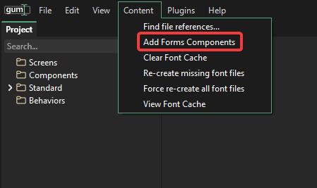
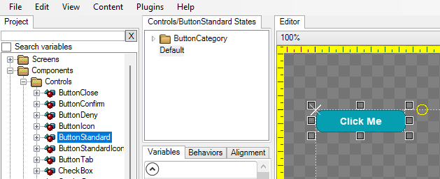
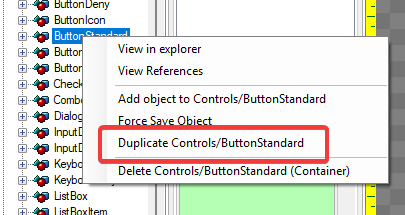

# Control Customization in Gum Tool

## Introduction

Gum Forms controls can be fully customized in Gum. Customization using the Gum tool allows immediate previewing of states.

This page covers customizing controls in the Gum tool. Controls can also be restyled in code through the `Styling` object. See [Gum Tool Styling and the Styling Object](#gum-tool-styling-and-the-styling-object) at the end of this page to decide which one fits your project.

## Setup

Before customizing controls you should add the default set of forms components to your project. You can check if these components exist by looking in the Components folder.

<figure><figcaption><p>Forms Components in Gum</p></figcaption></figure>

If you do not have these components you can add them by clicking Content -> Add Forms Components

<figure><figcaption><p>Add Forms Components if you do not already have them</p></figcaption></figure>

## Creating New Variants

Your game may require multiple types of common components. For example, you may need to have buttons which show different colors depending on their use.

Any component can be copied and modified without changing the original.

First we can create a duplicate of an existing component:

1.  Select the button component you would like to copy. For example select Controls/ButtonStandard\\

    <figure><figcaption><p>ButtonStandard in Gum</p></figcaption></figure>
2.  Duplicate the component by right-clicking and selecting the Duplicate item\\

    <figure><figcaption><p>Right-click duplicate item</p></figcaption></figure>
3.  Enter a new name for the component, such as OrangeButton\\

    <figure><figcaption><p>Enter component name</p></figcaption></figure>

Now we can modify the newly-created component. Most customizations are allowed, but keep in mind that ultimately the component's states are used when your game runs to reflect the control's actions such as being clicked.

To make the button appear orange, we need to modify each of the button's states. We can do this by first selecting the instance in the button that we would like to modify. Then we need to modify the instance in every state.

Keep in mind that your component may already have variables associated with each of the states, so you may want to remove the existing variables first so that they do not conflict with the changs you are about to make. You can do this by selecting the category and pressing the X button next to all variables.

<figure><figcaption></figcaption></figure>

Once all variables have been removed, we can add the changes we want for each state. Select OrangeButton's BackgroundInstance. With this instance selected, select the Enabled state. Change the BackgroundInstance's color with this state selected to change the default appearance of the button.

<figure><figcaption><p>Change the Background to orange in the Enabled state</p></figcaption></figure>

Repeat these steps for each of the states, adjusting the color as desired. Also, be sure to modify the default state for the button. This state does not get used at runtime, but it gets used in the Gum tool. This state should probably be the same as your Enabled state, so set the backgrould color to the same values.

After you are finished, you can use this new component in any other screen or component.

<figure><figcaption><p>Standard and orange button in a screen called GameScreen</p></figcaption></figure>

## Gum Tool Styling and the Styling Object

Gum has two separate ways to restyle Forms controls, and they apply to different controls.

* **Gum project styling** is what this page and the [Styling tutorial](../getting-started/tutorials/gum-project-forms-tutorial/styling.md) describe. Colors and fonts live in the **Styles** component, and the Forms components (`ButtonStandard`, `TextBoxStandard`, and so on) reference them through variable references. You edit these in the Gum tool and the game loads the result from your project.
* **The `Styling` object** is a C# class (`Gum.Forms.DefaultVisuals.V3.Styling`). Its `Styling.ActiveStyle` property supplies the colors, fonts, and sprite sheet used by the code-only default visuals, such as `ButtonVisual` and `TextBoxVisual`.

When a Gum project is loaded, a Forms component in the project replaces the code-only default visual for that control type. Those controls get their look from the project, so changing `Styling.ActiveStyle` does not restyle them. For a project with Forms components, make color and font changes in the **Styles** component or on the component itself, as described above. To change those values from code, see [Runtime Variable References](runtime-variable-references.md).

Use `Styling.ActiveStyle` when your controls come from the default visuals, which is the case for a code-only project and for any control type that your project does not provide a component for.

### What Styling Contains

`Styling.ActiveStyle` has the following members:

| Member | Contents |
|---|---|
| `Colors` | Named colors such as `Primary`, `Accent`, `InputBackground`, `TextPrimary`, and `TextMuted`, plus the lighten and darken percentages that the default visuals use to shade their states. |
| `Text` | Three font states, `Normal`, `Strong`, and `Emphasis`, each holding `Font`, `FontSize`, `IsBold`, and `IsItalic`. |
| `NineSlice` | Texture coordinates on the sprite sheet for each background style, such as `Solid`, `Bordered`, `Outlined`, and `Panel`. |
| `Icons` | Texture coordinates on the sprite sheet for the built-in icons, such as `Check`, `Close`, and `Gear`. |
| `SpriteSheet` | The texture that `NineSlice` and `Icons` point into. Assigning a new sprite sheet updates the texture on all of their states. |

For example, the following code changes the primary color before any controls are created:

```csharp
// Initialize
Styling.ActiveStyle.Colors.Primary = Color.DarkGreen;
```

Changes apply to controls created after the change, so set styling before creating controls. For the full list of colors and the controls that use them, fonts, and creation order, see [Styling Using ActiveStyles](code-only-styling/styling-using-activestyles.md). To change a single control instead of every control, see [Styling Individual Controls](code-only-styling/styling-individual-controls.md).
