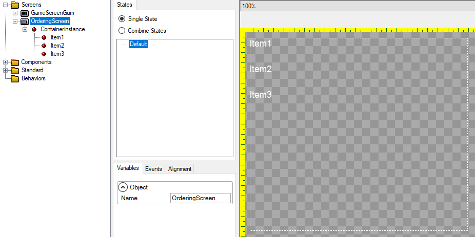

# Children Layout

### Introduction

The **Children Layout** property determines how a container positions its children. The default value is "Regular" which means that children are positioned according to their [X Units](https://github.com/vchelaru/Gum/tree/8c293a405185cca0e819b810220de684b436daf9/docs/Gum%20Elements/General%20Properties/X%20Units/README.md) and [Y Units](https://github.com/vchelaru/Gum/tree/8c293a405185cca0e819b810220de684b436daf9/docs/Gum%20Elements/General%20Properties/Y%20Units/README.md).

<figure><figcaption>
Children Layout showing Regular, Top to Bottom Stack, Left to Right Stack, Auto Grid Horizontal, and Auto Grid Vertical
</figcaption></figure>

The value **TopToBottomStack** results in the children stacking one on top of another, from top to bottom.

The value **LeftToRightStack** results in the children stacking one beside another, from left to right.

## Example

The following shows how to use the ChildrenLayout property to stack objects. It begins with a single NineSlice inside of a container called ContainerInstance. The following actions are performed:

1. The NineSliceInstance is copied and pasted 3 times. At this point all NineSliceInstance's are overlapping each other
2. The Children Layout is changed from Regular to TopToBottomStack. The NineSliceInstance's are automatically stacked top-to-bottom.
3. The Children Layout is changed to LeftToRightStack. The NineSliceInstance's are automatically stacked left-to-right.

.gif>)

### Regular

Regular layout positions each child independent of every other child. The position of one child will not affect the position of the other child. This is used in all cases except when stacking is needed.

<figure><figcaption></figcaption></figure>

### Top to Bottom Stack

Top to Bottom Stack results in each child being positioned after its previous sibling vertically. This can be used to create horizontal stacks quickly.

<figure><figcaption></figcaption></figure>

### Left to Right Stack

Left to Right Stack results in each child being positioned after its previous sibling horizontally. This can be used to create vertical stacks quickly.

<figure><figcaption></figcaption></figure>

### Stacking and Units

When children stack, each child's X or Y depends on the boundary of its previous sibling. When stacking vertically, the child's Y value begins at the bottom side of the previous item. Similarly, when stacking horizontally, the child's X value begins at the right side of the previous item.

For example, the following image shows a Text object with a Y value of 20. Notice that it is positioned 20 units below the item above it.

<figure><figcaption></figcaption></figure>

This effect is very easy to notice when dragging an object inside a stack, as shown in the following animation:

<figure><figcaption></figcaption></figure>

### Stacking and Units

If instances are stacked in a container, the stacking controls the instance values based on the direction of the stack. Containers with a **Top to Bottom Stack** control the Y value of their children. Similarly, Containers with a **Left to Right Stack** control the X value of their children. The position value which is not controlled by the stack can be changed freely without any impact on the stacking.

For example, if a container stacks its children using a **Top to Bottom Stack**, the children in the stack are free to change their X values. The following animation shows how children can be left, center, or right anchored (which changes their **X Units** and **X Origin**) without affecting the other children in the stack.

<figure><figcaption></figcaption></figure>

### Stack Spacing

Top to Bottom and Left to Right stacks separate their children using the Stack Spacing property. For more information, see the [Stack Spacing](stack-spacing.md) page.

## Stacking and Children Origin

In most cases children which are stacked should use a Left [X Origin](https://github.com/vchelaru/Gum/tree/8c293a405185cca0e819b810220de684b436daf9/docs/Gum%20Elements/General%20Properties/X%20Origin/README.md) if the parent uses a **LeftToRightStack** and should use a Top [Y Origin](https://github.com/vchelaru/Gum/tree/8c293a405185cca0e819b810220de684b436daf9/docs/Gum%20Elements/General%20Properties/Y%20Origin/README.md) if the parent uses a **Top To Bottom Stack**.

For example, consider a parent which contains two children - a blue and a red rectangle.

.png>)

In the image shown above, the red rectangle is positioned directly to the right of the blue rectangle. Notice that if the red rectangle's [X Origin](https://github.com/vchelaru/Gum/tree/8c293a405185cca0e819b810220de684b436daf9/docs/Gum%20Elements/General%20Properties/X%20Origin/README.md) is changed to **Center**, the red rectangle overlaps the blue rectangle.

.png>)

If the red rectangle's [X Origin](https://github.com/vchelaru/Gum/tree/8c293a405185cca0e819b810220de684b436daf9/docs/Gum%20Elements/General%20Properties/X%20Origin/README.md) is changed to **Right**, then its right side will align with the right side of the blue rectangle, resulting in the red overlapping the blue completely. In this case the stacking is essentially cancelled out by the [X Origin](https://github.com/vchelaru/Gum/tree/8c293a405185cca0e819b810220de684b436daf9/docs/Gum%20Elements/General%20Properties/X%20Origin/README.md).

This overlapping may not be desirable, so keep this in mind when changing a stacked child's origin.

## Wraps Children

The [Wraps Children](https://github.com/vchelaru/Gum/tree/8c293a405185cca0e819b810220de684b436daf9/docs/Gum%20Elements/General%20Properties/Wraps%20Children/README.md) property controls how stacking behaves beyond boundaries. For more information, see the [Wraps Children](https://github.com/vchelaru/Gum/tree/8c293a405185cca0e819b810220de684b436daf9/docs/Gum%20Elements/General%20Properties/Wraps%20Children/README.md) page.

## Reordering Children

Children of a container which uses the **TopToBottomStack** or **LeftToWriteStack** will be ordered according to their order in the tree view on the left. By default this is the order in which the children are added to a parent container.

Children can be reordered using the right-click menu on an instance.

.gif>)

Alternatively, children order can be changed by clicking on the item in the tree view, holding down the ALT key, then pressing the up or down arrows.

<figure><figcaption>
Changing order with ALT+Arrow hotkey
</figcaption></figure>
