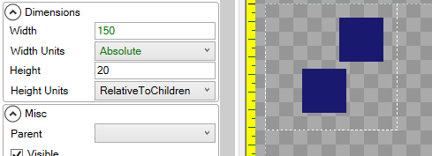

# Height Units

## Introduction

The **Height Units** variable controls how a unit is vertically sized, which may be relative to its parent. By default an object uses **Absolute** height, where each unit represents 1 pixel of height in pixels. When using **Absolute**, an object ignores its parents' With.

## Absolute

The following shows a child [ColoredRectangle](../coloredrectangle.md) with 50 **Absolute** Height:

## Relative to Container

The following shows a child [ColoredRectangle](../coloredrectangle.md) with -10 **RelativeToContainer** Height, which means it will always be 10 pixels less tall than its parent.

## Percentage of Container

The following shows a child [ColoredRectangle](../coloredrectangle.md) with 100 **Percentage** Height, which means it will have 100% of the height of its parent. Note that 100 **Percentage** is the same as 0 **RelativeToContainer**:

.png>)

If an object uses **Percentage** Height, but has no parent, it will size itself as a percentage of the entire screen's height.

If an object uses **RelativeToContainer** Height, but has no parent, it will size itself relative to the entire screen's height.

## Ratio of Container

Ratio of Container can be used to fill available space or to share available space with other objects using a ratio.

<figure><figcaption>
Ratio of Container Height Units
</figcaption></figure>

The simplest case is a single child in a container with its Height Units set to **Ratio of Continer**.

<figure><figcaption>
Ratio of Container set to 1
</figcaption></figure>

In this case the blue [ColoredRectangle](../coloredrectangle.md) has no siblings (its container has no other children), so it occupies the entire parent height. If a second child is added (by copy/pasting the existing child), then each child is given 1 _ratio_ value, which means each is 1/2 of the size of the entire parent.

<figure><figcaption>
Two stacked ColoredRectangles, each with a Height ratio of 1
</figcaption></figure>

To better visualize the effect of ratio, it's common to set the parent's [Children Layout](../container/children-layout.md) to Top to Bottom Stack, and to give each child a different color as shown in the following image.

<figure><figcaption>
Stacked children with a Height Width of Ratio of Container
</figcaption></figure>

As more children are added, each child's height is adjusted to make room for the new children.

<figure><figcaption>
Children shrink to make room for new ColoredRectangles
</figcaption></figure>

Ratio values are distributed among all siblings using Ratio of Container proportionally. The image above shows four siblings, each given 1/4 of the ratio. If one of the the ratios changes (such as by increasing the second sibling's Height value to 3), then all siblings adjust in response to this change.

<figure><figcaption>
Red ColoredRectangle with a Height value of 3
</figcaption></figure>

In this case, the total ratio is 6 (1 + 3 + 1 + 1), so the red is given 3/6 (1/2) of the container's height, while each of the others is given 1/6 of the container's height.

Values of 0 are supported, resulting in the object drawing with an absolute height of 0.

<figure><figcaption>
ColoredRectangle with a Ratio of Container Height of 0
</figcaption></figure>

Ratio of Container is calculated after accounting for the height of children which are using absolute height. For example, if the height of the first child is 80 with a Height Units of Absolute, then the other three shrink to give the first the necessary room.

<figure><figcaption>
Absolute ColoredRectangle with 80 Height
</figcaption></figure>

This effect can also be seen by adjusting the height using the handles.

<figure><figcaption>
Adjusting height changes all sibling heights
</figcaption></figure>

Ratio of Container also respects [Stack Spacing](../container/stack-spacing.md). A Stack Spacing value greater than 0 removes the available space for all children with a Height Units of Relative to Container.

<figure><figcaption>
Increasing Stack Spacing reduces the available ratio space for all children
</figcaption></figure>

## RelativeToChildren

The following image shows a child [ColoredRectangle](height-units.md#relativetochildren) with 50 **RelativeToChildren** Height, which means that it will always be 50 pixels taller than is necessary to contain its children. Since the rectangle has no children, this is the same as having 50 **Absolute** Height:

**RelativeToChildren** can be used to size an object based on the position and sizes of a container's children. The following image shows a container with 0 **RelativeToChildren** Height, which mans that its height is set just large enough to contain its children.

A non-zero **Height** when using **RelativeToChildren** can be used to add additional padding to a parent container. The following image shows a container with 20 pixels of padding height:

For more information on relative layout in regards to absolute vs. relative unit types, see the [Relative Layout Unit Type](relative-layout-unit-type.md) page.

## PercentageOfOtherDimension

**PercentageOfOtherDimension** will adjust the object's effective height so it remains proportional to the Width value multiplied by the Height value (as a percentage). For example, if a Height value of 200 is entered, then the effective height will be 200% (2x) of the width.

The following image shows a child [ColoredRectangle](../coloredrectangle.md) with a Height of 200 **PercentageOfOtherDimension**. In this image, the **Width** value is 50 units, so the effective height is 100 units:

## PercentageOfSourceFile

The [Sprite](https://github.com/vchelaru/Gum/tree/8c293a405185cca0e819b810220de684b436daf9/docs/Gum%20Elements/General%20Properties/Sprite/README.md) type has an extra **Height Unit** called **PercentageOfSourceFile**, which will set the height of the Sprite according to the file that it is displaying. This is the default **Height Unit** for Sprites.

The following image shows a child [Sprite](https://github.com/vchelaru/Gum/tree/8c293a405185cca0e819b810220de684b436daf9/docs/Gum%20Elements/General%20Properties/Sprite/README.md) with 200 **PercentageOfSourceFile** Height, which means it will draw two times as tall as its source image:

.png>)
