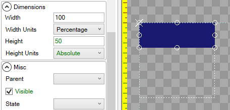
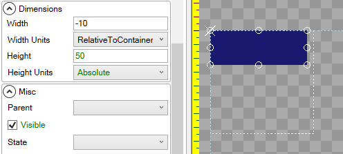

# Width Units

## Introduction

The **Width Units** variable controls how a unit is horizontally sized, which may be relative to its parent. By default an object uses **Absolute** width, where each unit represents 1 pixel of width in absolute terms. When using **Absolute**, an object ignores its parents' With.

## Absolute

The following shows a child [ColoredRectangle](https://github.com/vchelaru/Gum/tree/8c293a405185cca0e819b810220de684b436daf9/Gum/coloredrectangle/ColoredRectangle.html) with 50 **Absolute** Width:

.png>)

## Percentage

The following shows a child [ColoredRectangle](https://github.com/vchelaru/Gum/tree/8c293a405185cca0e819b810220de684b436daf9/Gum/coloredrectangle/ColoredRectangle.html) with 100 **Percentage** Width, which means it will have 100% of the width of its parent. Note that 100 **Percentage** is the same as 0 **RelativeToContainer**:

If an object uses **Percentage** Width, but has no parent, it will size itself as a percentage of the entire screen's width.

## RelativeToContainer

The following image shows a child [ColoredRectangle](https://github.com/vchelaru/Gum/tree/8c293a405185cca0e819b810220de684b436daf9/Gum/coloredrectangle/ColoredRectangle.html) with -10 **RelativeToContainer** Width, which means it will always be 10 pixels less wide than its parent.

If an object uses **RelativeToContainer** Width, but has no parent, it will size itself relative to the entire screen's width.

## RelativeToChildren

The following image shows a child [ColoredRectangle](https://github.com/vchelaru/Gum/tree/8c293a405185cca0e819b810220de684b436daf9/Gum/coloredrectangle/ColoredRectangle.html) with 50 **RelativeToChildren** Width, which means that it will always be 50 pixels wider than is necessary to contain its children. Since the rectangle has no children, this is the same as having 50 **Absolute** Width:

**RelativeToChildren** can be used to size an object based on the position and sizes of a container's children. The following image shows a container with 0 **RelativeToChildren** Width, which mans that its width is set just large enough to contain its children. Since the rectangle on the right is the furthest-right rectangle, the width of the container is set to be wide enough to contain the right-edge of the furthest-right blue rectangle.

A non-zero **Width** when using **RelativeToChildren** can be used to add additional padding to a parent container. The following image shows a container with 20 pixels of padding width:

**RelativeToChildren** will dynamically adjust to changes in properties on the children. In the following animation the container has a **Children Layout** of **LeftToRightStack**. Adding additional children expands the container automatically:

.gif>)

For more information on relative layout in regards to absolute vs. relative unit types, see the [Relative Layout Unit Type](https://github.com/vchelaru/Gum/tree/8c293a405185cca0e819b810220de684b436daf9/docs/Gum%20Elements/General%20Properties/Relative%20Layout%20Unit%20Type/README.md) page.

### RelativeToChildren and Text

Setting a Text instance's **Width Units** to **RelativeToChildren** results in the Text object adjusting according to its text contents. For example, setting the **Width Units** to **RelativeToChildren** and setting the **Width** to 0 results in the Text object automatically adjusting its actual width according to the text it contains.

.png>)

## PercentageOfOtherDimension

**PercentageOfOtherDimension** will adjust the object's effective width so it remains proportional to the Height value multiplied by the Width value (as a percentage). For example, if a Width value of 200 is entered, then the effective width will be 200% (2x) of the height.

The following image shows a child [ColoredRectangle](https://github.com/vchelaru/Gum/tree/8c293a405185cca0e819b810220de684b436daf9/Gum/coloredrectangle/ColoredRectangle.html) with a Width of 200 **PercentageOfOtherDimension**. In this image, the **Height** value is 50 units, so the effective width is 100 units:

.png>)

## PercentageOfSourceFile

The [Sprite](https://github.com/vchelaru/Gum/tree/8c293a405185cca0e819b810220de684b436daf9/docs/Gum%20Elements/General%20Properties/Sprite/README.md) type has an extra **With Unit** called **PercentageOfSourceFile**, which will set the width of the Sprite according to the file that it is displaying. This is the default **Width Unit** for Sprites.

The following image shows a child [Sprite](https://github.com/vchelaru/Gum/tree/8c293a405185cca0e819b810220de684b436daf9/docs/Gum%20Elements/General%20Properties/Sprite/README.md) with 200 **PercentageOfSourceFile** Width, which means it will draw two times as wide as its source image:

 (1) (1) (3).png>)
