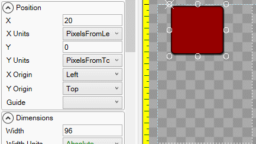

# Y

## Introduction

The Y property controls the vertical position for an object. The Y value represents the position of an object's [Y Origin](https://github.com/vchelaru/Gum/tree/8c293a405185cca0e819b810220de684b436daf9/docs/Gum%20Elements/General%20Properties/Y%20Origin/README.md), using its [Y Units](https://github.com/vchelaru/Gum/tree/8c293a405185cca0e819b810220de684b436daf9/docs/Gum%20Elements/General%20Properties/Y%20Units/README.md).

## Example

By default, an object's top-left corner is positioned relative to its parent's top-left corner.

