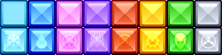

# Texture Address

## Introduction

The **Texture Address** variable can be used to define the area that the NineSlice displays. By default the **Texture Address** is set to **Entire Texture** which means the NineSlice will display the entire source file (split up among the nine pieces).

### Entire Texture

The following screenshot shows an entire texture being used for a NineSlice.

<figure><figcaption></figcaption></figure>

The entire texture is split up into 3 sections horizontally and 3 sections vertically, matching up the texture coordinates used to display the NineSlice's 9 sections.

## Custom

The **Custom** value allows specifying a custom set of coordinates for the Nine Slice. **Custom** is most often used to when an image is part of a sprite sheet. The following example uses this image:

<figure><figcaption></figcaption></figure>

The NineSlice uses the following variables:

* Texture Address = Custom
* Texture Top = 0
* Texture Left = 0
* Texture Height = 40
* Texture Width = 40

These values result in the the following NineSlice:

<figure><figcaption></figcaption></figure>

