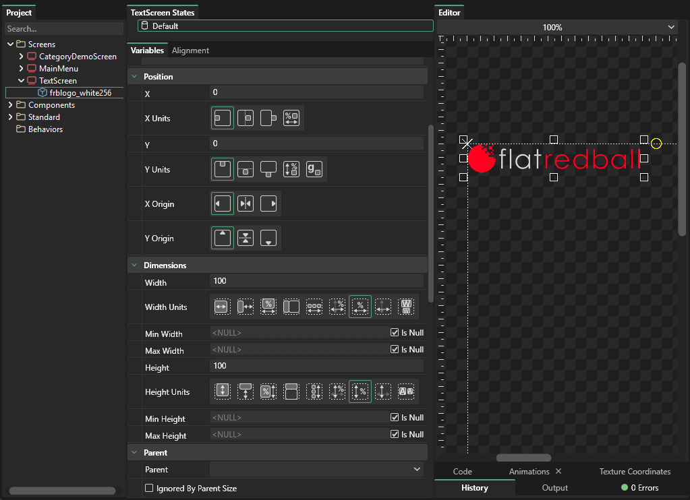

# Sprite

## Introduction

Sprites are objects which can draw an image \(such as a .png\) or a portion of a .png.

## Sprite Properties

* [Sprite.Color](https://github.com/vchelaru/Gum/tree/8c293a405185cca0e819b810220de684b436daf9/docs/Gum%20Elements/Sprite/Sprite.Color)
* [Sprite.Texture Address](https://github.com/vchelaru/Gum/tree/8c293a405185cca0e819b810220de684b436daf9/docs/Gum%20Elements/Sprite/Sprite.Texture%20Address)

