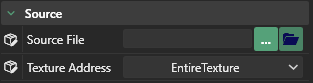
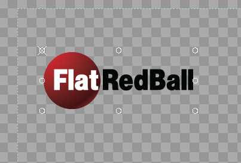
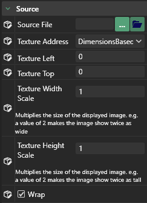

# Texture Address

## Introduction

The texture address property controls how sprites are drawn when their texture coordinates extend beyond the size of the image. The setting on texture address impacts which other properties are available.

## Entire Texture

If the texture address property is set to "EntireTexture" then the sprite will draw its full image. The sprite will not repeat this texture or render only part of the texture.

## Custom

If the texture address property is set to "Custom" then the top, bottom, left, and right properties can be independently set. This allows a sprite to only render a portion of its source texture.

.png>)

## DimensionsBased

If the texture address property is set to "DimensionsBased" then the texture coordinates will adjust internally according to the width and the height of the Sprite. In other words, making the sprite larger or smaller will not stretch the image that it is rendering. Instead the image will be clipped, or clamped/wrapped according to the Wrap property.

.png>)

### Wrap

Combining the DimensionsBased texture address with the wrap property will let you easily create tiling sprites.

.png>)
