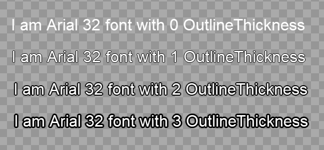

# OutlineThickness

## Introduction

OutlineThickness can be used to create an outline around a font. The outline is saved in the .png of the font itself, so each value for OutlineThickness results in a new .fnt file and associated .png files created in the FontCache folder.

## Setting OutlineThickness

The OutlineThickness can be set on a Text object like any other variable.

.png>)

OutlineThickness changes appear in the Gum window.

