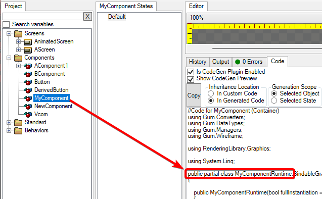
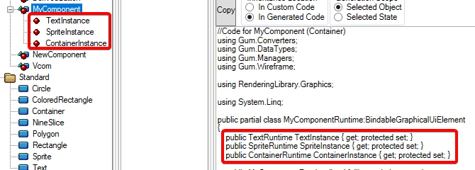
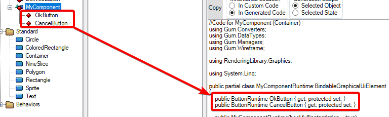
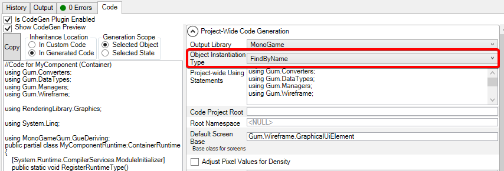
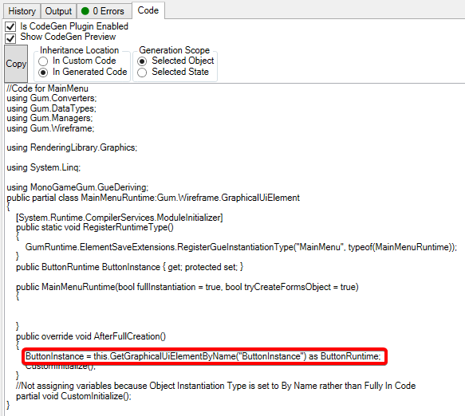

# Runtime Generation Details

### Introduction

The Code tab can be used to generate _runtime_ objects. A runtime object is a class which inherits from GraphicalUiElement. It can be instantiated and added to managers or to a child of another GraphicalUiElement so that it appears in your application.

Runtime classes can be _fully generated_, which means they do not require a loaded Gum project, or they can be instantiated from an ElementSave which requires a Gum project. This is controlled through the **Object Instantiation Type** option. Details about the differences between these two approaches are discussed later in this document.

### Runtime Naming Conventions

By default the runtime class is generated using the same name as the Screen or Component (also referred to generally as an _element_) with the word **Runtime** appended to the end. For example, a component named MyComponent is generated with the name MyComponentRuntime.

<figure><figcaption><p>MyComponent and its generate MyComponentRuntime</p></figcaption></figure>

### Runtime Classes are `partial`

Runtime classes are created with the `partial` keyword. This allows classes to be spread across multiple files. Typically one file includes the generated code which can change whenever a change is made in Gum. The other file includes code which can be modified by hand and which is not changed by Gum (unless an element is renamed).

If your project is set up to automatically generate files when changed, or if you click the **Generate Code** button, then Gum automatically generates both a generated file and a second file for you to write custom code. These are often referred to as _generated_ and _custom_ code files.

If you are manually copying the generated code, then you are free to include the partial keyword. Doing so does not require a second code file - classes can be partial regardless of how many code files they span.

### Instance Properties

One of the main benefits of using generated code is the creation of properties for each instance in an element. This allows you to access these instances without worrying about possible typos or the potential removal of these objects when additional edits are made in Gum.

Instance properties exist regardless of which Object Instantiation Type is used, although the generated code for creating these instances differs.

<figure><figcaption><p>MyComponent generates a runtime with properties matching the names of its contained instances</p></figcaption></figure>

The types of these properties match their types in Gum. Instances of standard elements are generated using their corresponding runtime types. For example, a Text instance generates a property of type TextRuntime. For more information about standard element runtime types, see the [Runtime Objects](broken-reference) section.

Instances of components are generated using their corresponding runtime types as well. For example, instances of a component named Button are generated with the type ButtonRuntime.

<figure><figcaption><p>Button instances generating properties of type ButtonRuntime</p></figcaption></figure>


Generated code assumes that any instance of a component has a matching runtime. If you are automatically generating code on changes, then Gum performs code generation recursively so that all referenced runtimes exist. In other words, if MyComponent were generated to create MyComponentRuntime, then Gum also generates ButtonRuntime if necessary.

If you are manually copying your generated code, then you are responsible for the creation of any referenced runtime.


#### Instance Creation and Variable Assignment

Instances inside of a generated runtime may be instantiated fully in the generated code, or they may be obtained by calling GetGraphicalUiElementByName. This is controlled by the Object Instantiation Type setting in the Code tab.

<figure><figcaption><p>Object Instantiation Type in the Code tab</p></figcaption></figure>

FindByName is the most common option when using generated code. If this value is set to FindByName, then the generated code assumes that the children have already been created and that the generated code is not responsible for creating the children. If you are loading a .gumx file and intend to create instances of runtime classes using elements from the loaded project, then you should use the FindByName property.

Since the children will have already been created, then the generated code does not instantiate new children. Instead, it searches through the children of the generated element by name and assigns the properties. For example, the following screenshot shows how Button instances are assigned by name:

<figure><figcaption><p>OkButton and CancelButton being assigned by searching through children </p></figcaption></figure>

If you intend to use Gum to create elements, but you do not want to load the .gumx file at runtime, you can tell the code generator to fully generate all instances by setting Object Instantiation Type to FullyInCode. In this case the generated runtime class can be instantiated without loading a Gum project. Of course, keep in mind that referenced components must still exist in the project.

The following shows the instantiation of the OkButton and CancelButton when using the FullyInCode setting.

<figure><figcaption><p>Button instances instantiated in code</p></figcaption></figure>

Furthermore, when using the FullyInCode option all variables are assigned in generated code. For example, if the OkButton's position is changed, its X and Y values are assigned in generated code.

<figure><figcaption><p>Variables assigned in generated code when using FullyInCode</p></figcaption></figure>


If using the FindByName option, then no variable assignment happens in code - rather the variable assignment happens when creating a new GraphicalUiElement from a Gum element.


### Exposed Variables in Generated Code

Exposed variables are generated as public properties in runtime classes. This makes it easy to modify variables on internal instances. For example, consider a Button component which has a Text instance. This variable can be exposed to create a public property in ButtonRuntime.

<figure><figcaption><p>Button's exposed variable Text creates a public Text property</p></figcaption></figure>

This can be accessed in code and used like a normal property. For example, a ButtonRuntime instance's Text property could be modified using the following code:

```csharp
ButtonRuntimeInstance.Text = "Click me";
```

### States in Generated Code

Categories and states generate enums and properties for the enum. Each category creates its own enum where the values in the enum match the names of the contained states.

For example, consider a Button with a category named ButtonCategory with states Enabled, Disabled, Focused, and Pushed. A ButtonCategory enum is generated, and a property named ButtonCategoryState is added to the ButtonRuntime class.

<figure><figcaption><p>ButtonCategory and ButtonCategoryState in a generated ButtonRuntime class</p></figcaption></figure>

### Creating Runtime Instances with FindByName

As mentioned above, the most common approach for working with Gum is to use the FindByName option in combination with loading a Gum project. When using FindByName, instances of runtimes are usually not created by using the `new` keyword. Rather, instances are created using Gum elements.

We can look at an example component named Button which is generated using FindByName. The simplest way to create an instance of the Button is to add a Button instance to a Screen in Gum, such as a screen named MainMenu.&#x20;

<figure><figcaption></figcaption></figure>

In this case, the Button is generated as part of the MainMenuRuntime.

<figure><figcaption><p>ButtonInstance as part of MainMenuRuntime</p></figcaption></figure>

Therefore, the button would not be explicitly created in code. Instead, the code would create an instance of the MainMenuRuntime using the MainMenu screen. Code to create this screen might look like this:

```csharp
Root = gumProject.Screens.First(item => item.Name == "MainMenu")
    .ToGraphicalUiElement(SystemManagers.Default, addToManagers:true);
```

Of course, if the button needs to be created directly rather than part of a screen, then its element can be obtained and it can be created much the same as how a Screen is created.

```csharp
var button = gumProject.Components.First(item => item.Name == "Button")
    .ToGraphicalUiElement(SystemManagers.Default, addToManagers:false);
    
// usually the button would be added to something else, like an existing root
Root.Children.Add(button);
```

Note that the generated code for every component includes a method called RegisterRuntimeType. This method is automatically called when your application runs, so you do not need to call it yourself. This registration method associates the respective runtime type with the name of the component. Therefore, the returned type from ToGraphicalUiElement matches the expected runtime type. In other words, the button instance in the following code is a valid (non-null) ButtonRuntime:

```csharp
var button = (ButtonRuntime)gumProject.Components.First(item => item.Name == "Button")
    .ToGraphicalUiElement(SystemManagers.Default, addToManagers:false);
    
```

