# Color

## Introduction

The `Color` value can be used to set or modify the effective color of an object. The color value is combined with the `Color Operation` and an object's `Source File` or `Font` settings to produce a final color.

## Example: Setting Color

Most objects in Gum have a Color (or similar) property which can be set directly in the editor. For example, `Text` instances have a `Color` which directly controls their effective color.

<figure>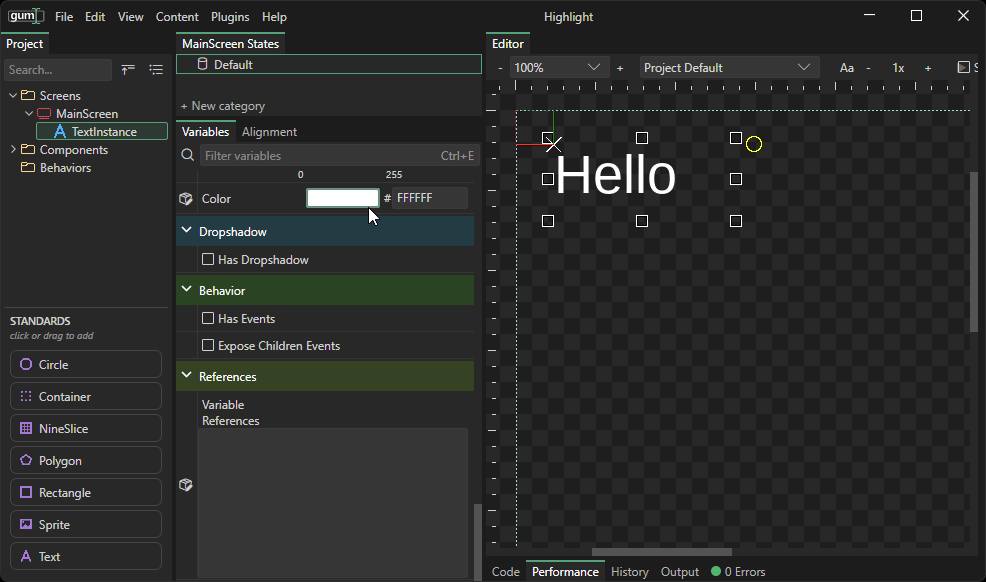<figcaption>
Color on a Text Instance
</figcaption></figure>

## Color and Shapes

Shapes support multiple color values. Which value applies depends on a number of settings.

### Stroke Color

By default shapes render their outline. The `Stroke Color` variable controls their outline color.

<figure>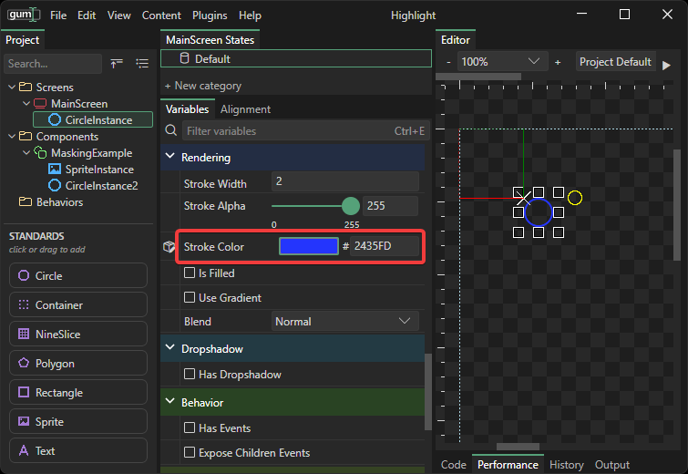<figcaption>
Circle with Stroke Color
</figcaption></figure>

`Stroke Color` also applies to `Rectangles`.

<figure>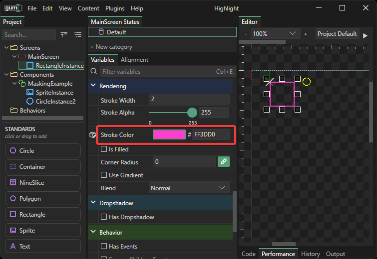<figcaption>
Rectangle with Stroke Color
</figcaption></figure>

### Fill Color

`Circles` and `Rectangles` can set an independent `Fill Color` along `Stroke Color`. First, `Is Filled` must be checked. Once a shape is filled, its Fill Color can be set.

<figure>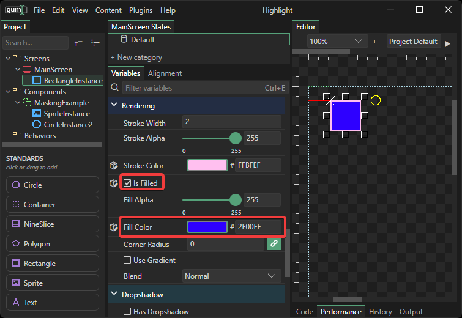<figcaption></figcaption></figure>

## Color Operations

Sprites and NineSlices can change the way their Color value is applied by changing Color Operation.


Color Operations require [project version 5](../../upgrading/upgrading-file-gumx-version.md#version-5) or newer.


### Modulate

The `Modulate` `Color Operation` is also often referred to as _multiply_. This is the default value, and it multiplies color the sprite that is being drawn by the color value.

`Modulate` is the default `Color Operation` value. When paired with the default value of (255, 255, 255) - pure white - `Modulate` does not modify the color of a sprite.

<figure>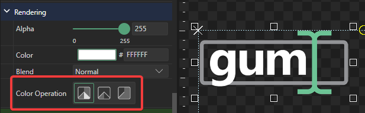<figcaption>
Modulate Color Operation with white color
</figcaption></figure>

Any color other than white darkens the `Sprite`. A value of pure black results in all colors (red, green, blue) being multiplied by 0, which creates a black silhouette.

<figure>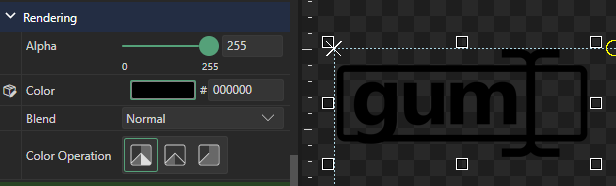<figcaption>
Modulate Color Operation with black color
</figcaption></figure>

The math for multiply is that each of the three color components is _normalized,_ which means a value of 0 to 255 is adjusted to a 0 to 1 range. Therefore, values of 128 become a value of (nearly) 0.5. These normalized values are multiplied against each channel in the source image to produce a final result.

Multiplying by a color which has uneven red, green, and blue values can darken and tint.

<figure>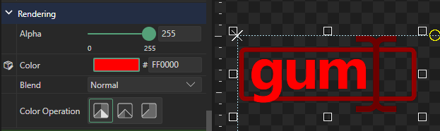<figcaption>
Modulate Color Operation with red color
</figcaption></figure>

### Add

The `Add` `Color Operation` can be used to add color values to the source image. `Add` can be used to brighten color values.

An `Add` value of 0, 0, 0 does not modify the original sprite.

<figure>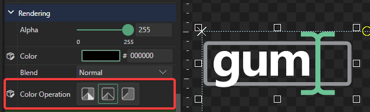<figcaption>
Add Color Operation with black color
</figcaption></figure>

Any other color besides black brightens the Sprite. A value of white creates a white silhouette, resulting in all color values displaying their max 255.

<figure>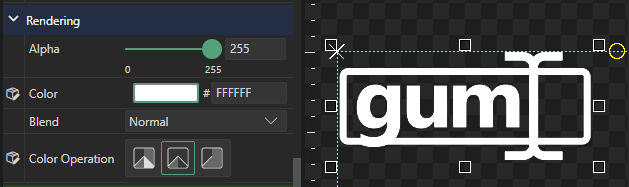<figcaption>
Add Color Operation with a white color
</figcaption></figure>

Other values can be used to tint and brighten the argument sprite.

<figure>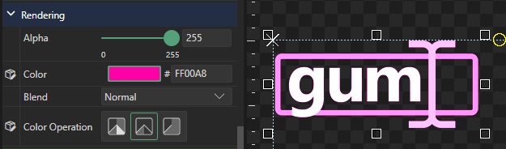<figcaption>
Add Color Operation with a magenta color
</figcaption></figure>


Some runtime libraries support negative color values, allowing Add to also subtract colors. This is currently not supported in the Gum tool, but it may be added in future versions.


### Silhouette (Color + Texture Alpha)

The `Silhouette` `Color Operation` uses the `Sprite's` `Color` value while keeping the `Source File's` opacity. This Color Operation is used to create colored silhouettes.

When using Silhouette, color values overwrite the source texture.

<figure>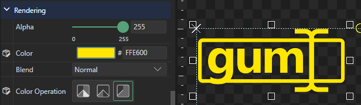<figcaption>
Silhouette Color Operation with a yellow color.
</figcaption></figure>


Runtime libraries use the `ColorTextureAlpha` enumeration for `Silhouette`.

