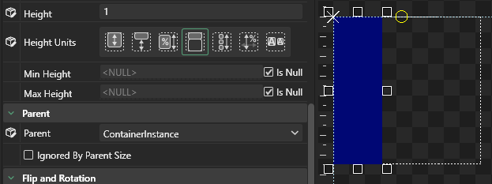
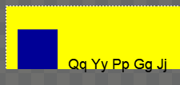
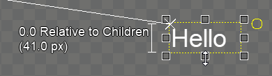
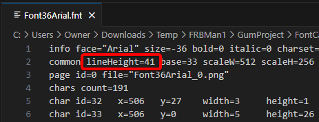

# Height Units

## Introduction

`Height Units` controls how a unit is vertically sized, which may be relative to its parent. By default most types uses `Absolute` height, where each unit represents 1 pixel of height in pixels. When using `Absolute`, an object ignores its parent's Height.

## Absolute

The following shows a child [ColoredRectangle](../coloredrectangle.md) with 50 `Absolute` Height:


Text instances which use an `Absolute` height of 0 size themselves to be the height of their contained text. This behavior will likely change in future versions of Gum so this combination is not recommended. Instead, to size a Text instance according to its contained text, Set `Height Units` to `Relative to Children`.


## Relative to Parent

The following shows a child ColoredRectangle with -10 `Relative to Parent` Height, which means is sized 10 pixels less tall than its parent.


All relationships between parent and children depend only on the direct parent or child. Grandchildren and grandparents are not considered when performing calculations. For more information, see the [Parent](parent.md#children-outside-of-parent-bounds) page.


## Percentage of Parent

The following shows a child ColoredRectangle with 100 `Percentage of Parent`, which means it has 100% of the height of its parent. Note that 100 `Percentage` is the same as 0 `Relative to Parent`:

## Ratio of Parent

`Ratio of Parent` can be used to fill available space or to share available space with other objects using a ratio.

<figure><figcaption>
Ratio of Parent Height Units
</figcaption></figure>

The simplest case is a single child in a container with its `Height Units` set to `Ratio of Parent`.

<figure><figcaption>
<code>Ratio of Parent</code> set to 1
</figcaption></figure>

In this case the blue [ColoredRectangle](../coloredrectangle.md) has no siblings (its parent has no other children), so it occupies the entire parent height. If a second child is added (by copy/pasting the existing child), then each child is given 1 _ratio_ value, which means each is 1/2 of the size of the entire parent.

<figure><figcaption>
Two stacked ColoredRectangles, each with a height ratio of 1
</figcaption></figure>

To better visualize the effect of ratio, it's common to set the parent's [Children Layout](../container/children-layout.md) to `Top to Bottom Stack`, and to give each child a different color as shown in the following image.

<figure><figcaption>
Stacked children with a <code>Height Units</code> of <code>Ratio of Parent</code>
</figcaption></figure>

As more children are added, each child's height is adjusted to make room for the new children.

<figure><figcaption>
Children shrink to make room for new ColoredRectangles
</figcaption></figure>

Ratio values are distributed among all siblings using `Ratio of Parent` proportionally. The image above shows four siblings, each given 1/4 of the ratio. If one of the the ratios changes (such as by increasing the second sibling's Height value to 3), then all siblings adjust in response to this change.

<figure><figcaption>
Red ColoredRectangle with a <code>Height</code> value of 3
</figcaption></figure>

In this case, the total ratio is 6 (1 + 3 + 1 + 1), so the red is given 3/6 (1/2) of the parent's height, while each of the others is given 1/6 of the parent's height.

Values of 0 are supported, resulting in the object drawing with an absolute height of 0.

<figure><figcaption>
ColoredRectangle with a <code>Ratio of Parent</code> <code>Height</code> of 0
</figcaption></figure>

`Ratio of Parent` is calculated after accounting for the height of children which are using absolute height. For example, if the height of the first child is 80 with a `Height Units` of `Absolute`, then the other three shrink to give the first the necessary room.

<figure><figcaption>
<code>Absolute</code> ColoredRectangle with 80 Height
</figcaption></figure>

This effect can also be seen by adjusting the height using the handles.

<figure><figcaption>
Adjusting <code>Height</code> changes all sibling heights
</figcaption></figure>

Gum ignores invisible objects when calculating available space for `Ratio of Parent` units. Therefore, if a sibling is invisible, Gum treats it as if it has 0 height which allows all other ratio siblings to expand.

<figure><figcaption>
Toggling visibility removes an object from the height ratio calculation
</figcaption></figure>

`Ratio of Parent` also respects [Stack Spacing](../container/stack-spacing.md). A `Stack Spacing` value greater than 0 removes the available space for all children with a `Height Units` of `Relative to Parent`.

<figure><figcaption>
Increasing <code>Stack Spacing</code> reduces the available ratio space for all children
</figcaption></figure>

## Relative to Children

The following image shows a child [ColoredRectangle](height-units.md#relativetochildren) with 50 `Relative to Children` `Height`, which means that it is 50 pixels taller than is necessary to contain its children. Since the rectangle has no children, this is the same as having 50 `Absolute` `Height`:

`Relative to Children` can be used to size an object based on the position and sizes of a parent's children. The following image shows a container with 0 `Relative to Children` `Height`, which means that its height is set just large enough to contain its children. Notice that if the children are moved, the parent's height adjusts. Both children are considered so the container adjusts its height according to the bottom-most side of either child:

A non-zero `Height` when using `Relative to Children` can be used to add additional padding to a parent container. The following animation shows how changing the height can adjust the absolute height relative to children:

### Ignored Height Values

A parent container can ignore its children when it determines its own height when using a `Height Units` of `Relative to Children` if any of the following are true:

1. The child's `Ignored By Parent Size` is true.
2. The child's height depends on its parent's height. This circular dependency is resolved by the parent ignoring this child.
3. The child is explicitly positioned outside of parent's bounds
4. The child's `Y Units` is `Percentage of Parent Height`

#### Child's Ignored By Parent Size is True (1)

If a child has its `Ignored By Parent Size` set to true, then the parent ignores this child when calculating its own size. For more information, see the [Ignored By Parent Size](ignored-by-parent-size.md) page.

#### Child Depends on Parent Height (2)

If a child's height depends on the parent, then the child is ignored by the parent. Once the parent has determined its own height, then the child is sized according to the parent. This type of circular dependency is common when adding background visuals to a container.

For example consider a container with two children - BlueRectangle and YellowRectangle - with the following variables:

* BlueRectangle `Y` = `Pixels from Top`
* BlueRectangle `Height Units` = `Absolute`
* YellowRectangle `Height Units` = `Relative to Parent`

Only YellowRectangle depends on its parent.

Since BlueRectangle's absolute height value does not depend on the parent, the parent can use BlueRectangle's absolute height when calculating its own absolute height. Since YellowRectangle depends on the parent, the parent ignores the YellowRectangle. Instead, YellowRectangle depends on the parent container's absolute height for calculating its own absolute height. This in effect creates a situation where BlueRectangle affects the height of both its parent and also its YellowRectangle sibling.

<figure><figcaption>
Moving BlueRectangle changes the height of both its parent and also YellowRectangle
</figcaption></figure>

#### Child Explicitly Positioned Outside of Parent's Bounds (3)

A parent does not consider a child if the child is explicitly positioned outside of the parent's bounds. This can happen if the child's `Y Units` and `Y` values result in the child being drawn outside of the parent's bounds.

If a child has `Y Units` of `Pixels from Top` and its `Y` value pushes the child out of the top of its parent, then the portion that is outside of the top of the parent is ignored. The BlueRectangle in the following image has an absolute height of 50. Its `Y` value is -20, so only 30 pixels are used to determine the parent's height.

<figure><figcaption>
Parent absolute height is 30 since the BlueRectangle explicitly has 20 of its height set outside of the parent's bounds
</figcaption></figure>

Similarly, if a child uses a `Y Units` of `Pixels from Bottom` then the parent does not consider the height of any portion which is outside of its bounds. The following animation shows RedRectangle placed outside of the bottom of its bounds with a `Y Units` of `Pixels from Bottom`.

<figure><figcaption>
RedRectangle not affecting the absolute height of its parent since it is placed outside of the parent's bounds
</figcaption></figure>

Notice that if RedRectangle is moved so that it is inside the bounds, it can affect the absolute height of the parent. As RedRectangle is moved into the bounds, the parent grows to accommodate the desired RedRectangle `Y` value.

<figure><figcaption>
Moving a child which uses <code>Pixels From Bottom</code> upward can make the parent grow to accommodate the child's <code>Y</code> value
</figcaption></figure>

If a child is a Text instance using a `Y Origin` of `Baseline` and a `Y Units` of `Pixels from Bottom`, then portions of the text which fall below the baseline are ignored by the parent's height.

<figure><figcaption>
Portions of the text are ignored when calculating heights
</figcaption></figure>

#### Child Y Units is Percentage of Parent Height (4)

A parent ignores its child if the child uses a `Y Units` of `Percentage of Parent Height` because this also creates a circular dependency (parent height depends on child position, child position depends on parent height).

<figure><figcaption>
<code>Y Units</code> of <code>Percentage of Parent Height</code> results in the child ignored
</figcaption></figure>

### Relative to Children and Auto Grid Vertical

If a parent sets its `Height Units` to `Relative to Children`, then it resizes itself to contain its children. Normally, the height of the entire parent is determined by the child which needs the most space vertically. If the parent uses an `Auto Grid Vertical` layout, then the children control the size of the _cells_ as well as the entire parent. Since all cells must be the same size, the child which needs the most amount of space vertically determines the height of all cells.

For example, the following image shows a four by four grid, each containing one white rectangle. The first rectangle has an `Absolute` `Width` and `Height` of 100, so each cell is sized to be 100x100. Note that the other rectangles are 50x50.

<figure><figcaption>
The largest child determines the height of the cell when the parent uses <code>Relative to Children</code> height
</figcaption></figure>

The largest child determines the cell size for all other children. Therefore, if a child is moved or resized so it outgrows its cell, then the parent height adjusts in response.

<figure><figcaption>
Resizing or moving a child can result in all cells growing or shrinking
</figcaption></figure>

The height of a container is determined by the height of the largest cell multiplied by the number of rows. For example, the following container has 4 columns and 3 rows, resulting in 12 cells. The height of the grid is based on 3 rows multiplied by the height of the largest cell.

<figure><figcaption>
Auto Grid Horizontal with Height Units Relative To Children
</figcaption></figure>

If children are removed from the container, the container's height does not change - the `Auto Grid Vertical Cells` value determines the number of rows when calculating height, whether the cells contain children or are empty.

<figure><figcaption>
Removed children do not shrink the container beyond its minimum number of rows
</figcaption></figure>

Since `Auto Grid Vertical Cells` acts only as a minimum and not maximum, more children can be added and the container expands to support the newly-added children.

<figure><figcaption>
Container expanding as more children are added to the grid
</figcaption></figure>

Setting a grid's `Height` value to a non-zero value increases the height of the on top of what is needed to contain its children. This additional height is distributed evenly to all cells, resulting in additional spacing between each child.

For example, the following 3x3 grid contains children with an absolute height of 50. The grid's `Height Units` is set to `Relative to Children`. Notice that as the grid's `Height` increases, it grows vertically. This vertical growth results in a larger cell size, so each child is spaced apart.

<figure><figcaption>
Increasing Height Relative to Children spreds the larger size across all cells
</figcaption></figure>

### Relative to Children and Text

The term "children" can refer to:

* Instances added to a parent, such as ColoredRectangles added to a Container
* Individual letters in a Text instance - each letter and line of text can expand the height of its parent

The following animation shows a Text instance which has its `Height Units` set to `Relative To Children`. As more lines of text are added, the Text automatically expands in size.

<figure><figcaption>
Adding lines of text to a Text instance expands its height if its <code>Height Units</code> is set to <code>Relative To Children</code>
</figcaption></figure>

The height of a Text instance using `Relative to Children` depends on the number of lines displayed by the Text instance and the maximum line height given the current font properties. Therefore, the height of a Text stance remains the same regardless of the contents of a single line.

For example, the following image contains multiple Text instances. Each has a single line of text, but the line of text differs in the height of each character. Notice that the texts are all the same height even though the contents of their lines differ.

<figure><figcaption>
Texts with the same height despite having different string
</figcaption></figure>

We can observe the absolute height of a Text instance by mousing over one of the handles for resizing vertically.

<figure><figcaption>
Text which has an absolute height of 41 pixels
</figcaption></figure>

In this case, the height is 41 pixels tall. This is based on the lineHeight as defined on the .fnt file. The image above is using an Arial 36 font which has a lineHeight value of 41 pixels.

<figure><figcaption>
Font36Arial has a lineHeight of 41.
</figcaption></figure>

## Percentage of Width

`Percentage of Width` adjusts the object's effective height so it remains proportional to the `Width` value multiplied by the `Height` value (as a percentage). For example, if a `Height` value of 200 is entered, then the effective height is 200% (2x) of the `Width`.

The following image shows a child ColoredRectangle with a `Height` of 200 `Percentage of Other Dimension`. In this image, the `Width` value is 50 units, so the effective height is 100 units:

<figure><figcaption>
Rectangle using <code>Percentage of Other Dimension</code> <code>Height</code> of 200
</figcaption></figure>

## Percentage of File Height

[Sprites](../sprite/) can select a `Height Units` called `Percentage of File Height`, which sets the height of the Sprite according to the file that it is displaying. This is the default `Height Units` for Sprites.

The following image shows a child Sprite with 200 `Percentage of Source File Height`, which means it draws two times as tall as its source image:

This value depends on the Sprite's `Texture Height` property, so changing `Texture Height` also changes the Sprite's absolute height.

<figure><figcaption>
Changing a Sprite's T<code>exture Height</code> adjusts its absolute height when using <code>Percentage of File Height</code>
</figcaption></figure>

## Maintain File Aspect Ratio Height

Sprites can select a `Height Unit` called `Maintain File Aspect Ratio Height` which sets the height of the sprite so its aspect ratio matches its source file multiplied by the `Height` value. Usually `Maintain File Aspect Ratio Height` is used with a `Height` value of 100 so that the Sprite shows is source file at the correct aspect ratio.


Svgs also support using `Maintain File Aspect Ratio Height`. For more information on using Svgs see the [Skia Standard Elements](../skia-standard-elements/) page.


When this value is used, a Sprite's `Width` can be changed resulting in its absolute height also changing.

<figure><figcaption>
Changing the <code>Width</code> when using <code>Maintain File Aspect Ratio Height</code> also adjusts absolute height
</figcaption></figure>

When using `Maintain File Aspect Ratio Height`, the Sprite's absolute height depends on the Sprite's `Texture Height` property.

<figure><figcaption>
Changing either <code>Width</code> or <code>Texture Height</code> affects the Sprite's absolute height
</figcaption></figure>
