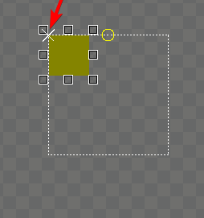

# X Origin

## Introduction

The `X Origin` variable controls the point which an object is positioned by. By default the `X Origin` is `Left`. `X Origin` is shown visually as a white "X" in the editor.

<figure><figcaption>
ColoredRectangle with an <code>X Origin</code> of <code>Left</code>
</figcaption></figure>

## Left

The following image shows a [ColoredRectangle](../coloredrectangle.md) with its `X Origin` set to `Left`:

## Center

The following image shows a ColoredRectangle with its `X Origin` set to `Center`:

## Right

The following image shows a ColoredRectangle with its `X Origin` set to `Right`:

