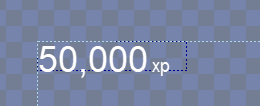

# Y Origin

## Introduction

The **Y Origin** variable controls the point which an object is positioned by. By default the **Y Origin** is **Top**. The **Y Origin** is shown visually as a white "X" in the editor.

## Top

The following image shows a [ColoredRectangle](../coloredrectangle.md) with its **Y Origin** set to **Top**:

## Center

The following image shows a ColoredRectangle with its **Y Origin** set to **Center**:

## Bottom

The following image shows a ColoredRectangle with its **Y Origin** set to **Bottom**:

## Baseline

The following shows a Text with its Y Origin set to Baseline:

<figure><figcaption>
Text with Baseline Y Origin
</figcaption></figure>

Baseline refers to the bottom of the text for letters without descenders. For more information see the [Wikipedia Baseline page](https://en.wikipedia.org/wiki/Baseline_\(typography\)).

Baseline is often used to align fonts of different sizes. The following image shows two Text instances with different font sizes. Both are positioned by their baseline so their bottoms align properly (ignoring descenders, such as on the letter p and the comma).

<figure><figcaption>
50,000 xp aligned by baseline
</figcaption></figure>

By contrast, the following image shows the same Text instances using bottom alignment.

<figure><figcaption></figcaption></figure>

## Y Origin in a Top to Bottom Stack

A child in a [Top to Bottom Stack](../container/children-layout.md#top-to-bottom-stack) which is not the first child ignores its `Y Origin`, and the stack positions it as if its `Y Origin` were `Top`. This keeps it from overlapping its previous sibling. The first child in the stack uses its `Y Origin` normally, and `Y Origin` works normally for every child in a `Left to Right Stack`.


**Breaking change in November 2026:** Before this version, `Y Origin` applied to every child in a `Top to Bottom Stack`, so a `Center`, `Bottom`, or `Baseline` origin moved a child back over its previous sibling. Available in November 2026, or now if building Gum from source. For more information see [Migrating to 2026 November](../../upgrading/migrating-to-2026-november.md).

