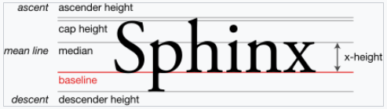

# Y Units

The `Y Units` variable controls how a unit is vertically positioned relative to its parent. By default an object is positioned relative to the top of its parent, where each unit represents 1 pixel downward.

## Pixels From Top

The following image shows a child [ColoredRectangle](../coloredrectangle.md) positioned 50 `Pixels From Top` relative to its parent:

## Pixels From Center

The following image shows a child ColoredRectangle positioned 50 `Pixels From Center` relative to its parent:

## Pixels From Bottom

The following image shows a child ColoredRectangle positioned 50 `Pixels From Bottom` relative to its parent:

## Percentage Parent Height

The following image shows a child ColoredRectangle positioned 50 `Percentage Parent Height` relative to its parent:

## Pixels From Baseline

`Pixels From Baseline` positions a child relative to the parent's baseline. If the parent is a Text instance, the baseline is the Y position of the bottom of letters which do not have descenders. For more information on the concept of text baseline, see the baseline Wikipedia page [https://en.wikipedia.org/wiki/Baseline\_(typography)](https://en.wikipedia.org/wiki/Baseline_\(typography\))

<figure><figcaption>
Baseline Example
</figcaption></figure>

The following image shows a child ColoredRectangle positioned 0 pixels relative to a Text instance's baseline.

<figure><figcaption>
ColoredRectangle with <code>Y Units</code> of <code>Pixels From Baseline</code>
</figcaption></figure>

When using `Pixels From Baseline`, the position depends on the font size, baseline definition in the .fnt, and whether the text wraps. For example, changing the `Width` of the Text causes line wrapping which shifts the baseline.

<figure><figcaption>
Baseline Shifts when the parent Width changes
</figcaption></figure>

A text instance's baseline is defined by its `Font` and `Font Scale` values. These values ultimately create a .fnt file with a `base` value indicating the distance from the top of the text instance to the baseline. For example, an Arial font with Font Size 40 has a `base` value of 36 and a lineHeight of 45.

<figure><figcaption>
Arial with Font Size 40 has a base value of 36
</figcaption></figure>

This means that 36 pixels fall above the baseline, and 9 pixels (45 - 36) below.

<figure><figcaption>
Base defines the distance from the top of the Text instance to the baseline
</figcaption></figure>

Note that if the parent is not a Text instance, then the bottom of the parent is used as the baseline. The following image shows a Colored Rectangle using a `Y Units` of `Pixels From Baseline` with a Container parent.

<figure><figcaption>
<code>Pixels from Baseline</code> uses the bottom of the parent if it is not a Text instance
</figcaption></figure>
