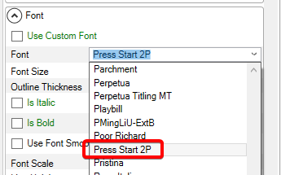

# Font

### Introduction

The Font variable sets the font family used by the text.

<figure><figcaption>
Text instance using Arial font family
</figcaption></figure>

&#x20;This dropdown appears only if [Use Custom Font](use-custom-font.md) is set to false.

The Font dropdown has access to any font which is installed locally.

<figure><figcaption>
Changing the font updates the appearance of the Text instance
</figcaption></figure>

To use a font in Gum, download the font and install it by double-clicking or right-clicking on the font.

<figure><figcaption>
Right-click Install font option
</figcaption></figure>

### Font Generation and Font Cache

Gum performs rendering using rasterized fonts. In other words, it renders using pre-made .png files which contain all of the characters in a font.

You can view the Font Cache in your project by selecting **Content -> View Font Cache**.

<figure><figcaption>
View Font Cache menu item
</figcaption></figure>

This folder contains all font files used by your project.

<figure><figcaption>
Font files in the FontCache folder
</figcaption></figure>

Note that each font has three files:

* bmfc - Bitmap Font Generator configuration file. This can be opened in Bitmap Font Generator to see the settings that have been used to export the other files
* fnt - Bitmap Font Generator font file. This is a text file indicating the location of each character in the matching png files. It also includes kerning pairs.
* png - This is the image file containing the letters for the font. The font may contain multiple image files if the character set or font size are large enough.

Each PNG can be opened in an image editor to view the packed characters. For example, the following shows the Arial 24 font. The blue background has been added manually to make the white characters visible:

<figure><figcaption>
Arial 24 font in a PNG with an added blue background for visibility
</figcaption></figure>

#### Font Cache Generation

Fonts are generated as needed by Gum. This happens whenever a property changes on a Text object requiring a new font. Gum only re-generates fonts if a matching font doesn't already exist. The following animation shows new fonts being generated as a Text's Font Size is changed.

<figure><figcaption>
Fonts generated as the Font Size changes
</figcaption></figure>

Fonts are generated in response to any of the following properties changing:

* Font
* [Font Size](font-size.md)
* [Outline Thickness](outlinethickness.md)
* [Is Italic](is-italic.md)
* [Is Bold](is-bold.md)
* [Use Font Smoothing](use-font-smoothing.md)

### Installing Fonts

Windows Machines typically have dozens of fonts installed automatically. You may be working on a project which needs custom fonts. These fonts can be obtained on many websites including [https://www.dafont.com/](https://www.dafont.com/) and [https://fonts.google.com/](https://fonts.google.com/).&#x20;

Once a font has been installed, you must restart Gum for the font to be available in the Font dropdown.

<figure><figcaption>
Font available in the Font dropdown after being installed
</figcaption></figure>
