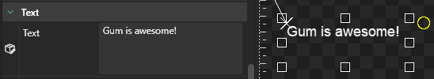
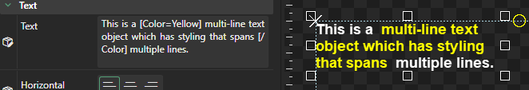

# Text

## Introduction

Text objects have a Text property which controls the displayed text. By default this value is set to "Hello".

## Changing Text

The Text property can be changed in the multi-line edit window.



Text will wrap according to the Text object's Width.

.png>)

The enter key can be used to add new lines to text.

.png>)

## Text Wrapping

Text instances can optionally wrap their text based on width units. By default Text instances use a `Width Units` of `Relative to Children` which means the text does not wrap.

<figure><figcaption><p>Width Units of Relative to Children</p></figcaption></figure>

This Width Units results in the Text automatically resizing itself in response to its Text variable, resulting in no wrapping.

<figure><figcaption><p>Changing the Text results in making the Text instance wider and does not wrap</p></figcaption></figure>

Any other `Width Unit` can be used to make the text wrap. For example, setting `Width Units` to `Absolute` and changing `Width` results in wrapping.

<figure><figcaption><p>Absolute Width can make Text wrap</p></figcaption></figure>

For a deeper dive into Width Units, see the [Width Units page](../general-properties/width-units.md).

## Using BBCode for Inline Styling

Gum text supports inline styling using BBCode-like syntax. To add inline styling, surround text with variable assignment tags as shown in the following screenshot:

<figure><figcaption><p>Red color using BBCode syntax</p></figcaption></figure>

The following table shows the available variables that can be used for inline styling:

<table><thead><tr><th width="129">Tag</th><th width="357">Example</th><th>Result</th></tr></thead><tbody><tr><td>Color</td><td>This is [Color=orange]orange[/Color] text.</td><td></td></tr><tr><td>Red Green Blue</td><td>This is [Red=0][Green=128][Blue=255]light blue[/Red][/Green][/Blue] text.</td><td></td></tr><tr><td>FontScale</td><td>This is [FontScale=2]big[/FontScale] text.</td><td></td></tr><tr><td>IsBold</td><td>This is [IsBold=true]bold[/IsBold] text.</td><td></td></tr><tr><td>IsItalic</td><td>This is [IsItalic=true]italic[/IsItalic] text.</td><td></td></tr><tr><td>Font</td><td>This is [Font=Papyrus]Papyrus[/Font] text.</td><td></td></tr><tr><td>FontSize</td><td>This is [FontSize=36]bigger[/FontSize] text.</td><td></td></tr><tr><td>OutlineThickness</td><td>This is [OutlineThickness=2]outlined[/OutlineThickness] text.</td><td></td></tr></tbody></table>

Note that changing Font and FontSize results in new Fonts created in the Font Cache.

BBCode can span multiple lines, whether the newlines happen due to line wrapping or through the addition of newlines in the text.

<figure><figcaption><p>Text object with inline styling and explicit line breaks</p></figcaption></figure>

Multiple tags can overlap each other allowing you to combine tags for a single piece of text. For example, the following sets text to both bold and orange:

```bbcode
This is [Color=Orange][IsBold=true]bold and orange[/Color][/IsBold] text.
```

<figure><figcaption><p>Styled text that is bold and orange.</p></figcaption></figure>

Styles can contain other styles as many levels deep as necessary.

```bbcode
This [Color=Orange]is orange, [IsBold=true]bold[/IsBold], and [IsItalic=true]italic[/IsItalic][/Color] text.    
```

<figure><figcaption></figcaption></figure>

### BBCode Color and Alpha

Color values can be specified using named colors or individual Red, Green, and Blue values.

Color values can be specified using any of the standard XNA color values, as listed here: [https://docs.monogame.net/api/Microsoft.Xna.Framework.Color.html](https://docs.monogame.net/api/Microsoft.Xna.Framework.Color.html)


MonoGame adds `MonoGameOrange` which is not available in other XNA-likes such as KNI and FNA. Gum UI uses KNI for rendering, so this property is not available in the Gum UI tool, but is available at runtime if you are using MonoGame.


If you need precise color values, then you should use the individual Red, Green, and Blue values.

Keep in mind that if a color value is not specified, then the default for that Text instance is used.&#x20;

For example, a Text's Red may have Red, Green, Blue values of 255, 0, 0 as shown in the following image:

<figure><figcaption><p>Text with explicitly set Red, Green, and Blue values</p></figcaption></figure>

If its Green value is set in BBCode, the green value from BBCode overrides the Green variable value, but the Red and Blue values from its variables persist. BBCode values are applied after all variables.

<figure><figcaption><p>Green value of 200 overriding the default value of 0</p></figcaption></figure>

Similarly, if a Color tag is used, then the BBCode color specified overrides all color variable values. This includes Red, Green, Blue, and Alpha. The following image is a yellow text with an Alpha value of 15, resulting in text that is almost completely transparent:

<figure><figcaption><p>Yellow text with an alpha of 15</p></figcaption></figure>

By specifying a Color value in BBCode, the Alpha value is also overwritten, as shown in the following image:

<figure><figcaption><p>Green overrides Alpha</p></figcaption></figure>

To preserve alpha, the individual Red, Green, and Blue values must be specified.

<figure><figcaption><p>Specifying only Red, Green, and Blue preserves the previously-set Alpha value</p></figcaption></figure>
