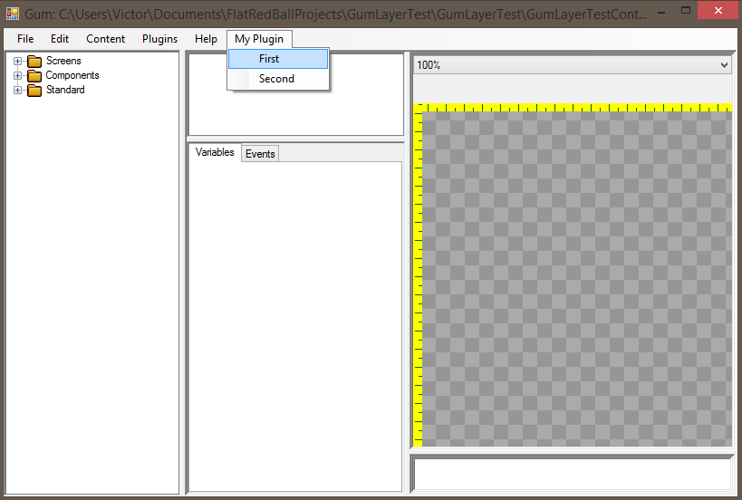

# AddMenuEntry

## Introduction

The AddMenuEntry function adds items to Gum's main menu. It takes the action to run when the item is clicked, followed by the menu path: the first string names the top-level menu (an existing one such as "Content", or a new one, which is inserted before "Help") and each following string is a submenu or, last, the item itself.

AddMenuEntry returns a MenuItemModel. This is a plain object with Header, IsEnabled, IsCheckable, IsChecked, and ToolTip properties; changing them updates the rendered menu item. A plugin that only uses AddMenuEntry does not need to reference any UI framework, and its menu items appear on every operating system (in the macOS menu bar on a Mac).

## Code Example

The following shows how to create a menu called "My Plugin" which contains two items: First and Second. Clicking each item shows a message through the injected dialog service. Add the following to your plugin's **StartUp** function.

```csharp
// Add startup logic here:
AddMenuEntry(() => _dialogService.ShowMessage("You clicked first"), "My Plugin", "First");

var second = AddMenuEntry(() => _dialogService.ShowMessage("You clicked second"), "My Plugin", "Second");

// The returned model can be changed later, for example after a tab is shown or hidden:
second.Header = "Second (visited)";
```



## AddMenuItem (obsolete)

Plugins written for the older WPF tool called AddMenuItem, which returned a WPF System.Windows.Controls.MenuItem and required subscribing to its Click event. The current tool does not have AddMenuItem, and it does not load plugins that reference WPF. Replace it with AddMenuEntry: move the Click handler into the action argument, and change any Header or IsEnabled updates to the returned MenuItemModel. See [Migrating a WPF plugin](README.md#migrating-a-wpf-plugin).
