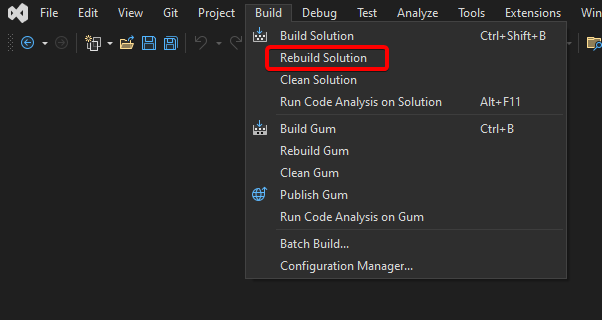

# Running from Source

## Introduction

Gum is an open source project so you can run it from source instead of running the pre-compiled project. Running from source is not a requirement, and is only needed if you intend to contribute to Gum or if you'd like to diagnose problems in a debugger.

## Obtaining the source code

1. Download the source file from [GitHub](https://github.com/vchelaru/gum)
   1. If you downloaded the .zip file from the GitHub main page, unzip the file
   2. If you downloaded the file through a Git client, be sure to be on the `main` branch

<figure><figcaption><p>Gum repository in Github Desktop</p></figcaption></figure>

## Running the code

Building Gum requires the [.NET 10 SDK](https://dotnet.microsoft.com/download). Gum builds and runs from source on Windows, macOS, and Linux.

### From an IDE

1. Locate the `Gum.slnx` file at the root of the repository (`Gum.Wpf.sln` is the older Windows-only WPF tool, which no longer ships)
2. Open it in Visual Studio, Rider, or VS Code
3. Build the whole solution rather than only the startup project. This guarantees that all plugins are built and copied correctly. For more information see below.
4. Run the **Gum.Avalonia** project, which is the Gum tool. It is the solution's startup project.

<figure><figcaption><p>Build -> Rebuild Solution in Visual Studio</p></figcaption></figure>

### From the command line

Run the following from the root of the repository:

```sh
dotnet build Gum.slnx
dotnet run --project Tool/Gum.Avalonia
```

To open a project on startup, add its path after `--`:

```sh
dotnet run --project Tool/Gum.Avalonia -- path/to/MyProject.gumx
```

### Building Plugins

Some of Gum's features live in plugin projects, which copy themselves into the tool's `Plugins` folder when they build. Building only the Gum.Avalonia project (for example, by pressing F5 in Visual Studio after changing a plugin) does not rebuild them. Build the whole solution, or run `dotnet build Gum.slnx`, after changing a plugin.

## Troubleshooting

### A feature added by a plugin is missing

If a menu item or tab that comes from a plugin is missing, build the whole solution. To see which plugins loaded, select **Plugins** > **Manage Plugins**. The dialog also lists any plugin that was found but could not be loaded, along with the reason.
