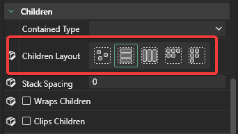

# Bottom-Up Stack

Bottom-up stacks can be used to display stacks of elements which should move up as more are added. This concept is similar to messages received in a chat window. Gum layout can be used to produce this type of stack.


This example shows a bottom-up stack (vertical) but the same approach could be used to create a right-aligned stack.


Items in a bottom-up stack need a parent Container. This Container could be an instance of a Container or a component since components usually have their `Base Type` set to Container. For this example we'll use a container.

<figure><figcaption>
Container instance
</figcaption></figure>

This container to stack needs the following variables set:

*   `Children Layout` set to `Top to Bottom Stack` so all children stack vertically

    <figure><figcaption>
<code>Children Layout</code> set to <code>Top to Bottom Stack</code>
</figcaption></figure>
*   `Height Units` set to `Relative to Children` so the container resizes itself as more children are added

    <figure><figcaption>
<code>Height Units</code> set to <code>Relative to Children</code>
</figcaption></figure>
*   `Height` set to `0` so the effective height of the container is based purely on its children

    <figure><figcaption>
<code>Height</code> set to <code>0</code>
</figcaption></figure>
*   `Stack Spacing` set to `2` (optional) to add spacing between each child

    <figure><figcaption>
<code>Stack Spacing</code> set to <code>2</code>
</figcaption></figure>

Now children of the Container stack vertically. This concept works for any type of child, but we'll use ColoredRectangles for this example. Add a few instances to the Container and they stack vertically.

<figure><figcaption>
ColoredRectangle instances stacking vertically in a container
</figcaption></figure>

Finally we can have the stack grow up instead of down. To do this, change the following variables on the parent container:

*   `Y Origin` set to `Bottom`

    <figure><figcaption>
<code>Y Origin</code> set to <code>Bottom</code>
</figcaption></figure>
*   `Y Units` set to `Pixels from Bottom`

    <figure><figcaption>
<code>Y Units</code> set to <code>Pixels from Bottom</code>
</figcaption></figure>

Now as new children are added, the parent stack grows and all items shift up.

<figure><figcaption>
Stack grows upward as more children are added
</figcaption></figure>
