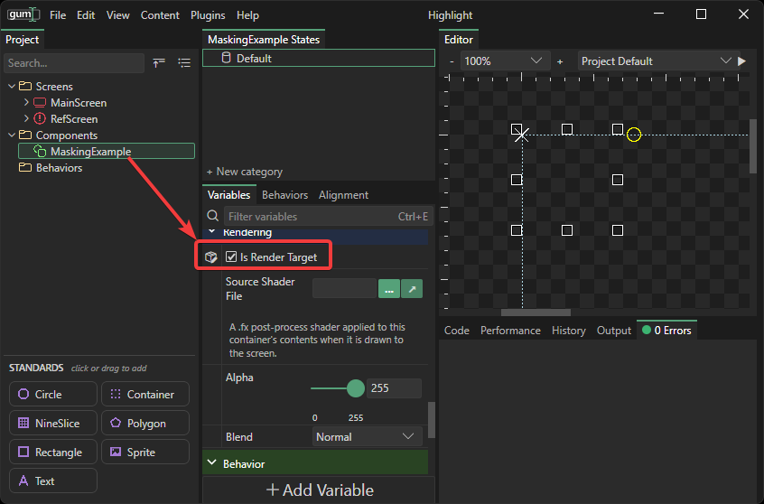
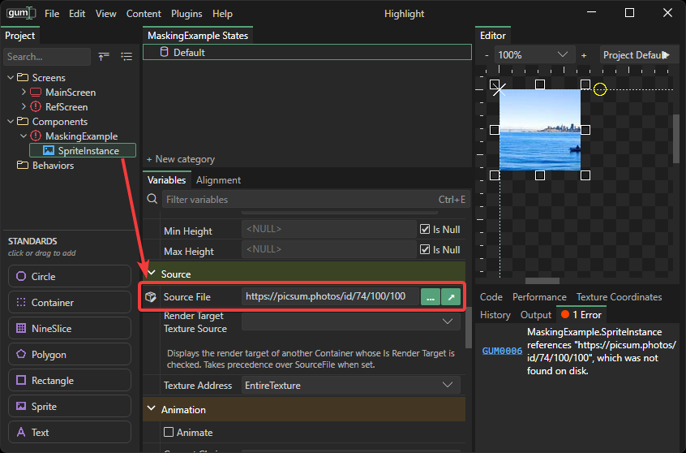
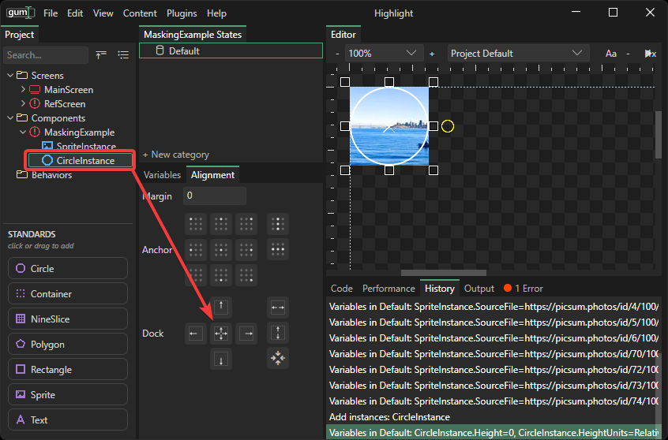

# Masking

## Introduction

Masking can be achieved to create "cut-out" effects such as rounded corners or images drawn over a circle shape. Masking is performed using render target containers and blend modes. Masking requires at least three objects:

1. A container to hold the masked objects. This container must be a render target container
2. The content to mask, such as a Sprite displaying an image
3. The mask shape, which can be a shape (such as a Circle) or another sprite with alpha that defines the mask

## Creating a Container

The first step is to create a container that will be the render target. A render target is required so that the mask can modify the alpha of its sibling in the container.

To contain a render target container, add a new Container object to your Screen or Component. If you want your entire Component to be the container, then you can check the Is Render Target variable on the container itself.

<figure><figcaption></figcaption></figure>

## Adding a Sprite

Next, add the content that you would like to have the mask applied to. For example, this could be an image. In this case, we will use a Sprite that is displaying a sample image. Add a sprite to your container and set its `Source File` to an image such as [https://picsum.photos/id/74/100/100](https://picsum.photos/id/74/100/100).

<figure><figcaption></figcaption></figure>

## Adding the Mask Shape

Next, add the shape that you would like to act as the mask. The mask can be an actual shape such as a circle, or it can be another image with custom alpha. For this example we'll use a circle.

Add a circle to your container and dock fill it so it takes the entire size of the container.

<figure><figcaption></figcaption></figure>

Next we'll modify the shape so it its alpha can be used. Set these variables:

*
