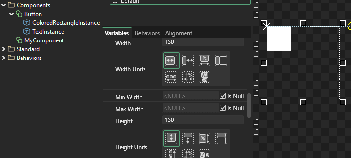
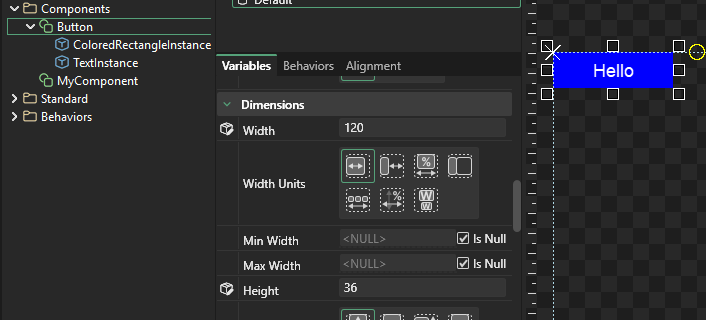
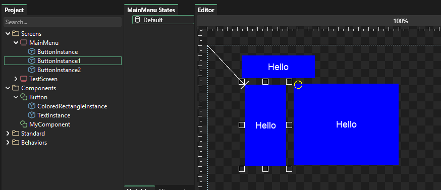

# 4 - Components

## Introduction

Components can contain instances of other components and of standard objects. Examples of components include:

* Check boxes
* Buttons
* Popup Menus

Components can also be simple such as a button or more complex UI elements such as a full Options screen with dozens of instances.

## Simple Button Example - Creating the Entity

To understand how components work, we'll create a simple Button component. To do this:

1. Right-click on the Components folder in Gum and select **Add Component**
2. Name the Component "Button"
3. Drag+drop a ColoredRectangle standard element into the Button component
4. Drag+drop a Text standard element into the Button component

Since ColoredRectangleInstance and TextInstance are both white you may not be able to see the Text. Let's change the ColoredRectangleInstance's color:

1. Select ColoredRectangleInstance
2. Change `Red` to `0`
3. Change `Green` to `0`
4. Keep `Blue` as `255`

Notice that as you change the values, the background on the text box changes from green to white to indicate that the value has an explicit value. The `Blue` text box keeps a green value since it has not been changed from its default value.

<figure><figcaption>
Values backgrounds change from green to white when explicitly set
</figcaption></figure>

Now you should be able to see the Text on top of the rectangle:

## Sizing the colored rectangle

At this point we have made some progress towards creating our first button, but it still needs some work.&#x20;

First, we're going to adjust the size of the instances inside of our Button component. At this point you can see that the ColoredRectangle (the blue background) is not the same size as the button. Not only do we want to make the blue ColoredRectangle larger, but we also want it to automatically match the Button's size (the dotted outline).

To do this:

1. Select the ColoredRectangleInstance
2. Select the Alignment tab
3. Click the Fill Dock button

<figure><figcaption>
Fill Dock expands the ColoredRectangleInstance to occupy its full parent
</figcaption></figure>

Alternatively you can adjust the individual values. Keep in mind that using the Alignment tab is the fastest way to get your instances setup. The next section shows all of the changes that the Alignment tab performs for you:

1. Select the ColoredRectangleInstance
2. Change `Height Units` to `Relative To Parent`
3. Change `Width Units` to `Relative to Parent`
4. Change `Height` to `0`. This means that the actual height of the ColoredRectangleInstance matches the actual height of its container (the Button Component). Since `Height Units` is set to `Relative To Parent`.
5. Change `Width` to `0`. This means that the actual width of the ColoredRectangleInstance matches the actual width of its parent.

Now the ColoredRectangleInstance automatically matches the Button's actual with and height:

Next we'll position the TextInstance. We'll want to adjust the Text so that it is always centered, and line-wraps with the size of the button.&#x20;

To do this:

1. Select TextInstance
2. Click the Alignment tab
3. Set Margin to 20
4. Click the Fill Dock button

<figure><figcaption></figcaption></figure>

Alternatively you can set each individual value on the Text by following these steps:

1. Select TextInstance
2. Change its `Horizontal Alignment` to `Center`
3. Change its `Vertical Alignment` to `Center`

At this point the Text is vertically and horizontally centered within its boundaries, but we want to have the boundaries centered within the Button. To do this:

1. Keep TextInstance selected
2. Change the `X Units` to `Pixels From Center`
3. Change the `X Origin` to `Center`
4. Change `X` to `0`

Now let's make it centered on the Y as well:

1. Keep the TextInstance selected
2. Change the `Y Units` to `Pixels From Center`
3. Change the `Y Origin` to `Center`
4. Change `Y` to `0`

Finally, let's make the width of the text match the width of the button. For the Text we'll actually leave a border around the edge so the Text doesn't line wrap right against the edge of the button. To do this:

1. Keep the TextInstance selected
2. Change the `Width Units` to `Relative to Parent`&#x20;
3. Change `Width` to `-40`. This means the actual width of the Text is 40 pixels less than the actual width of its container. Since the button is centered this means a 20 pixel border on the left and 20 on the right (20+20=40).

## Setting the Button Default Variables

Buttons are typically wider than they are tall. To match this common layout, let's set some variables on the Button:

1. Select the Button component
2. Change `Width` to `120`
3. Change `Height` to `36`

Notice that whenever you change these values, the contained objects (text and colored rectangle) adjust automatically.

## Creating Component Instances

Now that we have a component created, we can add instances of this component the same way we have added standard elements. To do this:

1. Create a new Screen. I'll call mine MainMenu
2. Drag+drop the Button component into the Screen

We can now resize and position the Button instance. We can reuse our Button component to create multiple instances. Each instance can be adjusted by changing its `X`, `Y`, `Width`, and `Height` values.

We can change _top level_ variables on the Button such as `X`, `Y`, `Width`, and `Height`, but we cannot change variables on instances within the Button - all of our buttons currently display "Hello" text.

The next tutorial shows how to use exposed variables to further customize each button instance.&#x20;
