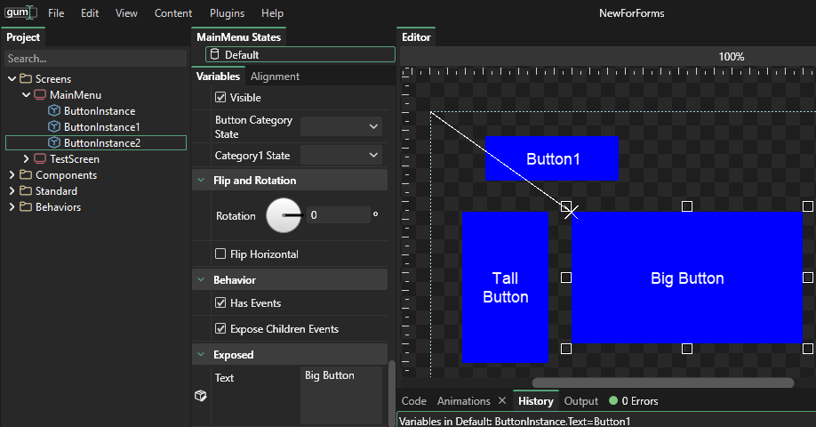

# 5 - Exposing Variables

## Introduction

The ability to expose variables in Gum makes components flexible. For this example we will continue the Button example from the last tutorial.

## Recap

The last tutorial created a Button component with Text and ColoredRectangle instances. The instances were set up to be positioned correctly according to the size of the button.

We then created a MainMenu screen and added a few instances of the Button component to the MainMenu screen.

While the size and positioning functionality in our button works well, the Text itself always says "Hello".

## Exposing the Text variable

By default a Button only exposes its _top level_ variables. Variables on instances inside the button are not available outside of the button. In programming terms these variables are considered _protected_.&#x20;

&#x20;However, we can _expose_ variables on instances so that they can be modified in our MainMenu screen.

To do this:

1. Select TextInstance under Button
2. Find the `Text` variable in the Variables tab (Second column, under the "States" panel)
3. Right-click on the text box and select **Expose Variable**
4. Enter the name "Text" for the variable name

<figure><figcaption>
Right-click to expose a variable
</figcaption></figure>

You can verify that the `Text` variable is exposed by clicking on the the **Button** component and seeing the `Text` variable under the **Exposed** category:

<figure><figcaption>
Text variable is exposed
</figcaption></figure>

## Setting instance variables

Now that the `Text` variable is an exposed variable, it can be changed on each Button instance. To do this:

1. Select one of the Buttons in MainMenu
2. Change its `Text` to "Button 1"

Feel free to set different Text values on all of the buttons. Notice that the `Text` may word-wrap.

## Conclusion

This tutorial shows how to expose Text values per-instance. You can expose other instance variables in your components to customize instances. Other examples of variables which may be exposed include:

* Visibility of icons on a Button component
* Font sizes on a Label component
* Sprite visibility showing the  number of connected gamepads on a JoinGame component
* Width (percentage) on a HealthBar component

It's best to experiment with exposed variables to get a feel for how you can use them in your own components.
