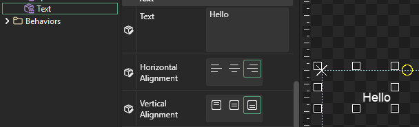

# 2 - Variables Tab

## Introduction

The Gum Variables tab displays all available variables when editing an instance or element. While the Editor tab is handy for quick edits such as positioning and resizing instances, the Variables tab exposes all variables. It is also useful for making fine changes to instances, such as by moving an instance by a single pixel.

The Variables tab shows variables for the selected instance or element.

## Editing Variables

Variables can be edited by changing values on the selected variable. For example, to move the text to the right, change its X value to a positive number. Press Enter or Tab to apply the changes:

<figure><figcaption>
Changing a Text's X variable
</figcaption></figure>

## Positioning Instances

Gum provides a flexible positioning system. The position of an element is a result of a number of variables. We'll go over a few here.

By default all instances are positioned by their top-left corner. For example, setting the Text instance's `X` and `Y` to 0 aligned its top-left position to the top-left of the screen (which is identified by a dotted line.

<figure><figcaption>
Setting X and Y to 0 positions the instance at the top-left of the screen
</figcaption></figure>

We can change the origin of the Text object by setting its `X Origin` and `Y Origin` values. Notice that if `X Origin` is set to `Center` then the Text object is positioned by its center:

 (1) (1) (1) (1) (1) (1) (1) (1) (1) (1).png>)

You may need to pan the view in the Editor tab to be able to see the Text object. Gum provides multiple ways to pan the view:

* Press and hold the middle mouse button while the cursor is over the preview window. While the middle mouse button is down, move the mouse cursor.
* Use the scroll bars on the bottom and side of the view
* Hold down CTRL and press the arrow keys

Changing the `X Origin` value changes the origin of the selected instance; however, it is still positioned relative to the top-left corner of the Text instance's container - which in this case is the entire screen designated by the dotted outline rectangle.

We can change the origin that the Text is relative to by changing the `X Units`. By default the `X Units` variable is set to `Pixels From Left` and `Y Units` is set to `Pixels From Top`.

 (1) (1).png>)

Changing the `X Units` to `Pixels From Right` causes the Text to be positioned on the right-side of the screen.

## Text Alignment

The X,Y, Origin, and Units values are all available for every type of element in Gum; however, these values only change the bounds. In the case of a Text object we may be interested in how the text is aligned within the bounds. The Text object offers two variables for aligning its text: `Horizontal Alignment` and `Vertical Alignment`. Changing the `Horizontal Alignment` to `Center` centers the Text within its bounds:

 (1) (1).png>)

## Default and overriding values

You may have noticed that some variables in the Variables tab have a green background while others have a white background. For example, in the image above the TextInstance's `Vertical Alignment` is green. This is because instances are not required to define values for every variable. Whenever an instance does not set a variable value, it uses the value that is defined in the Standard Element definition.

To see in action, select the **Text** item under the **Standard** folder. Notice that all values have a white background. Keep in mind the the default values for `Horizontal Alignment` and `Vertical Alignment`:

 (1) (1) (1) (1) (1).png>)

If the default `Horizontal Alignment` and `Vertical Alignment` values are changed, the changes will immediately be reflected in the preview window for the default Text configuration:

Now if we select the TextIntance we will see that the `Vertical Alignment` is using the `Bottom` value; however the `Horizontal Alignment` is still using `Center` - this is because a value that is explicitly set on an instance will always override the default value set in the Standard element. Notice that `Horizontal Alignment` has a white background (indicating a custom value) and `Vertical Alignment` has a green background (indicating a default value).

 (1) (1) (1).png>)

Values can be reverted back to their default simply by right-clicking on the variable name in the Variables tab and selecting **Make Default**

 (1) (1) (1) (1) (1) (1).png>)
