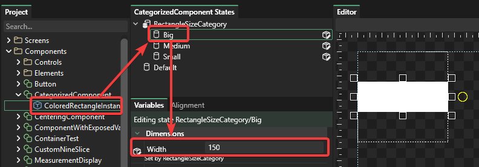

# 8 - State Categories

## Introduction

States are a powerful way to create expressive groups of variables. Some UI elements may require a combination of states to be applied simultaneously.

For example, consider a Button component which displays a button callout.

<figure><figcaption>
Button with Y button callout. Credit Game UI Database <a href="https://www.gameuidatabase.com/gameData.php?id=36&#x26;autoload=975">https://www.gameuidatabase.com/gameData.php?id=36&#x26;autoload=975</a>
</figcaption></figure>

This button might be a standard Button with the following states:

* Enabled
* Disabled
* Highlighted
* Pushed

But it may also have states for which button icon to display:

* A
* B
* X
* Y
* LeftStick
* RightStick

These two sets of states could be set independently and combined at runtime. Categories let you create groups of states so that multiple states can be set simultaneously.

## Creating Categorized States

For this tutorial we'll create a new component. This component has state categories for size and for color. To do this:

1. Open Gum
2. Create a new Component called **CategoryDemo**
3. Right-click anywhere in the State box and select **Add Category**
4. Enter the name "Size" for the new category and click OK
5. Repeat the above steps to create a "Color" category

Now we can add states to the categories. To do this:

1. Right-click on the **Size** category and select **Add State**
2. Enter the name "Small" for the new state
3. Right-click on the **Size** category again and select **Add State**
4. Add a second state to "Big"
5. Right-click on the **Color** category and select **Add State**
6. Add a state called "Red"
7. Right-click on the **Color** category again and select **Add State**
8. Add a state called "Blue"

## Adding Visuals

Now that we have states set up we need to add a visual element to the component so that we can see our changes.

To do this, select the **Default** state and drag+drop a ColoredRectangle into your component

## Setting Variables in States

To modify a state, you can select it and edit in the Editor tab or change properties in the Variables tab to modify what the state sets. Notice that normally for a component like this the ColoredRectangleInstance would have its width and height be relative to its container, but we're not doing this for the sake of keeping the tutorial shorter.

First we'll set the Size states. To do this:

1. Select the **Big** state
2. Resize the colored rectangle so it is larger than the default
3. Select the **Small** state
4. Resize the colored rectangle so it is smaller than the default

Next we'll set the Color states. To do this:

1. Select the **Red** state
2. Set the `Red`, `Green`, and `Blue` values to: `255`, `0`, `0`
3. Select the **Blue** state
4. Set the `Red`, `Green`, `Blue` values to: `0`, `0`, `255`

<figure><figcaption>
Red and Blue states with the correct color values
</figcaption></figure>

## Viewing Multiple States on an Instance

Now that we have our CategoryDemo component set up with multiple categories, we can view these states on any CategoryDemo instance. To do this:

1. Create a Screen called "CategoryDemoScreen"
2. Drop an instance of the **CategoryDemo** component into the **CategoryDemoScreen**
3. Select the newly-created **CategoryDemoInstance**
4. Scroll down in the Variables list and notice that the instance has drop-downs for each category.
5. You can set each state independently and the states combine

We can revert the states back to their unset values by right-clicking on the state variable and selecting the **Make Default** item.

<figure><figcaption>
States can be made default through the right-click make Default item
</figcaption></figure>

### Categories and Variables

If a variable is modified in one of the states in a category, then all of the states in that category are automatically assigned the default value, and this value is explicitly set. This concept makes working with states far more predictable.

For example, consider a component which has:

* A single ColoredRectangle
* A category called RectangleSizeCategory
* States called Big, Medium, and Small

Initially, all states in a category do not explicitly assign any variables. We can see this by selecting the category and observing the Variables tab.

<figure><figcaption>
RectangleSizeCategory which does not set any variables
</figcaption></figure>

If a variable is changed in one of the states in the category, then that variable propagates to all other states, and the Category lists this as one of the variables that it modifies.

For example, we can select the Big category and change the ColoredRectangle.Width property to 150.

<figure><figcaption>
Setting ColoredRectangleInstance Width to 150
</figcaption></figure>

Once this value is changed, the RectangleSizeCategory lists this as a variable that it modifies in the Variables tab.

<figure><figcaption>
RectangleSizeCategory lists any variables that it changes
</figcaption></figure>

If we select any of the other states in the category, they show that they explicitly set the Width value as well (the value has a white background instead of light green). The value is inherited from the default state.

<figure><figcaption>
Width value set by Medium state
</figcaption></figure>

Once a variable is set in a category, all states are required to set this value. A variable cannot be removed from a single state in a category. Rather, to remove a variable, all states in the category must remove the variable. This can be done by selecting the category and pressing the X button next to the variable name.

<figure><figcaption>
Press the X next to a variable on a category to remove the assignment of that variable on all states in the category
</figcaption></figure>
