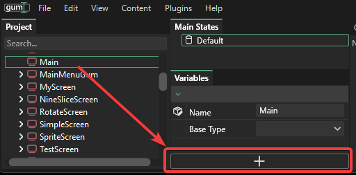
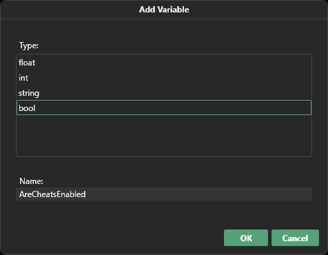

# Add Variable

### Introduction

The Add Variable button can be clicked to add new variables to a selected screen, component, or behavior. Variables added to screens and components are referred to as _custom variables._ Custom variables differ from variables which come from standard elements in the following ways:

* Custom variables are defined at the screen or component level and cannot be added to standard elements
* Custom variables can be renamed
* Custom variables can be deleted
* Custom variables do not have automatic built-in functionality, although they can be used in [Variable References](../gum-elements/general-properties/variable-references.md)

### Adding Variables

To add a variable, select a screen or component and click the Add Variables button.

<figure><figcaption>
Add Variable button in the Variables tab
</figcaption></figure>

Select the variable type and enter the variable's name in the popup window.

<figure><figcaption>
Add Variable popup window
</figcaption></figure>

Newly added variables appear in the Variables tab.

<figure><figcaption>
New variable in the Variables tab
</figcaption></figure>

Custom variables can be edited just like any other variable but they do not have any built-in behavior such as modifying the appearance of objects in the Editor tab.

### Removing Custom Variables

Custom variables can be removed by right-clicking on the variable and selecting the Delete Variable item.

<figure><figcaption>
Delete Variable right-click item
</figcaption></figure>

### Editing Variables

Existing custom variables can be edited by right-clicking on the variable and selecting the Edit Variable item.

<figure><figcaption>
Edit Variable right-click item
</figcaption></figure>

Custom variable names and types can be changed.

<figure><figcaption>
Custom variables can be edited
</figcaption></figure>
