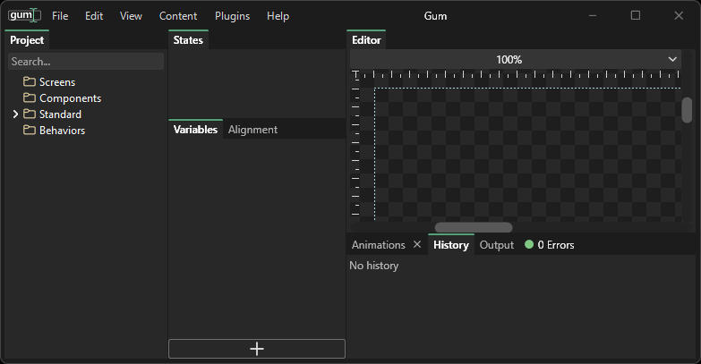
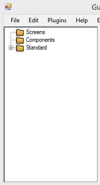
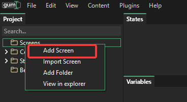
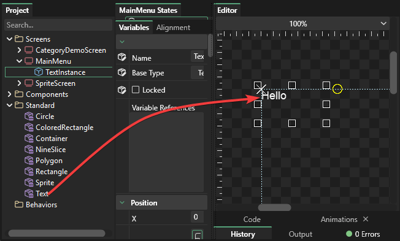
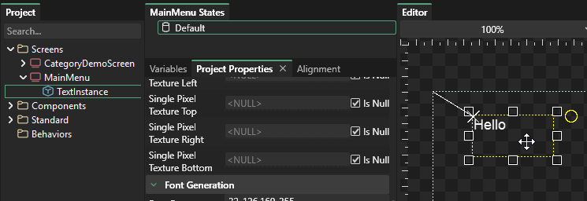

# 1 - The Basics

## Introduction

This page walks you through the basics of using the Gum UI tool \(which we'll refer to simply as Gum for this and all other documentation\).  

## Gum Elements

Gum separates its elements into three categories: Screens, Components, and Standard: 

Standard elements represent the building-blocks for screens and components, and all projects use the same set of standard elements. To see the list of elements, expand the Standard tree item. Clicking on any element will display it in the preview window.

In the image above, the Sprite element is selected. Notice that since a "SourceFile" is not set, the Sprite renders as a red X.

## Components vs. Screens

Components and screens are very similar - both can contain instances of standard elements, and both can contain other components. The only difference between screens and components is that screens cannot contain other screens.

You can think of screens like a screen in a video game. Examples include a main menu, credits screen, options screen, and level selection screen. You can think of components as elements which are composed of multiple standard elements. Examples include a Button component which is made up of a Sprite instance and a Text instance, or a Logo component which may be made up of multiple Sprites and Text objects.

## Creating a Screen

To create a screen:

1. Right-click on the Screens tree item and select "Add Screen" 
2. Enter the name of the new screen - such as "MainMenu"
3. The newly-created screen will be created and selected for you automatically 

## Adding instances

Instances of standard and component elements can be added to screens and components. To add an instance:

1. Select the destination screen or component.  In this case I'll use the MainMenu screen.
2. Push the left mouse button \(but don't release it\) on the Text item.  If you happen to release the mouse button, this will select the Text item.
3. Drag the Text item onto the preview window
4. Release the mouse button.  A new text instance will appear in your screen 

## Editing in the preview window

Once an instance is a part of a screen or component it can be edited visually in the preview window. The selected instance will have eight \(8\) circles surrounding it. These are called the "resize handles" and can be used to resize the instance. In the case of the Text object, the resize handles are used to control how the text object performs line wrapping.

You can use the resize handles to resize the instance, or you can simply push the mouse button and drag inside the instance to change its position.

When the mouse is positioned over an instance you will see an outline over the instance 

